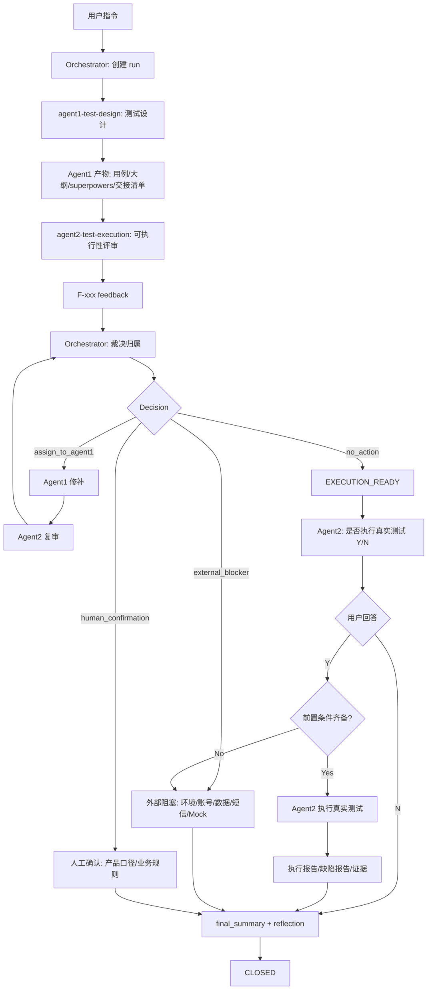

# Agent 测试工程能力图

> 更新时间：2026-05-23  
> 当前架构：Orchestrator 主控裁决式 multi-agent

---

## 一、总体架构

当前 `.agent` 不是简单的“双角色提示词”，而是由主控统一编排的测试工程系统：

```text
用户任务
  ↓
Orchestrator 主控
  ├─ agent1-test-design：测试设计
  └─ agent2-test-execution：可执行性评审 / 测试执行
  ↓
run 状态、exchange 反馈、memory、reflection、evolution
```

核心原则：

| 原则 | 说明 |
|:--|:--|
| 主控裁决 | Agent2 的反馈先提交给 Orchestrator，由主控判断归属 |
| 角色隔离 | Agent1 不处理执行环境事实，Agent2 不直接修改测试设计产物 |
| 执行确认 | Agent2 评审后必须询问“是否执行真实测试？请输入 Y/N” |
| 可追踪 | 每次任务都有 `.agent/runs/{run_id}/` 运行记录 |
| 可沉淀 | 经验先进入 memory/reflection，重复验证后才进入 evolution candidate |

---

## 二、角色定位

| 维度 | Orchestrator 主控 | agent1-test-design | agent2-test-execution |
|:--|:--|:--|:--|
| 核心定位 | 状态控制、裁决、分派、收敛 | 测试设计师 | 测试执行专家 |
| 主要输入 | 用户指令、Agent1 产物、Agent2 feedback | PRD、原型、历史文档、shared memory | Agent1 产物、执行交接清单、agent2 memory |
| 主要输出 | run 状态、主控裁决、final summary、reflection | 测试文档、用例、交接清单 | 可执行性评审、执行确认、执行报告、缺陷报告 |
| 是否改用例 | 仅裁决，不直接改 | 可以改 | 不可以改 |
| 是否执行测试 | 不执行 | 不执行 | 只有用户回答 Y 且前置条件齐备后执行 |
| Memory 写入 | exchange、runs、reflection | agent1 memory、exchange | agent2 memory、exchange |
| 关键约束 | 不让 Agent1 伪造环境/账号/数据 | 不碰真实环境，不写执行报告 | 不直接指挥 Agent1，不越权写库 |

---

## 三、Orchestrator 主控能力

| 阶段 | 能力 | 产物 |
|:--|:--|:--|
| O1 | 创建 run | `.agent/runs/{run_id}/run.yaml` |
| O2 | 分派 Agent1 / Agent2 | run 状态更新 |
| O3 | 接收 Agent2 feedback | `agent2_review.yaml`、`agent2_review_feedback.md` |
| O4 | 裁决反馈归属 | `orchestrator_decision.yaml`、`orchestrator_decisions.md` |
| O5 | 等待真实执行确认 | `EXECUTION_CONFIRMATION_REQUIRED` |
| O6 | 收敛 run | `final_summary.md` |
| O7 | 反思沉淀 | `.agent/reflections/*.md` |
| O8 | 自进化候选 | `.agent/evolution/promotion_candidates.md` |
| O9 | 历史项目学习导入 | 脱敏 reflection、memory 更新、evolution candidate |

主控裁决类型：

| Decision | 含义 | 后续动作 |
|:--|:--|:--|
| `assign_to_agent1` | 测试设计产物不完整、不一致、不可执行 | 分派 Agent1 修补 |
| `external_blocker` | 缺环境、账号、权限、数据、短信通道、Mock 授权 | 等人工或配置补齐 |
| `human_confirmation` | 产品口径或业务规则未确认 | 进入人工确认 |
| `memory_candidate` | 可复用经验，暂不改规则 | 写入 memory |
| `evolution_candidate` | 多次验证或严重阻塞的问题 | 写入 evolution candidate |
| `no_action` | 已覆盖、不适用或无需处理 | 关闭反馈 |

---

## 四、Agent1 能力矩阵

### 工作内容

| 阶段 | 任务 | 核心能力 |
|:--|:--|:--|
| A1-1 | 需求读取 | 读取 PRD、原型、历史文档，识别范围和边界 |
| A1-2 | 需求审计 | 输出待确认问题，识别暂缓项、版本项、产品口径缺口 |
| A1-3 | Superpowers | 提炼项目级测试规约、模块缩写、风险红线 |
| A1-4 | 测试点大纲 | 将需求拆为 WHAT 层测试点，不写执行 HOW |
| A1-5 | 测试用例 | 生成 `TC-模块-序号` 锚点、优先级、Smoke 标记 |
| A1-6 | 自审 | 校验规则映射、优先级、覆盖度、命名一致性 |
| A1-7 | 工期评估 | 输出测试工时、轮次和延期风险 |
| A1-7.5 | 执行交接 | 生成 `执行交接清单.yaml`，暴露环境、数据、权限阻塞 |
| A1-R | 修补 | 只处理主控裁决为 `assign_to_agent1` 的反馈 |
| A1-M | Memory | 记录设计模式、需求审计经验、覆盖缺口 |

### 典型产物

```text
{项目}/测试文档/
  架构级需求摘要.md
  审计待确认问题单.md
  superpowers.md
  测试点大纲.md
  {项目}测试用例.md
  第六阶段_用例反射评审报告.md
  工期评估.md
  执行交接清单.yaml
```

Agent1 不负责：

| 禁止项 | 原因 |
|:--|:--|
| 登录真实测试系统 | Agent1 是设计角色 |
| 伪造环境 URL、账号、密码、短信通道 | 这些属于外部事实 |
| 直接解决 Agent2 的外部阻塞项 | 只能由主控裁决后分派 |
| 写 Agent2 execution memory | Memory 边界隔离 |

---

## 五、Agent2 能力矩阵

### 工作内容

| 阶段 | 任务 | 核心能力 |
|:--|:--|:--|
| R0 | 可执行性评审 | 六维评审：步骤、输入、环境、数据、Smoke、YAML |
| R0.5 | 执行确认 | 询问用户：`是否执行真实测试？请输入 Y/N。` |
| E1 | 环境预检 | URL、账号、权限、登录态、数据画像、IP 拦截 |
| E2 | 队列编排 | 按 Critical/High/Medium/Low 和 Smoke 排队 |
| E3 | 执行 | API Direct、Playwright Headless、必要时只读探索 |
| E4 | 证据留存 | 截图、录屏、console、失败现场证据 |
| E5 | 报告 | 执行报告、缺陷报告、Blocked/Skip 统计 |
| E6 | Memory | 记录 selector、API、环境阻塞、执行历史 |

### Agent2 输出

```text
{项目}/测试文档/
  Agent2_用例评审报告.md
  执行报告/
    执行报告_日期.md
    缺陷清单_日期.md
    screenshots/
```

```text
.agent/runs/{run_id}/
  agent2_review.yaml
```

```text
.agent/memory/agent2-test-execution/
  execution_history.jsonl
  selector_memory.yaml
  api_memory.yaml
  env_blockers.md
  db_mock_audit.jsonl
```

Agent2 不负责：

| 禁止项 | 原因 |
|:--|:--|
| 直接修改 Agent1 用例、测试点、superpowers | 设计归 Agent1 |
| 直接命令 Agent1 修补 | 必须先提交给 Orchestrator |
| 用户未确认时执行真实测试 | 必须等待 Y/N |
| 未授权写数据库 | 只能通过受控 DB helper，且必须审计 |

---

## 六、运行状态层

每次 multi-agent 任务必须有独立 run 目录：

```text
.agent/runs/{run_id}/
  run.yaml
  agent1_output.yaml
  agent2_review.yaml
  orchestrator_decision.yaml
  remediation.yaml
  final_summary.md
```

关键状态：

| 状态 | Owner | 含义 |
|:--|:--|:--|
| `CREATED` | Orchestrator | run 已创建 |
| `DESIGN_IN_PROGRESS` | Agent1 | Agent1 正在设计 |
| `DESIGN_READY` | Agent1 | 设计产物完成 |
| `EXEC_REVIEW_REQUESTED` | Agent2 | Agent2 开始评审 |
| `ORCHESTRATOR_TRIAGE` | Orchestrator | 主控裁决 Agent2 feedback |
| `EXEC_REVIEW_FEEDBACK` | Orchestrator | 有设计类反馈需要 Agent1 修 |
| `DESIGN_REMEDIATION_IN_PROGRESS` | Agent1 | Agent1 修补中 |
| `DESIGN_REMEDIATED` | Agent1 | 修补完成 |
| `EXECUTION_READY` | Agent2 | 用例具备执行准备基础 |
| `EXECUTION_CONFIRMATION_REQUIRED` | Orchestrator | 等待用户 Y/N |
| `EXTERNAL_BLOCKED` | Orchestrator | 外部前置条件阻塞 |
| `EXECUTION_IN_PROGRESS` | Agent2 | Agent2 执行真实测试 |
| `EXECUTION_DONE` | Agent2 | 执行完成 |
| `REFLECTION_READY` | Orchestrator | 可生成 reflection |
| `CLOSED` | Orchestrator | run 闭环 |

---

## 七、标准执行顺序

```text
1. 用户发起任务
2. Orchestrator 创建 run
3. Agent1 读取需求并输出测试设计
4. Agent2 读取 Agent1 产物并做可执行性评审
5. Agent2 提交 F-xxx feedback 给 Orchestrator
6. Orchestrator 裁决 feedback 归属
7. 只有 assign_to_agent1 才分派 Agent1 修补
8. Agent2 复审被修补项
9. Agent2 提出：是否执行真实测试？请输入 Y/N
10. 用户回答：
    - Y：前置条件齐备后进入执行
    - N：进入总结和 reflection
    - 未回答：停在 EXECUTION_CONFIRMATION_REQUIRED
11. Orchestrator 写 final_summary 和 reflection
12. run CLOSED
```

---

## 八、协作全景图



---

## 九、Memory 分层模型

| 层级 | 路径 | 用途 | 写入边界 |
|:--|:--|:--|:--|
| Shared | `.agent/memory/shared/` | 稳定项目事实、环境入口、人工确认决策 | 稳定事实或人工确认后写入 |
| Agent1 Memory | `.agent/memory/agent1-test-design/` | 需求审计、设计模式、覆盖缺口 | Agent1 写入 |
| Agent2 Memory | `.agent/memory/agent2-test-execution/` | 执行历史、selector、API、环境阻塞、DB mock audit | Agent2 写入 |
| Exchange | `.agent/memory/exchange/` | Agent2 feedback、主控裁决、remediation、需补充用例 | Agent1/Agent2/Orchestrator 按协议写入 |
| Reflections | `.agent/reflections/` | 单次 run 复盘 | Orchestrator 写入 |
| Evolution | `.agent/evolution/` | 候选晋升、治理规则、拒绝经验 | 多次验证或人工确认后写入 |

历史项目学习导入规则：

| 步骤 | 产物 | 约束 |
|:--|:--|:--|
| 识别学习价值 | project registry | 只记录项目类型、路径、可复用主题 |
| 脱敏反思 | reflections | 不复制账号、密码、Token、Cookie、客户隐私 |
| 规则沉淀 | Agent1/Agent2/shared memory | 只沉淀模式、审计问题、覆盖缺口、环境阻塞 |
| 晋升候选 | evolution promotion candidates | 需要证据数量、风险和拟晋升目标 |

Exchange 关键文件：

```text
.agent/memory/exchange/
  feedback_schema.yaml
  agent2_review_feedback.md
  orchestrator_decision_schema.yaml
  orchestrator_decisions.md
  remediation_log.md
  needs_more_cases.md
```

---

## 十、Runtime 与依赖层

| 层级 | 路径 | 作用 |
|:--|:--|:--|
| Manifest | `.agent/dependencies.yaml` | 统一路径别名 |
| Agents | `.agent/agents.yaml` | 角色边界和权限 |
| Workflows | `.agent/workflows/` | 工作流协议 |
| Runtime | `.agent/runtime/` | 可执行 helper |
| Scripts | `.agent/scripts/` | 安装、准备、辅助脚本 |
| Playwright Runner | `.agent/playwright-runner/` | 浏览器执行环境 |
| Templates | `.agent/templates/` | `.env` 等模板 |

DB 能力边界：

| 模式 | 权限 |
|:--|:--|
| readonly | 只允许 `SELECT/WITH/EXPLAIN` |
| mock_write | 仅非生产环境、白名单表、带 `/* AGENT_MOCK_DATA */`、写审计日志 |
| 禁止 | 生产库写入、DDL、权限操作、无 WHERE 更新/删除、存储过程、批量导入 |

---

## 十一、关键边界约束

| 规则 | 说明 |
|:--|:--|
| Agent2 feedback 不是 Agent1 指令 | 必须先经 Orchestrator 裁决 |
| Agent1 只修设计类问题 | 外部环境、账号、短信、Mock 授权不由 Agent1 伪造解决 |
| Agent2 真实执行需 Y/N | 未确认时停在 `EXECUTION_CONFIRMATION_REQUIRED` |
| 外部阻塞不等于设计缺陷 | 记录为 `external_blocker` 或 `human_confirmation` |
| 经验不直接改 workflow | 先进入 memory/reflection，重复验证后才进 evolution candidate |
| 不存敏感信息 | 不在 `.agent` 存密码、Token、Cookie、私钥、客户隐私数据 |

---

## 十二、推荐用户指令

新项目默认指令：

```text
agent1和agent2开始工作，新项目【项目名】，需求路径【D:\test_workspace\项目目录】
```

Agent2 评审后会提出：

```text
是否执行真实测试？请输入 Y/N。
```

如果只想做设计和评审，也可以提前明确：

```text
agent1和agent2开始工作，新项目【项目名】，需求路径【路径】，本轮不执行真实测试
```

如果允许执行：

```text
允许 Agent2 执行真实测试
```

但即使允许执行，仍需满足：

```text
环境 + 账号 + 权限 + 数据 + 短信通道 + Mock/DB 授权全部齐备
```
