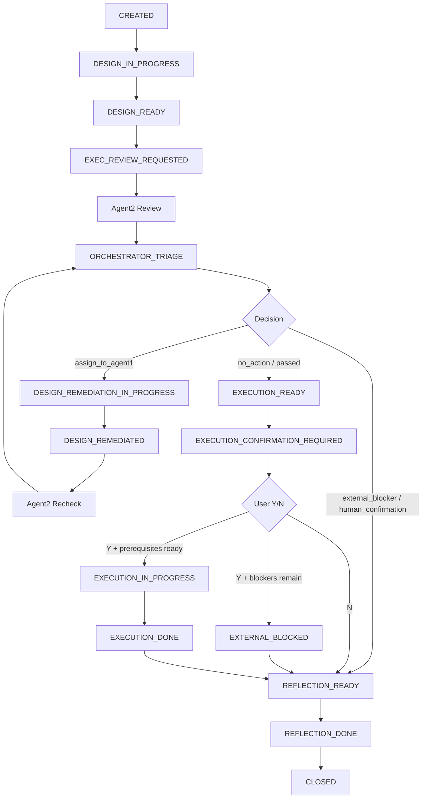

# Cross-Agent Review Protocol

> 触发提示词：`agent2评审测试用例` / `agent1和agent2开始工作` / `multi-agent测试设计评审`

本流程定义 Agent1、Agent2 和 Orchestrator 的协作边界。核心原则是：

```text
Agent2 发现问题
→ 提交给 Orchestrator
→ Orchestrator 裁决归属
→ 只把设计类问题分派给 Agent1
```

Agent2 的反馈不是直接命令 Agent1 修改。缺少环境、账号、权限、测试数据、短信通道、API/DB mock 授权、产品口径等问题，必须由 Orchestrator 记录为外部阻塞或人工确认项。

## 0. 协议依赖

| 依赖 | 用途 |
|---|---|
| `deps.dependencies_yaml` | 路径别名入口 |
| `deps.agents_manifest` | Agent1、Agent2、Orchestrator 的职责边界 |
| `deps.runs_readme` | run 状态机 |
| `deps.memory_readme` | memory 和 exchange 规则 |
| `deps.memory_exchange_feedback_schema` | Agent2 feedback 字段 |
| `deps.memory_exchange_orchestrator_decision_schema` | 主控裁决字段 |
| `deps.project_handoff_manifest_pattern` | Agent1 交接清单 |
| `deps.project_test_cases_pattern` | Agent1 测试用例 |
| `deps.project_superpowers_pattern` | 项目规约 |

## 1. Run 创建

用户可以使用简化指令：

```text
agent1和agent2开始工作，新项目【XXX】，需求路径【D:\test_workspace\XXX】。
```

如果用户没有明确写“暂不执行真实测试”或“允许 Agent2 执行测试”，Orchestrator 必须把真实执行状态设为待确认，而不是默认执行或默认跳过。

Orchestrator 创建：

```text
deps.run_state_pattern
```

最低字段：

```yaml
run_id: "YYYY-MM-DD_project_slug"
project:
  name: "项目名"
  slug: "project_slug"
  root: "项目目录"
  requirement_path: "需求路径"
mode:
  design: true
  executability_review: true
  real_execution: "pending_confirmation"
state: "CREATED"
current_owner: "orchestrator"
next_agent: "agent1_test_design"
execution_confirmation:
  required: true
  asked_by: "agent2_test_execution"
  question: "是否执行真实测试？请输入 Y/N。"
  user_answer: null
```

## 2. Agent1 设计完成门

Agent1 负责测试设计产物，不负责执行环境和真实测试数据。

必须输出：

| 产物 | 路径别名 |
|---|---|
| 项目 superpowers | `deps.project_superpowers_pattern` |
| 测试点大纲 | `deps.project_test_outline_pattern` |
| 测试用例 | `deps.project_test_cases_pattern` |
| 执行交接清单 | `deps.project_handoff_manifest_pattern` |
| Agent1 run artifact | `deps.run_agent1_output_pattern` |

Orchestrator 确认产物存在后，将状态推进到：

```text
EXEC_REVIEW_REQUESTED
```

## 3. Agent2 可执行性评审

Agent2 只读 Agent1 产物并输出评审，不直接修改测试用例、superpowers、交接清单或 Agent1 memory。

### 3.1 输入

Agent2 读取：

1. `deps.project_handoff_manifest_pattern`
2. `deps.project_test_cases_pattern`
3. `deps.project_superpowers_pattern`
4. `deps.memory_exchange_feedback_schema`
5. 必要时读取 `deps.memory_agent2_dir`

### 3.2 六维评审

| 维度 | 检查重点 | 常见裁决方向 |
|---|---|---|
| 操作步骤精细度 | 是否能逐步执行，无隐含动作 | 设计不清则 `assign_to_agent1` |
| 中文输入兼容 | 是否需 JS 注入、剪贴板、输入法处理 | 设计不清则 `assign_to_agent1` |
| 环境前置可达 | URL、账号、权限、功能开关是否明确 | 缺失则 `external_blocker` |
| 数据自愈可行 | API/UI/DB mock seed 是否能准备数据 | 缺授权则 `external_blocker` |
| Smoke 队列完整 | 首轮队列是否可执行、是否混入未确认范围 | 队列设计问题则 `assign_to_agent1` |
| 交接清单完整 | total_cases、conditional_cases、blocking_risks 是否准确 | 文档缺失则 `assign_to_agent1` |

### 3.3 Agent2 输出

Agent2 输出：

```text
deps.run_agent2_review_pattern
deps.memory_exchange_agent2_review_feedback
```

每个反馈必须使用 `F-001`、`F-002` 递增编号，并只表达“发现了什么问题”，不直接决定谁修。

Agent2 结论可以是：

| 结论 | 含义 |
|---|---|
| `passed` | 无需修补 |
| `passed_with_risk` | 可继续，但有风险 |
| `needs_triage` | 需要 Orchestrator 裁决 |
| `blocked` | 存在高优先级阻塞，仍需 Orchestrator 裁决 |

Agent2 输出后，状态进入：

```text
ORCHESTRATOR_TRIAGE
```

### 3.4 执行确认提示

当 Agent2 判断测试设计已经具备进入执行准备的基础时，必须在评审结论中提出执行确认问题：

```text
是否执行真实测试？请输入 Y/N。
```

规则：

1. 如果用户回答 `Y`，Orchestrator 将 `mode.real_execution` 改为 `true`。
2. 如果用户回答 `N`，Orchestrator 将 `mode.real_execution` 改为 `false`，并进入 reflection/close。
3. 如果用户没有回答，状态保持 `EXECUTION_CONFIRMATION_REQUIRED`，Agent2 不得执行测试。
4. 即使用户回答 `Y`，若仍存在 `external_blocker` 或 `human_confirmation`，也必须先解决前置条件，不能直接执行。

## 4. Orchestrator 裁决门

Orchestrator 读取 Agent2 的 F-N 反馈，并使用：

```text
deps.memory_exchange_orchestrator_decision_schema
```

输出：

```text
deps.run_orchestrator_decision_pattern
deps.memory_exchange_orchestrator_decisions
```

### 4.1 裁决类型

| Decision | 含义 | 后续动作 |
|---|---|---|
| `assign_to_agent1` | 设计产物不完整、不一致或不可执行 | 分派 Agent1 修补 |
| `external_blocker` | 缺环境、账号、权限、测试数据、短信通道、Mock 授权 | 记录阻塞，等待人工或配置补齐 |
| `human_confirmation` | 产品口径或业务规则未确认 | 进入人工确认清单 |
| `memory_candidate` | 可复用经验，但还不足以改规则 | 写入 memory candidate |
| `evolution_candidate` | 重复出现或阻塞 E1/Smoke 的系统性问题 | 写入 evolution candidate |
| `no_action` | 已覆盖、不适用或无需处理 | 关闭该反馈 |

### 4.2 裁决原则

1. Agent1 只处理 `assign_to_agent1`。
2. Agent1 不处理 `external_blocker` 和 `human_confirmation`。
3. Agent2 不直接要求 Agent1 修改。
4. Orchestrator 不把一次经验直接提升成 workflow 或 skill。
5. 任何缺失的外部事实都不能被 Agent1 伪造填充。

## 5. Agent1 修补

只有当 Orchestrator 产生 `assign_to_agent1` 裁决时，Agent1 才进入修补。

Agent1 可修改：

1. 测试用例
2. 执行交接清单
3. superpowers 中的测试数据画像或版本范围说明
4. 测试点大纲中的追踪关系

Agent1 不可修改：

1. Agent2 执行报告
2. Agent2 memory
3. DB mock audit
4. 外部环境、账号、短信通道、真实测试数据事实

修补后写入：

```text
deps.run_remediation_pattern
deps.memory_exchange_remediation_log
```

## 6. Agent2 复审

Agent1 修补后，Orchestrator 再把已修补项交给 Agent2 复审。

Agent2 只能复审被分派给 Agent1 的反馈，不复审外部阻塞是否“已解决”，除非 Orchestrator 明确说明外部条件已补齐。

复审结论：

| Verdict | 含义 |
|---|---|
| `passed` | 已解决 |
| `partially_resolved` | 方向正确但仍需补充 |
| `failed` | 未解决 |

## 7. Run 收敛

Orchestrator 根据裁决和复审结果收敛状态：

| 条件 | 状态 |
|---|---|
| 无需 Agent1 修补，只有外部阻塞 | `REFLECTION_READY` 或 `EXTERNAL_BLOCKED` |
| Agent1 修补项全部通过 | `EXECUTION_READY` |
| Agent2 已评审完成但用户未回答是否执行 | `EXECUTION_CONFIRMATION_REQUIRED` |
| 用户回答 N | `REFLECTION_READY` |
| 用户允许真实执行且前置条件齐备 | `EXECUTION_IN_PROGRESS` |
| reflection 完成 | `CLOSED` |

## 8. Reflection 与 Evolution

Run 结束后必须生成 reflection。

只有满足以下条件之一，才进入 evolution candidate：

1. 同类问题跨项目重复出现 2 次及以上。
2. 问题导致 Agent2 无法进入 E1 或首轮 Smoke。
3. 人工明确确认需要固化为 skill/workflow 规则。

## 9. 状态流转图


