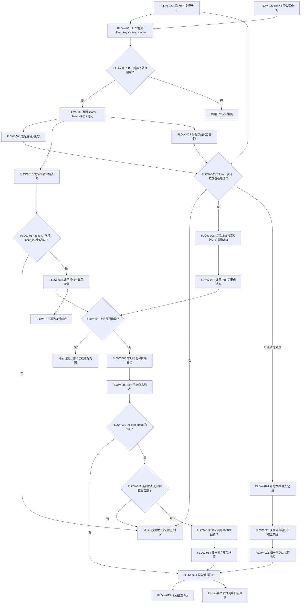
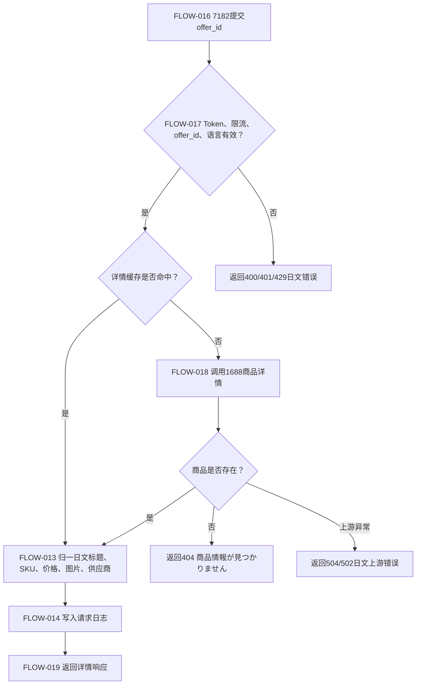

# 7182词搜接口流程图

## 1. 摘要

- 关联 PRD：[7182词搜接口PRD.md](./7182词搜接口PRD.md)
- 关联功能清单：[7182词搜接口功能清单.md](./7182词搜接口功能清单.md)
- 同步状态：已同步
- 最后更新：2026-06-03

## 2. 流程节点映射（Flow Node Mapping）

| 流程节点ID | 节点名称 | 关联功能 | 关联PRD章节 | 说明 |
| --- | --- | --- | --- | --- |
| FLOW-001 | 7182 获取 Token | FUN-001 | 2.1 | 客户提交 `client_key/client_secret`。 |
| FLOW-002 | 校验客户凭据和状态 | FUN-001 | 2.1 | 校验客户是否存在、密钥是否匹配、状态是否启用。 |
| FLOW-003 | 返回 Bearer Token | FUN-001 | 2.1 | 成功返回 JWT、Token 类型、过期时间；失败返回日文错误。 |
| FLOW-004 | 7182 发起关键词搜索 | FUN-002 | 3.1 | 请求 `POST /product/search`，携带 Token 和搜索参数。 |
| FLOW-005 | 校验 Token、限流和参数 | FUN-001、FUN-006 | 2.1、3.1、10.4 | Token、客户限流、关键词语言、分页、筛选排序白名单校验。 |
| FLOW-006 | 组装 1688 搜索参数 | FUN-002、FUN-004、FUN-005 | 3.1、5 | 将对外参数映射到 1688 `searchParams`，返回语言固定日文。 |
| FLOW-007 | 调用 1688 关键词搜索 | FUN-002、FUN-008 | 3.1、10.5 | 服务端生成 1688 鉴权与签名，调用上游搜索。 |
| FLOW-008 | 执行本地过滤和排序补偿 | FUN-004 | 5.1、5.2 | 对上游不支持的销量、起订量、复购率、评分等执行候选集过滤。 |
| FLOW-009 | 归一日文商品列表 | FUN-002、FUN-005 | 3.1、5.3 | 输出日文标题、标签、商品链接、价格、销量等字段。 |
| FLOW-010 | 判断是否补充详情 | FUN-002、FUN-003 | 3.1、4.1 | `include_detail=true` 时进入详情补充，否则直接返回列表。 |
| FLOW-011 | 校验详情补充数量 | FUN-002、FUN-003 | 3.1 | 当前页最多补充 20 个商品；超限按约定返回 400。 |
| FLOW-012 | 逐个调用 1688 商品详情 | FUN-003、FUN-008 | 4.1、10.5 | 对当前页商品按 `offer_id` 查询详情，控制并发和超时。 |
| FLOW-013 | 归一日文商品详情 | FUN-003、FUN-005 | 4.1、5.3 | 输出日文详情字段，缺失字段返回 null/空数组。 |
| FLOW-014 | 写入请求日志 | FUN-007 | 10.3、10.4 | 记录 client、IP、URI、参数摘要、响应码、耗时。 |
| FLOW-015 | 返回搜索响应 | FUN-002、FUN-004、FUN-005 | 3.1、5 | 返回商品列表、分页、筛选说明、trace_id。 |
| FLOW-016 | 7182 发起单品详情查询 | FUN-003 | 4.1 | 请求 `POST /product/detail`，携带 `offer_id`。 |
| FLOW-017 | 校验详情请求 | FUN-001、FUN-003、FUN-006 | 2.1、4.1、10.4 | 校验 Token、限流、offer_id、语言。 |
| FLOW-018 | 调用并归一单品详情 | FUN-003、FUN-005、FUN-008 | 4.1、10.5 | 调用 1688 商详，返回日文详情。 |
| FLOW-019 | 返回详情响应 | FUN-003 | 4.1 | 成功返回详情；商品不存在返回 404 日文错误。 |
| FLOW-020 | 处理上游异常 | FUN-008 | 3.1、4.1、10.5 | 超时、限流、鉴权失败、字段缺失进入统一异常处理。 |
| FLOW-021 | 后台维护 API客户授权 | FUN-009 | 7.1 | 后台管理员在 API客户授权添加客户、生成Token、禁用、调整限流。 |
| FLOW-022 | 后台查询调用日志记录 | FUN-010 | 8.1、10.3 | 后台管理员按客户ID、状态、时间范围查询日志，点击搜索后展示今日统计。 |
| FLOW-023 | 7182 发起商品状态查询 | FUN-011 | 6.1 | 请求 `GET /product/status_v2`，携带同一 Bearer Token 和 SKU、JAN、消费者订单号、商品状态、下单时间、排序条件。 |
| FLOW-024 | 查询 7182 导入记录 | FUN-011 | 6.1、10.3 | 按消费者订单号、SKU、JAN、状态、下单时间定位导入记录，优先读取 cart_id。 |
| FLOW-025 | 关联全球站订单与全商品 | FUN-011 | 6.1、10.6 | 通过 cart_id 或受控兜底条件关联 `b2b_order` 与 `b2b_order_detail`。 |
| FLOW-026 | 归一全球站状态响应 | FUN-011 | 6.1、10.6 | 返回 6 个对外商品状态之一、商品番号、商品名称、SKU、JAN、属性、数量、運単番号、注文日時和 trace_id。 |
| FLOW-027 | 前台商品数据查询页面 | FUN-012 | 5.1、6.1 | 日本客户先输入 Client Key 与 Client Secret 认证，认证后启用筛选条件，点击「検索」后展示统计结果和商品一覧，可跳转 Sakura 照会ページ对照。 |

## 3. Mermaid 流程图（Mermaid Flowchart）

## 4. 单品详情流程

## 5. 异常流程

| Exception ID | Trigger | Flow Node | Handling | Related Function |
| --- | --- | --- | --- | --- |
| EX-001 | `client_key/client_secret` 缺失或错误 | FLOW-002 | 返回 400/401 日文认证错误；不生成 Token。 | FUN-001 |
| EX-002 | 客户被禁用 | FLOW-002、FLOW-005、FLOW-017 | 返回 403 `APIアクセスが無効になっています`。 | FUN-001 |
| EX-003 | Authorization 缺失或 Token 过期 | FLOW-005、FLOW-017 | 返回 401 日文错误；不调用 1688。 | FUN-001 |
| EX-004 | 超出客户限流 | FLOW-005、FLOW-017 | 返回 429；写入限流日志。 | FUN-006、FUN-007 |
| EX-005 | keyword 为空或语言不支持 | FLOW-005 | 返回 400；不调用 1688。 | FUN-002、FUN-005 |
| EX-006 | 筛选或排序字段不在白名单 | FLOW-005 | 返回 400；说明无效字段。 | FUN-004 |
| EX-007 | 1688 搜索超时或限流 | FLOW-020 | 有缓存时可返回缓存并标记；无缓存返回 504/429 日文错误。 | FUN-008 |
| EX-008 | 1688 鉴权或签名失败 | FLOW-020 | 返回 502 日文错误；触发内部告警；不暴露签名信息。 | FUN-008 |
| EX-009 | `include_detail=true` 超过数量限制 | FLOW-011 | 推荐返回 400，提示降低 `page_size` 或关闭详情补充。 | FUN-002、FUN-003 |
| EX-010 | 部分商品详情失败 | FLOW-012、FLOW-013 | 搜索整体仍返回 200；失败商品 `detail=null` 并带 item 级错误。 | FUN-003、FUN-008 |
| EX-011 | 单品详情商品不存在 | FLOW-018、FLOW-019 | 返回 404 `商品情報が見つかりません`。 | FUN-003 |
| EX-012 | 日文字段缺失 | FLOW-009、FLOW-013 | 字段返回空或 null；记录字段缺失，不阻断整体响应。 | FUN-005、FUN-007 |
| EX-013 | 商品状态查询无结果 | FLOW-024 | 返回 200，`items=[]`，记录结果数 0。 | FUN-011 |
| EX-014 | 商品状态查询链路缺失 | FLOW-025、FLOW-026 | 返回已知导入、加购、下单状态，全球订单或全商品字段为空，并返回 `match_mode`。 | FUN-011 |
| EX-015 | 商品状态查询参数非法 | FLOW-023、FLOW-005 | 返回 400 日文参数错误，不查询主业务数据。 | FUN-011 |
