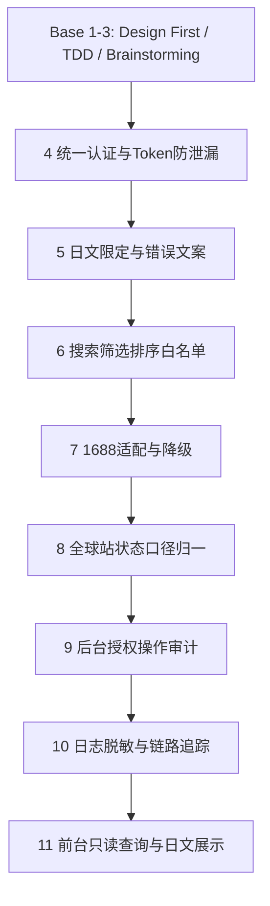

# 7182词搜接口 Superpowers

> 本文件继承 `00_全局测试规约库/superpowers-base.md` 的 1-3 通用规则，仅补充本项目领域规则。严禁在未通过上游规则审计的情况下执行下游规则审计。

## 项目上下文

| 维度 | 内容 |
|:--|:--|
| 现状问题 | 7182 需要在全球站域名下接入 1688 日文词搜、商品详情和商品状态查询，并沿用樱花站开放接口认证体验。 |
| 解决目标 | 对外接口字段稳定、日文响应统一、客户凭据复用、敏感信息脱敏、状态查询以全球站真实订单与全商品状态为准。 |
| 功能全景 | 统一认证、词搜列表、商品详情、商品状态查询、前台商品数据查询、后台 API 客户授权、调用日志记录。 |

执行约束：必须先通过前置规则审计，再进入后置规则审计。

## 领域规则

### 4. 统一认证与 Token 防泄漏

触发：涉及 `client_key`、`client_secret`、Bearer Token、客户启停、Token 过期、Token 刷新、业务接口鉴权。

| 规则 | 约束 | 必测方向 |
|:--|:--|:--|
| 4.1 | Token 获取接口不需要 Authorization，其他业务接口必须携带 `Authorization: Bearer <token>`。 | 正确凭据、错误凭据、Token 缺失、Token 无效、Token 过期。 |
| 4.2 | Token 禁止出现在 query、日志、异常消息、第三方跳转地址。 | URL、日志、错误响应脱敏。 |
| 4.3 | 客户禁用后 Token 获取和业务接口均应被阻断。 | 后台禁用实时生效和历史 Token 失效。 |

### 5. 日文限定与错误文案

触发：涉及关键词语言、返回语言、错误消息、前台页面文案。

| 规则 | 约束 | 必测方向 |
|:--|:--|:--|
| 5.1 | `keyword_language` 未传默认 `ja`，传非 `ja` 必须 400。 | 默认语言、非日文语言、明显中文关键词。 |
| 5.2 | 商品标题、标签、属性、错误消息优先日文。 | 日文字段存在、缺失兜底、错误文案日文。 |
| 5.3 | 前台商品数据查询页面全部日文展示，不暴露内部状态口径。 | 页面文案、列表字段、提示文案。 |

### 6. 搜索筛选排序白名单

触发：涉及价格、销量、类目、发货时效、认证工厂、一件代发、7天上新、严选、起订量、复购率、评分、排序。

| 规则 | 约束 | 必测方向 |
|:--|:--|:--|
| 6.1 | 筛选和排序字段必须白名单校验，未知字段返回 400。 | 非法字段、非法枚举、组合筛选。 |
| 6.2 | 上游不支持的筛选可本地过滤，但必须在 `filter_notes` 中说明。 | total 精度、候选集过滤提示。 |
| 6.3 | `include_detail=true` 最多补充 20 个商品详情。 | page_size 边界、部分详情失败。 |

### 7. 1688 适配与降级

触发：涉及 `product.search.keywordQuery`、`product.search.queryProductDetail`、AppKey、签名、缓存、上游超时。

| 规则 | 约束 | 必测方向 |
|:--|:--|:--|
| 7.1 | 1688 鉴权和签名仅服务端使用，不返回给 7182。 | 响应、日志、错误消息不泄漏。 |
| 7.2 | 搜索缓存 key 必须包含 client、keyword、language、page、page_size、filter、sort。 | 不同语言、筛选、排序结果不串用。 |
| 7.3 | 上游超时、限流、鉴权失败返回稳定日文错误或可标记缓存兜底。 | 502、504、429、from_cache。 |

### 8. 全球站状态口径归一

触发：涉及 `/product/status_v2`、导入记录、购物车、订单、全商品、状态展示。

| 规则 | 约束 | 必测方向 |
|:--|:--|:--|
| 8.1 | 商品状态查询是独立服务节点，但复用同一套客户凭据和 Bearer Token。 | Token 复用、模块边界、限流一致。 |
| 8.2 | 对外只展示 `受理中`、`到着未質検`、`正品未梱包`、`梱包済`、`発送済`、`取消済`。 | 6 状态筛选、内部 19 状态不暴露。 |
| 8.3 | 查询为空返回 200 且 `items=[]`；链路缺失返回可追踪字段，不直接失败。 | 空结果、match_mode、链路缺失。 |

### 9. 后台授权操作审计

触发：涉及 API客户授权页面、添加客户、生成 Token、禁用客户、限流调整。

| 规则 | 约束 | 必测方向 |
|:--|:--|:--|
| 9.1 | 客户ID 默认 `SKR7182`，页面不展示、不录入用户ID。 | 列表、筛选、弹窗。 |
| 9.2 | Client Secret 和 Token 展示、复制、生成必须满足脱敏和审计要求。 | 脱敏、复制、操作日志。 |
| 9.3 | 限流调整和禁用客户必须实时影响业务接口。 | 后台配置与接口行为一致。 |

### 10. 日志脱敏与链路追踪

触发：涉及开放接口请求日志、调用日志记录页面、错误日志、trace_id。

| 规则 | 约束 | 必测方向 |
|:--|:--|:--|
| 10.1 | 日志记录 client、IP、URI、参数摘要、响应码、耗时、错误分类、trace_id。 | 成功、失败、限流、上游错误。 |
| 10.2 | `client_secret`、Bearer Token、1688 access_token、AppSecret、签名必须脱敏。 | 日志列表、数据库日志、错误日志。 |
| 10.3 | 日志写入失败不得影响主查询成功返回，但必须告警或补偿。 | 日志异常降级。 |

### 11. 前台只读查询与日文展示

触发：涉及商品ステータス照会页面、Client Key / Secret 认证、検索、リセット、Sakura照会ページ。

| 规则 | 约束 | 必测方向 |
|:--|:--|:--|
| 11.1 | 未认证前筛选区、搜索、分页、列表均不可操作。 | 初始态、认证失败、解除认证。 |
| 11.2 | 页面只读，不允许修改订单、购物车、商品状态。 | DOM、接口方法、权限拦截。 |
| 11.3 | 商品一覧固定展示 20 个字段，单行展示，时间到分钟，超出省略号。 | 字段完整、视觉截断、日文标签。 |

## 模块缩写配置表

| 缩写 | 模块 | 范围 |
|:--|:--|:--|
| AUTH | 统一认证 | Token 获取、Bearer 校验、客户启停、Token 泄漏防护 |
| SRCH | 词搜列表 | 日文关键词搜索、筛选排序、分页、详情补充 |
| DET | 商品详情 | 单 `offer_id` 商详、SKU、图片、供应商、上游异常 |
| STAT | 商品状态查询 | `/product/status_v2`、全球站状态归一、导入记录链路 |
| ADM | API客户授权 | 添加客户、生成 Token、禁用、限流、Secret 展示 |
| LOG | 调用日志记录 | 统计卡、筛选、日志明细、脱敏、trace_id |
| UI | 前台商品数据查询 | 商品ステータス照会、认证、検索、リセット、商品一覧 |

## 测试数据画像与隔离策略

| 数据类型 | 最小数据集 | 隔离要求 |
|:--|:--|:--|
| 7182 API 客户 | 启用客户 `SKR7182` 1 个、禁用客户 1 个、错误凭据 1 组 | Secret 与 Token 不写入测试文档，使用安全账号引用。 |
| Token | 有效 Token、过期 Token、无效签名 Token、禁用客户历史 Token | 仅记录摘要和状态，不记录明文。 |
| 1688 商品 | 日文关键词可搜商品 2 个、无结果关键词 1 个、下架或无权限 offer_id 1 个 | 避免使用真实客户敏感商品数据。 |
| 搜索筛选 | 价格区间、销量、发货时效、认证工厂、一件代发、起订量、复购率、评分组合样例 | 每组参数单独 trace_id，缓存 key 不串用。 |
| 7182 导入记录 | 至少覆盖 6 个对外状态，每状态 1 条；包含消费者订单号、SKU、JAN、cart_id | 不同状态、不同订单号数据隔离，避免互相污染。 |
| 链路缺失数据 | 导入记录存在但无 cart_id、无订单、无全商品明细各 1 条 | 用于验证 `match_mode` 与空链路字段。 |
| 后台管理员 | 具备 API维护权限账号 1 个、无权限账号 1 个 | 后台操作日志记录操作人，不泄露凭据。 |

