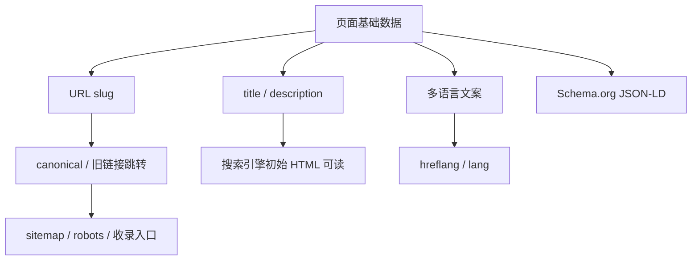

# Superpowers - SEO优化

> 本项目继承 `00_全局测试规约库/superpowers-base.md` 的通用规则；本文仅定义 SEO 优化领域的补充验收规则。

## 项目上下文

| 上下文 | 内容 |
|:--|:--|
| 现状问题 | B2B 首页、产品分类页、产品页需要提升搜索引擎可读性，URL 需从参数/ID 风格优化为可读伪静态。 |
| 业务目标 | 让搜索引擎能读取页面 title、description、产品详情、多语言关系和结构化数据。 |
| 技术目标 | SEO 关键信息在初始 HTML 中稳定输出，URL 结构清晰且兼容旧链接。 |
| 验收重点 | 元信息可读、URL 规范、结构化数据合法、多语言关系正确、缓存与安全边界不破坏现有页面。 |

## 功能全景

| 模块 | 能力 | 测试关注 |
|:--|:--|:--|
| 元信息可爬取 | title、description、robots、canonical | 初始 HTML 可读、唯一性、页面主题匹配、空值兜底 |
| URL 伪静态 | 分类 URL、产品 URL、页面 URL、旧链接跳转 | 不含中文/ID/参数/后缀、唯一性、301、canonical |
| 分类页 SEO | 分类标题、描述、列表结构、分页筛选 | ItemList、BreadcrumbList、分页 canonical/noindex |
| 产品页 SEO | 产品标题、描述、图片、价格、详情字段 | Product Schema、字段来源、缺失兜底、下架状态 |
| 多语言与 Schema | hreflang、lang、JSON-LD | 多语言互链、语言一致性、Schema 校验 |
| 安全回归 | XSS、防重复、缓存、robots/sitemap | 别名和 SEO 字段安全、缓存刷新、爬虫入口 |

## 规则依赖图

执行约束：未确认 URL 生成规则、语言范围和 Schema 字段来源前，Agent2 不得将对应争议场景直接判为缺陷，应先标记 Conditional。

## §4 SEO 关键信息必须在初始 HTML 可读取

触发：首页、产品分类页、产品详情页的 `<title>`、description、canonical、Schema 输出。

| 规则 | 验收标准 |
|:--|:--|
| 初始 HTML 可读 | `curl`、浏览器查看源代码或禁用 JS 后仍能读取核心 SEO 信息。 |
| title 唯一 | 单页面仅保留一个有效 `<title>`，且不为空、不全站重复。 |
| description 有效 | `meta name="description"` 存在，内容描述当前页面，不为空、不堆砌关键词。 |
| 详情字段可读 | 产品页的名称、核心描述、图片等可在 HTML 或结构化数据中读取。 |

## §5 URL 必须符合伪静态与可读别名规则

触发：分类页 URL、产品页 URL、普通页面 URL 和旧 URL 访问。

| 规则 | 验收标准 |
|:--|:--|
| 分类页 | `域名/分类别名`，如 `/Menswear` 或 `/shuma`。 |
| 产品页 | `域名/分类别名/产品别名`，如 `/Menswear/cotton-shirt`。 |
| 页面 | `域名/页面别名`，如 `/about-us`。 |
| 禁止项 | 不出现中文、纯数字 ID、`.html`、`.php`、`?id=` 等后缀或参数作为主访问 URL。 |
| 唯一性 | 同一层级别名不得冲突；冲突时必须有明确拦截或自动去重策略。 |

## §6 旧链接兼容和 canonical 必须防止重复收录

触发：旧参数 URL、大小写 URL、带尾斜杠 URL、重复 slug URL。

| 场景 | 规则 |
|:--|:--|
| 旧 ID/参数链接 | 若旧链接仍可访问，应 301 到新规范 URL 或明确 noindex/canonical。 |
| canonical | 页面 canonical 指向当前规范 URL，不能指向旧参数链接、错误语言或 404。 |
| 尾斜杠和大小写 | 按产品确认规则统一，不允许两个可收录 URL 展示同一内容。 |
| 错误 slug | 不存在的分类/产品别名应返回 404 或业务定义的有效空态，不得返回错误商品。 |

## §7 分类页和产品页元信息必须与业务数据一致

触发：分类名称、产品名称、商品详情、SEO 后台配置、上下架状态。

| 规则 | 验收标准 |
|:--|:--|
| 分类页 | title/description 体现分类主题，列表商品与分类匹配。 |
| 产品页 | title/description 包含产品核心信息，产品详情不串品、不串语言。 |
| 后台配置优先级 | 若存在 SEO 自定义字段，优先级需明确且保存后前台同步。 |
| 异常数据 | 缺图、缺描述、下架、禁用分类需有兜底规则，不输出误导性 SEO 信息。 |

## §8 多语言 SEO 必须语言一致且互链完整

触发：切换语言、默认语言页面、同内容多语言页面。

| 规则 | 验收标准 |
|:--|:--|
| lang 标识 | HTML `lang` 与页面文案语言一致。 |
| hreflang | 多语言版本互相声明，URL 指向存在且 HTTP 状态正常。 |
| x-default | 默认入口按产品确认规则声明。 |
| 语言隔离 | 中文、英文、日文、韩文等内容不得串到错误语言的 title/description/Schema。 |

## §9 Schema.org 结构化数据必须合法且匹配页面类型

触发：首页、分类页、产品详情页 JSON-LD 输出。

| 页面 | 结构化数据要求 |
|:--|:--|
| 首页 | Organization、WebSite 或 SearchAction 按本次方案输出。 |
| 分类页 | BreadcrumbList、ItemList 与当前分类商品列表一致。 |
| 产品页 | Product 至少包含 name、description、image、url；价格、币种、库存按字段来源确认。 |
| 通用 | JSON-LD 可解析，无重复冲突字段，URL、图片 URL 可访问。 |

## §10 爬虫入口、缓存和安全边界必须可控

触发：robots.txt、sitemap.xml、缓存刷新、SEO 字段输入、URL 别名输入。

| 规则 | 验收标准 |
|:--|:--|
| robots | 不误屏蔽首页、分类页、产品页。 |
| sitemap | 若纳入范围，新规范 URL 能进入 sitemap，不包含旧参数 URL。 |
| 缓存 | SEO 配置保存后在约定 SLA 内生效，不同语言和页面互不污染。 |
| 安全 | title、description、slug、Schema 字段对脚本字符转义，不触发 XSS 或 JSON 注入。 |

## 【模块缩写配置表】

| 模块缩写 | 模块名称 | 说明 |
|:--|:--|:--|
| SEO-META | 元信息可爬取 | title、description、canonical、初始 HTML 可读 |
| SEO-URL | URL 伪静态 | 分类、产品、页面 URL、旧链接跳转、别名唯一性 |
| SEO-CAT | 产品分类页 SEO | 分类元信息、列表、分页筛选、ItemList |
| SEO-PDP | 产品详情页 SEO | 产品详情、Product Schema、上下架和异常数据 |
| SEO-I18N | 多语言与结构化数据 | lang、hreflang、JSON-LD、语言一致性 |
| SEO-SEC | 安全回归与爬虫入口 | XSS、缓存、robots、sitemap、性能和日志 |

## 【测试数据画像与隔离策略】

| 数据类型 | 最低配置 | 用途 |
|:--|:--|:--|
| 分类数据 | 至少 3 个一级分类、2 个二级分类，含英文别名和拼音别名 | 验证分类 URL、分类页 title/description 和 ItemList。 |
| 产品数据 | 至少 6 个商品，覆盖正常、缺描述、缺图、下架、长标题、特殊字符标题 | 验证产品页 SEO、异常兜底和安全转义。 |
| 多语言数据 | 至少覆盖默认语言 + 1 个非默认语言；若产品确认更多语言需扩展 | 验证 lang、hreflang、文案隔离和 Schema 语言。 |
| 旧链接样本 | 分类旧参数 URL、产品旧 ID URL、大小写和尾斜杠变体各至少 1 条 | 验证跳转、canonical 和重复收录防护。 |
| SEO 配置样本 | 自定义 title、description、slug 各 1 组，含空值和特殊字符 | 验证后台配置优先级、缓存生效和安全过滤。 |
| 爬虫文件 | robots.txt、sitemap.xml 或生成接口 | 验证核心 URL 未被屏蔽且 sitemap URL 规范。 |

