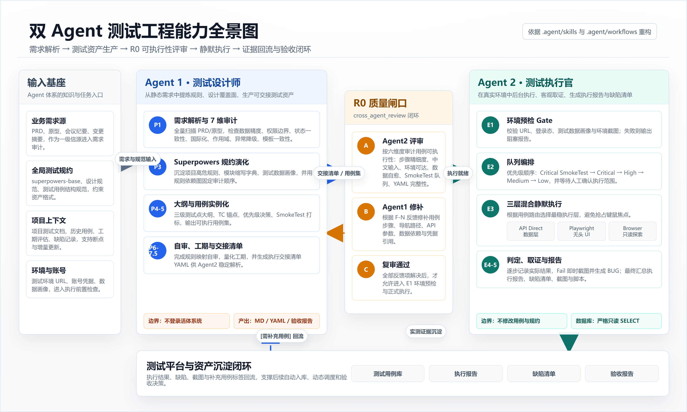
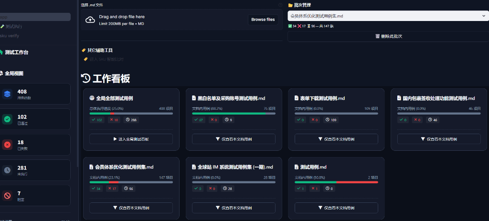
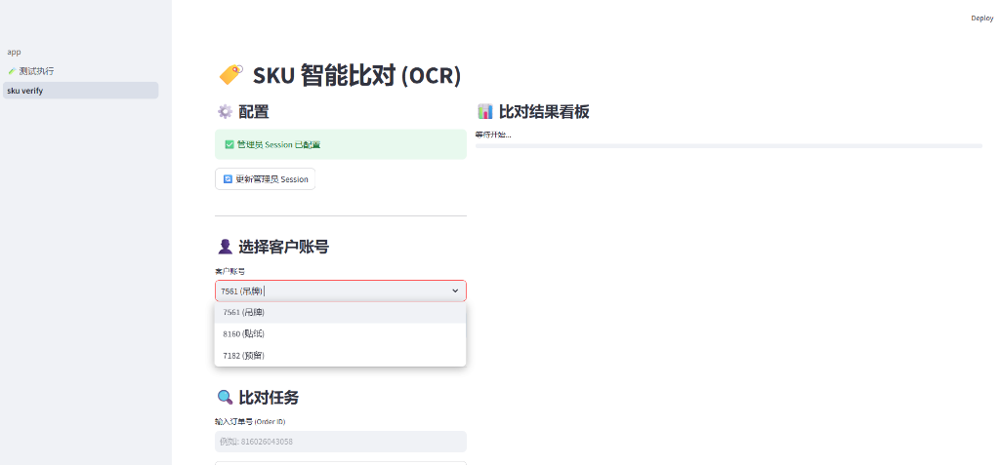
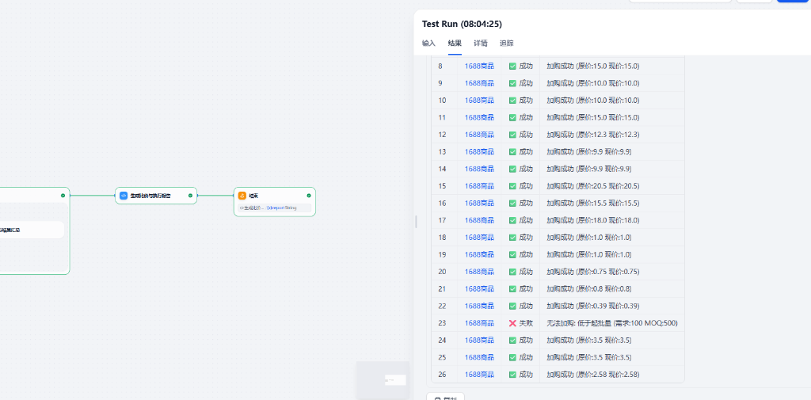
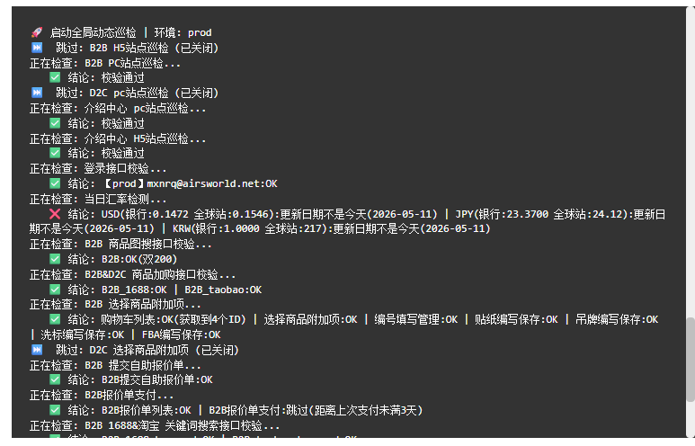

# 试用期述职报告

> **工作空间背景**：本报告基于 `D:\test_workspace` 工作区试用期的实际沉淀提炼。
> **演进历程**：历经试用期的建设与多次维护迭代，目前已扩展为包含测试 Agent 体系、自建测试平台、Dify 工作流及自动化执行脚本的工程体系。所有的架构、文档与工具链，均为试用期内的增量产物。

---

## 一、整体产出概览

试用期间，工作重心从日常测试执行延伸到"**测试工程化能力建设 + Agent 测试体系搭建 + 项目测试交付 + Dify 业务自动化**"四个方向。

| 产出维度 | 实际沉淀量 |
| :--- | :--- |
| **测试 Agent** | 搭建 2 个核心 Agent，编排 5 个配套工作流 |
| **测试平台** | 自建用例执行平台，当前入库 408 条用例 |
| **Dify 工作流** | 批量加购等自动化工作流 3 个版本 |
| **项目测试用例** | 6 个重点项目共产出 474 条 |
| **缺陷管控** | 提交缺陷 222 个，已闭环 86 个 |
| **自动化脚本** | 试用期新增核心测试与巡检脚本（Python/JS）共百余个（已剔除临时调试产物） |

---

## 二、核心能力一：测试 Agent 体系搭建

### 1. Agent 1：测试设计师

从 PRD、原型、会议纪要等需求材料出发，完成需求解析、风险审计、测试点拆解、测试用例生成、工期评估和验收报告输出。

核心能力包括：
- PRD 目录全量扫描与需求变更摘要；
- 7 维度需求审计（数据精度、权限边界、状态一致性、国际化、作用域隔离、异常降级、模板一致性）；
- 项目级 `superpowers.md` 高危规则抽取；
- 测试点大纲与结构化测试用例生成；
- 工期评估与执行交接清单输出。

### 2. Agent 2：测试执行官

读取 Agent 1 输出的用例和交接清单，在真实测试环境中进行环境预检、队列编排、逐例执行、截图留证、结果判定和缺陷报告生成。

技术架构采用 **API Direct + Playwright Headless + Browser 只读探索**的三层混合静默执行方式，具备：
- E1 环境预检 → E2 队列编排 → E3 逐例执行 → E4 结果判定 → E5 报告生成的完整生命周期；
- 前置数据自愈与截图证据留存；
- 数据库只读铁律，避免测试执行污染环境。

### 3. Agent 协同工作流

在 `.agent/workflows/` 下沉淀了 5 个工作流：

| 工作流 | 作用 |
|---|---|
| `kickoff_test_engine.md` | 启动项目全生命周期测试设计流程 |
| `cross_agent_review.md` | Agent 1 与 Agent 2 之间的用例评审、反馈、修补闭环 |
| `run_test_suite.md` | Agent 2 自动化执行引擎，驱动 E1-E5 测试执行流程 |
| `lookup-testcase.md` | 用例查询与定位能力 |
| `gitee_repo_sync_rules.md` | 仓库同步和权限边界规则 |

这套体系使"需求解析 → 用例设计 → 可执行性评审 → 环境预检 → 执行 → 报告 → 验收"形成完整闭环。

---

## 三、核心能力二：自建测试用例执行平台

自建了公司内部测试用例执行平台，基于 Streamlit + SQLite 搭建，核心功能包括：

1. **Markdown 测试用例导入**：支持上传 `.md` 测试用例文档，解析 `#### TC-XXX` 格式锚点，支持列表格式和表格格式两种用例结构，入库时自动识别新增与更新。
2. **树状用例执行面板**：按项目、模块、测试点、用例形成树状结构，支持状态记录（Untested / Pass / Fail / Blocked）。
3. **工作看板与批次管理**：首页展示执行统计，支持按来源文件管理批次，删除批次前自动归档 Excel，新版导入时识别孤儿用例并提示同步删除。
4. **SKU 智能比对辅助入口**：平台首页包含 SKU 比对入口，支撑业务核对场景。

   

当前平台已入库 **408 条用例**，覆盖会员体系、表单下载、黑白名单及采购账号、国内包裹签收处理、全球站 IM 等项目，已实际承接多个项目的测试用例管理和执行记录。

---

## 四、核心能力三：Dify 工作流建设

在 `dify工作流文档/加购工作流` 下，已沉淀 Dify 批量加购相关工作流：

| 工作流文件 | 说明 |
|---|---|
| `dify_workflow_批量加购_带附加项.yml` | 支持带附加项的批量加购场景 |
| `dify_workflow_批量加购_无附加项.yml` | 支持无附加项批量加购场景 |
| `dify_workflow_批量加购_比价版_修复死锁.yml` | 比价增强版，修复死锁问题 |

工作流实现了：上传 Excel 后自动解析，通过 1688 获取现价，若价格上涨则拦截，否则自动加购。

业务价值：
- 降低业务人员批量加购操作成本；
- 将价格上涨风险前置拦截；
- 将 Excel 处理、1688 比价、加购动作串成自动化流程；
- 为后续更多业务流程自动化提供模板。

---

## 五、重点项目测试交付

试用期间，主要支撑了 6 个业务项目的测试工作，共产出 **474 条**测试用例。每个项目同步沉淀了 PRD 风险审计单、测试点大纲、评审报告和自动化测试脚本，形成完整的测试资产。

| 项目 | 用例数 | 状态 | 主要覆盖 |
|---|---:|---|---|
| 黑白名单及采购账号 | 81 条 | 已上线 | 采购账号管理、一键采购联动、订单状态控制 |
| 会员体系 | 147 条 | 进行中 | 会员等级、全球定价、大客专属价、入金审核 |
| 全球站批量导入功能 | 63 条 | 进行中 | 模板导入、SKU 校验、比价、吊牌/贴纸生成 |
| 国内包裹签收处理 | 46 条 | 进行中 | 签收处理、超时判定、私人包裹隔离、统计 |
| 表单下载 | 109 条 | 进行中 | 移动端核对、表单下载、跨端同步、面单处理 |
| 全球站 IM 系统（一期） | 28 条 | 已上线 | 聊天通信、消息同步、IM 界面交互 |

其中黑白名单及采购账号项目已完成上线，两轮测试中发现并验证修复了 5 个有效缺陷，保障项目顺利上线；全球站 IM 系统（一期）也已完成上线交付，验证了聊天通信、消息同步和 IM 界面交互链路。

---

## 六、自动化巡检与辅助脚本

在试用期间，对其进行了维护迭代与扩充：

- **全球站与樱花站自动化巡检**：目前已扩充为包含 79 个核心 Python 脚本的自动化集群，覆盖页面访问、登录、搜索、附加项、报价单、支付等关键链路，常态化输出巡检报告与异常告警。
- **业务辅助脚本**：研发了 SKU 自动核对器、模板数据比对器等工具，有效降低了人工核对成本。

---

## 七、测试规范与知识库沉淀

沉淀了全局测试规约库（`00_全局测试规约库`），包括：

- 测试用例编写规范；
- 测试用例树状结构规范；
- 测试执行报告规范；
- 缺陷报告编写规范；
- Superpowers Base Rules；
- 用户行为规律库；
- 业务角色行为基准（业务员、客服、采购员、仓库管理员、B 端外部客户等）。

将个人测试经验和项目中反复出现的风险点沉淀为规则库，让后续 Agent 生成文档、执行测试、判断风险时有统一标准。

---

## 八、缺陷提交与质量闭环

截至 2026/05/11，共提交 BUG **222 个**，已跟进并关闭 **86 个**，覆盖全球站和樱花站。

缺陷处理包含分流、严重等级判断、PRD 规则映射、复现路径整理、影响范围评估、回归验证和上线风险判断。

---

## 九、后续计划（Agent 与测试平台深度打通）

接下来的工作重心，是将现有的“双 Agent 体系”与“自建测试平台”进行底层互通，打造更为流畅的全自动测试流水线：

1. **Agent 1（测试设计师）：实现数据直连与智能学习**
   - **自动化用例入库**：优化 Agent 1 的输出方式，使其在完成用例设计后，直接通过接口将数据写入测试平台，替代现有的手动上传 Markdown 流程。
   - **基于历史缺陷的智能设计**：赋予 Agent 1 读取平台历史数据的能力，使其在设计新用例时，能自动识别历史故障高发模块，并针对性地增加测试点覆盖。

2. **Agent 2（测试执行官）：实现动态调度与结果回传**
   - **动态任务拉取**：Agent 2 的执行模式将从“读取静态清单”升级为“动态拉取”。它将自动轮询测试平台中状态为 `Untested` 的用例并主动执行。
   - **大屏状态实时同步**：执行过程中，Agent 2 会将测试结果、错误日志和现场截图实时回写到平台数据库，实现大屏进度的动态展示。

3. **测试平台：升级为 AI 调度中心与数据沉淀库**
   - **网页端一键调度**：在平台前端增加可视化调度面板，测试人员可在页面上一键唤醒后台的 Agent 进行自动化测试任务。
   - **沉淀高质量测试语料**：通过持续的业务运转，平台积累的需求、用例与缺陷链路数据，将成为后续训练和微调业务专属测试大模型的重要语料。

4. **继续推进日常核心工作**
   - 持续推进会员体系、表单下载等在研项目的验证工作；
   - 在已有的 Dify 批量加购基础上，探索和落地更多业务线的自动化流；
   - 持续优化和扩充现有的 70 余个自动化巡检脚本，提升日常巡检的报警准确率。
