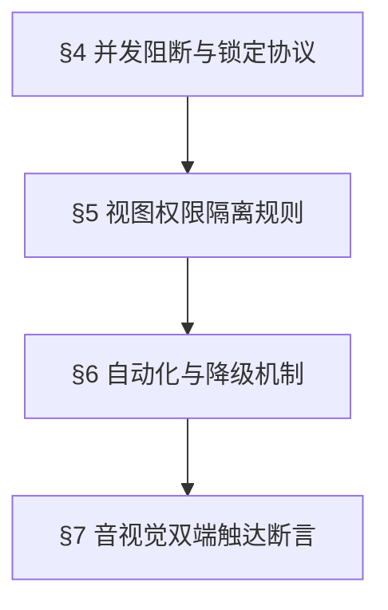

# Superpowers 规约 - 仓库环节优化问题

> 本项目继承了 `superpowers-base` 的通用测试规约（§1 Design First, §2 TDD Protocol, §3 Brainstorming），并在此基础上扩充了以下仓库 PDA 业务专属的强约束边界条件。

## 1. 业务上下文 (Project Context)

| 维度 | 描述 |
|:---|:---|
| 现状问题 | PDA 操作缺乏明确通知、反复跳转易漏单、多人并发同一单据导致数据错乱/责任不明。 |
| 解决目标 | 增强提示触达，减少不必要操作；实现并发防重与处理人独占锁定。 |
| 功能全景 | 涵盖正品录入（捆绑商品提示及详情扩充）、配货管理（新消息提醒及独占处理）、打包管理（自动打箱贴及独占处理）。 |

## 2. 规则依赖拓扑 (Mermaid Rule Dependency Graph)

> **执行约束：严禁在未通过前置规则校验的情况下执行后置规则的审计逻辑**

## 3. 领域规则 (Domain Rules)

### §4 并发阻断与锁定协议 `🔫 触发`
- **规则要求**：任何一笔配货单/装箱单，仅允许首个点击操作（配货/装箱）的账号成为“责任人”。一旦绑定，其他任何账号不得再次介入操作，且状态自动转入“配货中”或“打包中”。

### §5 视图权限隔离规则 `🔫 触发`
- **规则要求**：对于已处于“配货中”/“打包中”的单据，在 PDA 终端必须且仅对绑定的责任人可见；其他仓管员设备必须彻底隐藏该数据；电脑 PC 端需维持全局可见，且强制回显绑定的操作人，不可人为修改。

### §6 自动化与降级机制 `🔫 触发`
- **规则要求**：自动打印箱贴等自动化行为，不能阻塞核心主干流程。触发打印后若硬件异常，必须保证系统的业务状态流转不受影响。

### §7 音视觉双端触达断言 `🔫 触发`
- **规则要求**：对于异常操作（扫码捆绑件）、新任务到达（新配货单）、任务完结（装箱完毕），必须实现语音播报与界面视图（红点、气泡、弹窗）的双路并行业务触达，缺失其一即视为 Defect。

## 4. 【模块缩写配置表】

| 业务域 | 模块缩写 | 说明 |
|:---|:---|:---|
| 正品录入 | PDA-PR | 包含捆绑品拦截提示、FBA信息展示 |
| 配货模块 | PDA-AL | 包含新订单触达、配货锁定、视图隔离 |
| 打包模块 | PDA-PK | 包含自动打印、打包锁定、完结跳转与提示 |

## 5. 【测试数据画像与隔离策略】

- **极简测试集**：
  - 测试账号：至少需要 3 个隔离的 PDA 测试账号 (UserA, UserB, UserC) 及 1 个 PC 端管理员账号。
  - 测试单据：包含捆绑商品的入库单 2 个，待配货订单 3 个，待打包订单 3 个。
- **环境隔离要求**：必须支持多账号并发登录测试，确保在同一时间戳下 UserA 和 UserB 分别操作。
