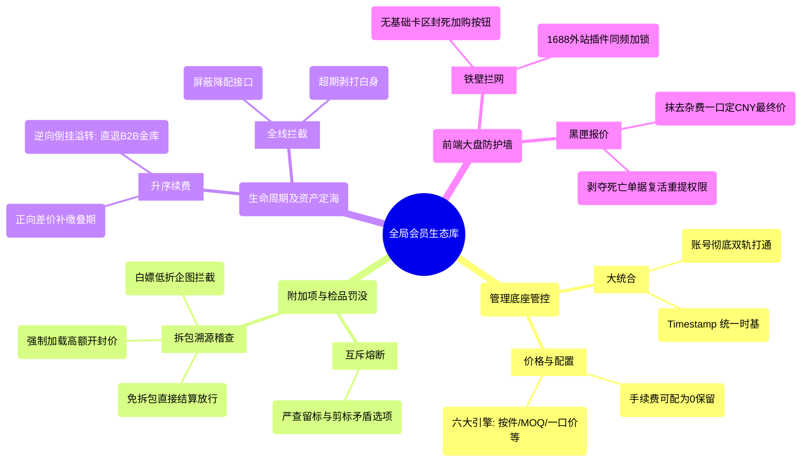
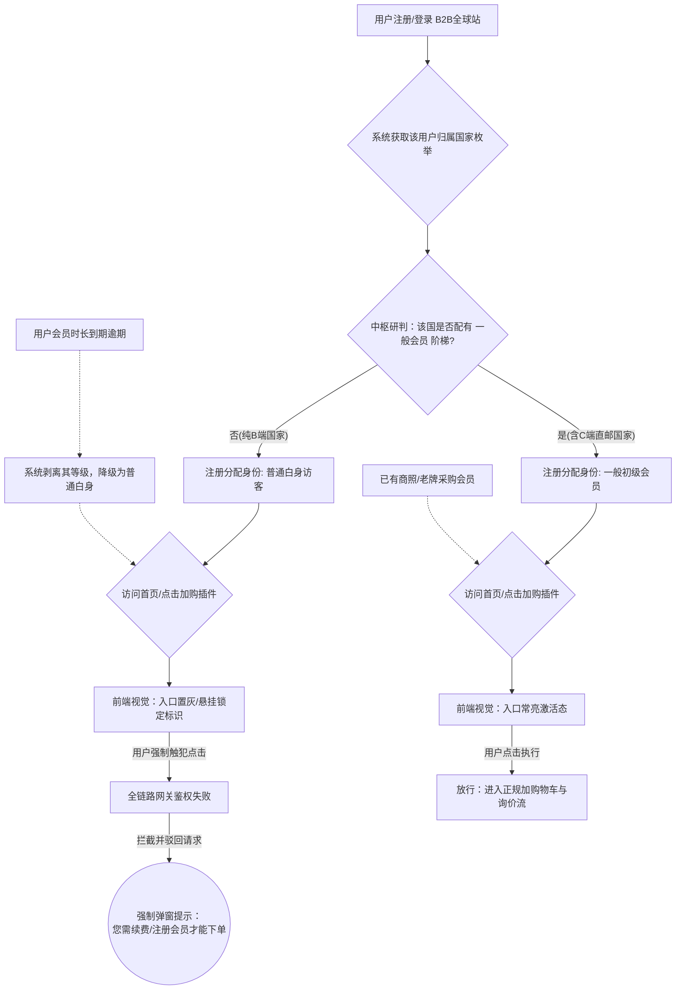
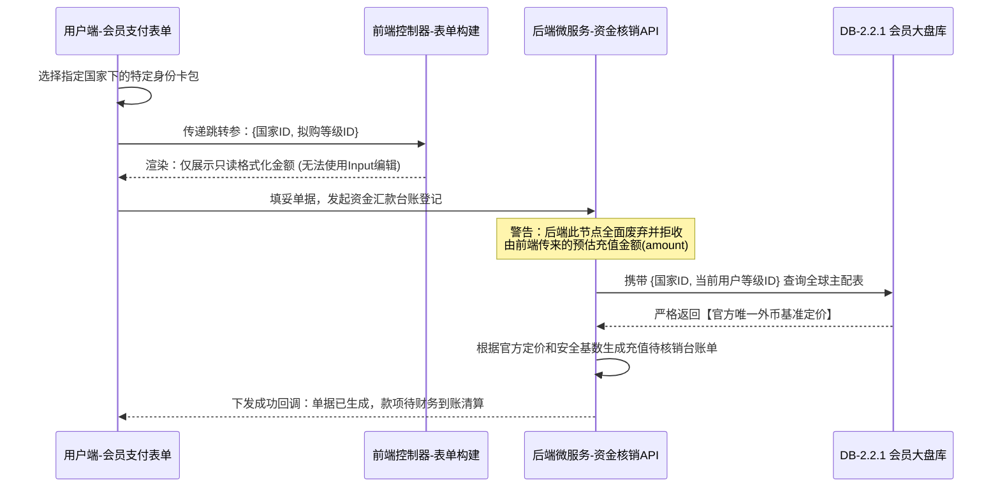
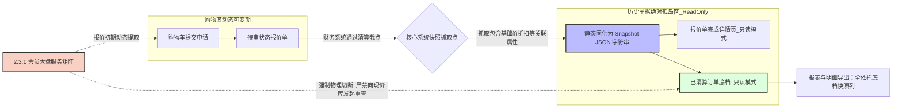
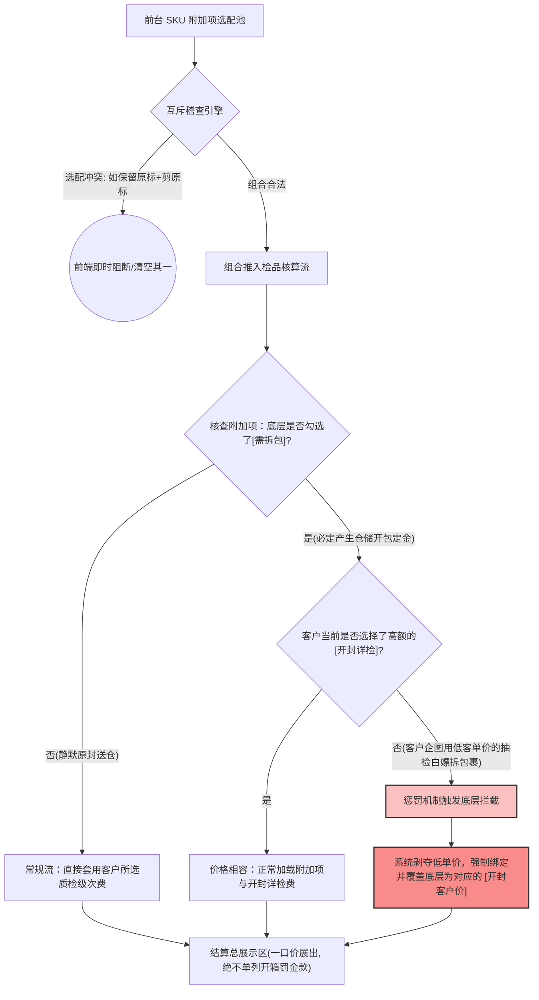
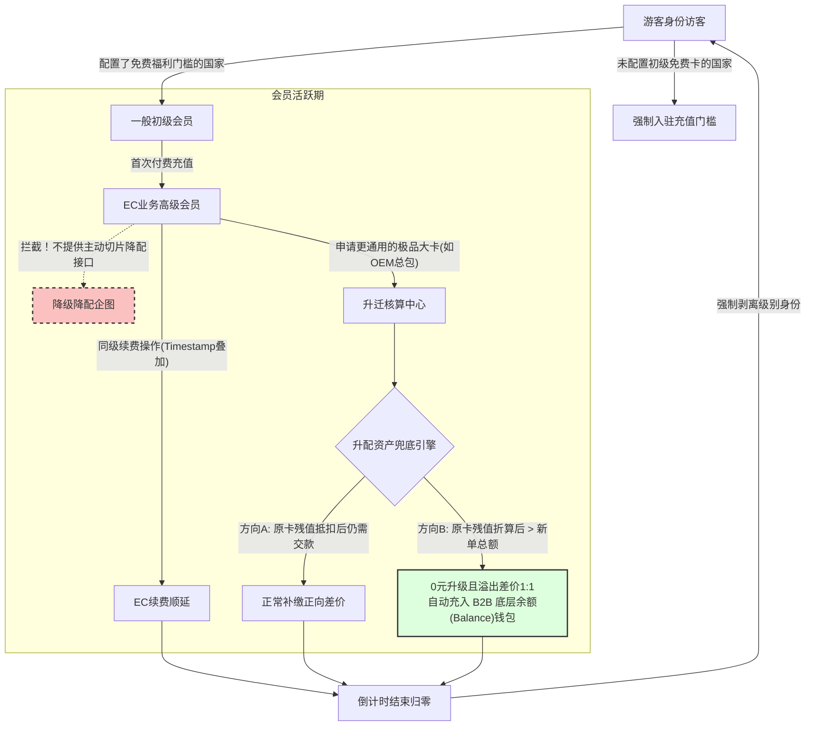

# 会员体系优化：核心架构流程图与交互链路导图

本文档基于《会员体系优化PRD》及当前 B2B/OEM 后端业务模块（`api-all`）之交互逻辑整理生成，涵盖此次架构升级的宏观架构思维导图、防越权链路图以及高等级安全支付时序图。

---

## 一、 会员体系优化全景拆解 (Mindmap)

以下思维导图全景展现了本次优化项目于管理端与用户端所切分的核心疆域及兜底法则：

---

## 二、 【越权阻击】访客/降维会员核心加购路由验证图

针对 3.0(首页核心入口) 及 3.2(1688加购插件) 等模块的越权防线判断逻辑，其在前端视觉表现与后台中间件拦截的双相协作时序：

---

## 三、 【防篡改溯源墙】汇款金额强制锁定核销流程

针对 3.1.1 `会员支付.html` 等汇款入金模块，为防御前端金额篡改攻击，保障资金汇率精确转接的核心安全逻辑：

---

## 四、 后端防串行：报价与清算单据的全生命周期定价定格标准

针对 `3.4 ~ 3.7` 从报价走向结算履约的终端状态页，对“价格”这唯一标的的强力限制框架，杜绝“改单价导致全盘历史账单翻车”的雷区：

---

## 五、 附加项售前互斥与开封检品溢价判定链路

针对 `3.3` 与 `2.0.1` 对于附加动作的售卖与强制性“开封惩罚价”核查组合拳的时序防线：

---

## 六、 会员生命周期流转与资产“防吞没”溢转机制

针对 `1.03` 与 PRD 中提及的严禁用户主动降级，以及在升级时“原卡高净值”导致抵扣出现负差价差额时的兜底流转法则：

