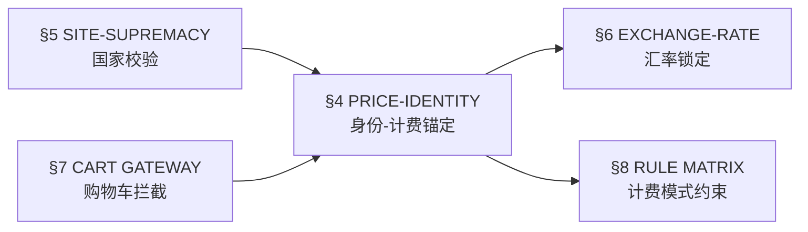

# Superpowers v2026 — 会员体系

> **继承**: 本文件继承 [superpowers-base.md](file:///D:/test_workspace/00_全局测试规约库/superpowers-base.md) 中的通用规则（§1 Design First / §2 TDD Protocol / §3 Brainstorming）。
>
> **领域审计重点（对 §3 Brainstorming 的补充）**: 针对跨国（日/韩/美）和币种转换逻辑，必须自发进行边界值审计。

---

## 规则依赖图

> Agent 在执行审计或生成用例时必须遵循以下执行顺序：

**执行约束**：严禁在未通过前置规则校验的情况下执行后置规则的审计逻辑。

---

## 4. PRICE-IDENTITY ANCHORING (身份-计费强锚定规约)
> **🔫 触发**: 附加项价格展示 | 会员等级变更 | 大客户专属价开关操作

- **Absolute Consistency (绝对一致性)**: 
  - 前台展示的附加项价格必须与该用户【当前实时】会员等级在后台配置的价格 100% 匹配。
  - 严禁出现"跨等级串价"或"缓存残留价"。

- **Dynamic State Audit (动态状态审计)**:
  - **身份变更瞬间**：用户发生升级（如一般->EC）或 VIP 到期降级时，所有附加项计费必须秒级同步刷新。
  - **拦截与回退**：若 B2B 用户会员过期，计费逻辑必须立即封锁优惠价，并触发"下单拦截"弹窗。

- **Multi-Source Verification (三方一致性校验)**:
  - 必须验证：管理端配置 (Admin) ↔ 接口返回 (API) ↔ 前端展示 (UI) 的数据链路闭环。
  - 校验精度：JPY 必须取整，USD 必须保留两位小数。

- **Priority Override (优先级覆盖)**:
  - **开关优先原则**：当用户的【大客户专属价】开关处于开启状态时，一切价格以大客户专属价为准，直接覆盖当前会员等级价，无需进行价格比较。
  - 大客户专属价开关关闭时，回退至【当前会员等级价】进行计费。
  - 若专属价开关已开启，即使当前等级的附加项开关被关闭，仍需允许该用户按专属价计费。

## 5. SITE-SUPREMACY HIERARCHY (国家维度最高优先级规约)
> **🔫 触发**: 国家/站点切换 | 跨国会员等级查询 | 币种不匹配异常

- **Hierarchical Anchor (层级锚定)**: 
  - 逻辑执行顺序必须严格遵循：[国家 Site] > [会员等级 Level] > [附加项价格 Price]。
  - 严禁"越级访问"：禁止在未校验国家合法性的情况下，直接调用等级或价格接口。

- **Domain Isolation (域隔离强制审计)**:
  - 每个国家的会员体系（包含等级名称、价格、计费模式）必须物理隔离。
  - **测试断言**：A国特有的会员等级（如日本站 VIP），在未配置该等级的B国（如韩国站）必须处于"逻辑不存在"状态，前端不得展示，后端接口必须拦截。

- **Session/Context Reset (环境重置协议)**:
  - 用户切换国家（Site Switch）时，Superpowers 必须强制审计【身份清理】过程。
  - 必须清除：旧国家的 Level 缓存、旧币种的 Price 缓存、旧国家的专属价快照。

- **Currency Cross-Check (币种硬校验)**:
  - 价格计算前必须校验：[当前 Site 币种] == [附加项配置币种]。
  - 若不匹配（例如日本站出现 USD 计价），系统必须立即触发异常中断（Abort），严禁进行任何汇率转换后的模糊计费。

## 6. EXCHANGE-RATE LOCKING (汇率锁定时间点规约)
> **🔫 触发**: 下单结算 | 入金充值 | 会员费支付 | 涉及汇率转换的任何业务

- **Order-Time Anchor (下单时刻锚定)**:
  - 汇率快照必须锁定为用户**下单/提交时刻**的当日已生效汇率，严禁以支付完成时间、审批时间或其他后置时间点的汇率进行计算。
  - **规则变更说明**：旧规则以"支付时间"为汇率锚定点，新规则已变更为以"下单/提交时间"为准，确保用户在提交瞬间即锁定汇率，不因后续支付延迟而产生汇率波动风险。

- **Snapshot Immutability (快照不可变性)**:
  - 一旦汇率快照在下单/提交时刻生成，后续任何环节（审核、支付、退款）均不得修改该快照值。
  - 跨日审核场景：用户 Day1 下单锁定汇率A，Day2 审核时即使当日汇率已变为B，系统必须使用汇率A。

- **Scope (作用范围)**:
  - 本规则适用于所有涉及汇率转换的业务场景，包括但不限于：商品下单结算、入金充值申请、会员费支付。

## 7. CART & CHECKOUT GATEWAY (结算提单拦截枢纽) *[V2新增]*
> **🔫 触发**: 购物车结算操作 | 提单请求 | 会员身份过期状态下的任何提交动作

- **Identity Access Control (购物车强身份防线)**:
  - 【结算/提单动作】被划为高度特权区，仅持有效会员身份的用户可执行。
  - 针对普通用户：系统绝不阻碍其浏览页面，但在发起最终"结算"请求时，前后端必须同步开启硬拦截，强行重定向至会员充值页。严禁底层 API 出现鉴权裸奔导致的绕过提单。

- **Graceful Degradation (拦截降级策略)** *[V2增强]*:
  - 拦截触发后，已加入购物车的商品必须保留，不得清空。
  - 重定向至会员充值页时，页面必须携带 `return_url` 参数，用户充值完成后自动回跳至购物车。
  - 拦截弹窗必须明确告知用户拦截原因（"您的会员已过期"而非通用错误）。

## 8. RULE MATRIX ENFORCEMENT (计费模式高危约束) *[V2新增]*
> **🔫 触发**: 阶梯价配置变更 | 大客户定制价录入 | 订单成交定型

- **Pricing Profit Defense (定价底线与区间防爆)**:
  - 【阶梯价】配置下，必须对"大区间价格反超小区间（价格倒推逻辑）"或"区间数量重叠交叉"进行闭环防爆拦截。
  - 【特定客制价】无论人工发起到何种离谱折扣，最终录入数字绝对不可 `≤` 内部成本底价。
  - **红标强审计法**：只要某大客被设定了私有让利价，前端展示单时必须用极度显眼的 `纯红色` 标识覆盖旧价进行越权告警展示。

- **Snapshot Finality (快照封存隔离断言)**:
  - 当订单由于成交定型后，其计费因数（原价、附加价、阶梯价组）即刻转为不可变 JSON 固化封存。
  - 后续针对老单据的查询或二次重算，只进出 Snapshot 字段读数据，彻底阻断与全球定价库的新价产生干涉碰撞。

---

## 9. 增量更新影响评估 (V2 Delta Impact)

> **本次 V2 增量更新规则变更影响面评估：**

| 影响域 | 变更内容 | 受影响模块 | 测试策略调整 | 新增用例估算 |
|--------|---------|-----------|-------------|-------------|
| 购物车核权 | 提单流程加盖身份校验 | 购物车→结算→提单 | 笛卡尔积叠加 `[是否会员]` 前置因子，重组测试脉络；验证后端 403 中间件防漏策略 | +12~15 条 |
| 复合计费 | 一口价碎裂为 `等级×服务项目` 矩阵报价（含按量、按套等异形计算法则） | 附加项价格获取全链路 | 重点打击串号、跨国越级取默认价、阶梯数组死循环 | +20~25 条 |
| 大客退款 | 入金退余机制仍在系统闭环内 | 大客户管理→退款流→金币逆入款 | 专项验证【长卡升短卡引发的大额金币逆入款流程】；验证【私定价只读快照】及【强制红标审查】 | +8~10 条 |
