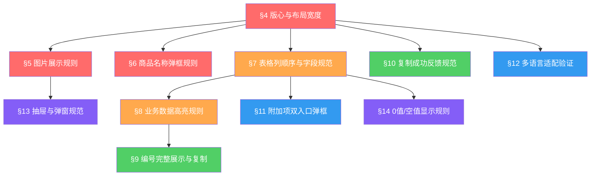

# Superpowers — 全球站用户端UI走查

> **继承声明**：本文件继承 `superpowers-base.md` 中的 §1 Design First / §2 TDD Protocol / §3 Brainstorming 三大通用协议。
> 以下领域规则从 §4 起编号，聚焦UI走查项目的视觉红线与验收约束。
> 领域审计补充：§3 Brainstorming 在本项目中重点关注多语言下布局变形、长文本处理、图片展示和0值规则的边界审计。

---

## 项目上下文

### 项目背景

| # | 改版范围 | 说明 |
|:--|:--|:--|
| 1 | 用户中心29个页面/功能模块 | 从菜单栏到账户设置的全链路UI统一 |
| 2 | 改版原则 | 只改UI（按钮/文字/悬浮/选中/弹框/抽屉），不改业务逻辑 |
| 3 | 版心范围 | 1200px-1700px；小于1350px时表格出现左右滚动条，不压缩表格 |
| 4 | 测试宽度基准 | 1366px桌面宽度 |
| 5 | 多语言覆盖 | 简体中文、英文、日文、韩文、繁体中文 |

### 功能全景

| 模块代码 | 优化点 | 页面/功能 |
|:--|:--|:--|
| UI-MENU | 01 | 菜单栏示例 |
| UI-FLOAT | 02 | WhatsApp咨询悬浮入口 |
| UI-PDETAIL | 03 | 商品详情页选中效果 |
| UI-HOME | 04 | 个人中心首页 |
| UI-QUOTE | 05 | 报价单页面 |
| UI-QDETAIL | 06 | 报价单详情页面 |
| UI-ORDER | 07 | 我的订单页面 |
| UI-ODETAIL | 08 | 订单详情页面 |
| UI-GOODS | 09 | 我的商品页面 |
| UI-QC | 10 | 问题确认页面 |
| UI-REPORT | 11 | 测量报告页面 |
| UI-NOTIFY | 12 | 系统通知页面 |
| UI-WH | 13 | 我的仓库页面 |
| UI-SHIP | 14 | 确认发货页面 |
| UI-INTL | 15 | 国际配送页面 |
| UI-INTLD | 16 | 国际配送详情页面 |
| UI-INTLP | 17 | 国际配送待审核详情页面 |
| UI-FUND | 18 | 资金管理页面 |
| UI-REMIT | 19 | 余额汇款页面 |
| UI-WDRAW | 20 | 余额提现页面 |
| UI-RECORD | 21 | 提现记录/充值记录页面 |
| UI-CART | 22 | 购物车页面 |
| UI-LGCS | 23 | 购物车物流方式选择 |
| UI-ADDON | 24 | 附加项管理/番号管理/贴纸/洗标/FBA |
| UI-FAV | 25 | 收藏商品页面 |
| UI-FAVS | 26 | 收藏店铺页面 |
| UI-ACCT | 27 | 账户设置页面 |
| UI-SEC | 28 | 账号安全/我的地址 |
| UI-EN | 29 | 英文版优化内容 |
| UI-CMN | -- | 通用规则（贯穿所有模块）|

---

## 规则依赖图

---

## §4 版心与布局宽度（最高优先级）

> **红线规则**：所有验收必须在 **1366px** 桌面宽度下执行，不得出现页面级横向滚动。

- **R4.1** 版心范围 1200px-1700px，页面主体内容不得超出版心溢出。
- **R4.2** 页面宽度 ≥1350px 时，表格正常展示；小于1350px 时，表格出现左右滚动条，不压缩表格内容。
- **R4.3** 底部固定操作栏（汇总、提交发货单、核对确认等）始终吸附在视口底部，不遮挡最后一行数据。
- **R4.4** 左侧菜单栏展开/收起时，主内容区不抖动，版心自适应变化。
- **R4.5** 独立滚动区域：仅列表区域独立滚动，页面整体不随表格内容滚动（如我的仓库、我的商品）。

---

## §5 图片展示规则

> **红线规则**：所有业务图片（头像除外）必须支持悬停放大，点击进入预览，图片使用 contain 不裁切。

- **R5.1** 单SKU商品图：72×72 px，contain展示，图片列内水平垂直居中。
- **R5.2** 多SKU图片规则（列表）：
  - 1个SKU：单张 72×72
  - 2个SKU：2张 36×72（左右排列）
  - ≥3个SKU：最多3张 24×72；整体视觉尺寸与单图一致，**不使用 `+N` 更多标识**
- **R5.3** 悬停/聚焦放大预览：图片悬停时显示 180×180 放大预览；放大预览不被容器裁切；最后一行图片放大后不被底部固定栏遮挡。
- **R5.4** 图片加载失败时显示统一占位符（72×72），不影响行高和列宽。
- **R5.5** 报价单/订单详情页商品图：固定 72×72，悬停显示放大预览，点击可进入预览弹层。

---

## §6 商品名称弹框规则

> **红线规则**：所有包含商品名称的页面，超出列宽时必须省略展示，hover/选中/聚焦时弹框显示完整名称。

- **R6.1** 触发方式：鼠标悬停、鼠标选中文本、键盘聚焦三种方式均可触发完整名称弹框。
- **R6.2** 弹框约束：弹框显示在当前商品名称附近，不被表格边界裁切，不遮挡右侧操作列或关键操作入口。
- **R6.3** 布局约束：弹框触发时，不改变当前行高、列宽、卡片高度或操作列位置。
- **R6.4** 不叠加浏览器原生提示：自定义弹框与浏览器 `title` 属性原生提示不得同时出现。
- **R6.5** 同类规则适用范围：附加项名称、店铺名称、地址长文本等超长文本遵循相同规则。

---

## §7 表格列顺序与字段规范

> **红线规则**：各页面表格列顺序必须与PRD截图一致，不得自定义调整列顺序或合并列。

| 页面 | 列顺序 |
|:--|:--|
| 报价单列表 | 勾选框 / 图片 / 报价单信息 / 商品数据 / 费用数据 / 支付/交易(CNY) / 操作 |
| 报价单详情明细 | 图片 / 商品信息 / 编号管理 / 价格(CNY) / 备注 / 备注图像 / 附加项 |
| 我的订单 | 图片 / 订单信息 / 商品数据 / 质检数据 / 仓库数据 / 交易 / 操作 |
| 订单详情/我的商品 | 图片 / 商品信息 / 编号管理 / 价格(CNY) / 商品数据 / 质检数据 / 仓库数据 / 备注 / 附加项 |
| 问题确认 | 图片 / 商品 / 编号管理 / 规格 / 价格(CNY) / 商品数据 / 质检数据 / 问题数据 / 操作 |
| 我的仓库 | 复选框 / 图片 / 商品信息 / 编号管理 / 价格(CNY) / 入库时间 / 备注 / 操作 |
| 购物车物流方式选择 | 图片 / 商品 / 编号管理 / 商品费用(CNY) / 备注 / 备注图像 / 附加项 |
| 国际配送详情发货商品 | 图片 / 商品信息 / 编号管理 / 箱号 / 商品费用(CNY) / 备注 / 操作 |

- **R7.1** 规格列禁止单独出现：颜色、尺码、型号等规格信息必须合并到商品信息列，不单独成列（部分页面如问题确认例外，已在PRD中明确）。
- **R7.2** 状态字段归属：状态标签放在商品信息列，不放在价格列。
- **R7.3** ID字段命名：商品编号字段统一命名为"ID"（不使用"商品编号""编号"等），编号管理列展示 MySKU / ASIN / FNSKU。
- **R7.4** 编号管理列独立：MySKU、ASIN、FNSKU 不与商品信息列混排，单独占一列，顶部与商品名称第一行对齐。

---

## §8 业务数据高亮规则

> **红线规则**：变动数量和不良数高亮必须与参考截图完全一致。

- **R8.1** 下单数量变动时：原"下单数"保留**灰色删除线**；新增"变动数量"字段，整行使用**浅红底 + 红色文字**高亮。
- **R8.2** 不良数 >0 时："不良数:"标签和数量整行使用**浅红底 + 红色文字**高亮；无值或0值显示 `--` 并保持普通样式。
- **R8.3** 问题数据列：展示浅红底和红色文字，数量完整显示，不被列宽裁切。
- **R8.4** 金额高亮规则：
  - 支付/交易金额（报价单、资金管理等）：`#B4272B` 红色加粗
  - 待付款状态：红色胶囊；付款截止时间：红色文字
  - 报价金额（详情页）：红色强调
  - 底部汇总商品金额：红色强调
- **R8.5** 报价单类型只允许展示 `自动报价单` 或 `委托负责人报价`，不展示其他类型。

---

## §9 编号完整展示与复制

> **红线规则**：所有业务编号（订单号、报价单号、物流号等）优先完整展示，不得截断或省略号显示。

- **R9.1** 编号文字可点击：直接点击编号文字即可触发复制，无需点击旁边图标。
- **R9.2** 复制图标同效：复制图标点击效果与文字点击效果完全一致。
- **R9.3** 收银台弹窗中的报价单编号：完整展示，不截断。
- **R9.4** 菜单栏文字：完整展示，不出现省略号（如"B2B代行管理"不得显示为"B2B代行..."）。

---

## §10 复制成功反馈规范

> **红线规则**：复制成功提示必须统一，不得使用"已复制"或英文提示。

- **R10.1** 提示文案：统一为 **"复制成功"**。
- **R10.2** 提示位置：居中展示（页面中间）。
- **R10.3** 提示样式：浅绿色底、绿色文字、绿色圆形勾选图标（✓）。
- **R10.4** 同一次复制只出现一个提示，不叠加多个提示。
- **R10.5** 提示自动消失：不需要用户手动关闭。

---

## §11 附加项双入口弹框规则

> **红线规则**：附加项列必须同时展示"全数详细"和数量入口两个按钮。

- **R11.1** 布局：上方紫色"全数详细"按钮 + 下方灰色"N附加项"按钮，两按钮宽度一致，在单元格内水平垂直居中。
- **R11.2** 弹框类型：附加项弹框为跟随弹框（不使用整页遮罩），显示在点击按钮附近。
- **R11.3** 弹框内容：检品种类、数量、单价、小计(CNY)和底部合计。
- **R11.4** 弹框内对齐：检品种类、数量、单价、小计列内容居中；小计金额使用红色强调。
- **R11.5** 关闭方式：点击外部、关闭按钮或 Esc 均可关闭。
- **R11.6** 超出10条时：弹框内部滚动，不拉高页面，不遮挡右侧操作列。

---

## §12 多语言适配验证

> **覆盖语言**：简体中文 / 英文 / 日文 / 韩文 / 繁体中文

- **R12.1** 菜单栏多语言：切换到英文后，菜单文字仍完整展示，长文案可换行不截断。
- **R12.2** 英文优化文案必须按PRD第29章对照表执行（如 `B2B Control`、`Optional Services` 等）。
- **R12.3** 修正错误币种缩写：`CYN` 必须更正为 `CNY`，所有金额字段不再出现错误缩写。
- **R12.4** 英文文案不得造成按钮、Tab、表头或服务卡片文字溢出或截断。
- **R12.5** 缺少翻译时优先回退英文，不展示翻译键名（如 `i18n.menu.xxxx`）。

---

## §13 抽屉与弹窗规范

- **R13.1** 抽屉打开时：左侧主页面保留半透明遮罩，用户仍能识别上下文。
- **R13.2** 抽屉关闭方式：关闭按钮 / 遮罩点击 / Esc 均可关闭。
- **R13.3** 物流选择抽屉：初始不默认选中任何物流方式；点击卡片后才显示选中态（红色描边+折角）。
- **R13.4** 能力标签过滤：物流选择抽屉中不展示"粉末""超大""FBA/RSL/ZOZO"标签。
- **R13.5** 物流方式排序：空运分组（EMS→流通王→海源-DG→OCS）在前，船运分组（邮政船运→海源-DQ）在后。
- **R13.6** 确认弹框：删除/取消配送等破坏性操作必须弹出二次确认；弹框居中白色，文案和按钮按PRD规定。
- **R13.7** aria-expanded 语义：WhatsApp悬浮卡片展开时设置 `aria-expanded="true"`，收起时恢复 `false`。

---

## §14 零值/空值显示规则

> **红线规则**：0值和空值的展示规则必须全站统一。

- **R14.1** 费用类字段为0时：显示 `--`（如商品金额0.00→显示`--`，避免无效金额干扰）。
- **R14.2** 数量类字段为0时：显示 `--`（如下单数、购入数等数量字段）。
- **R14.3** 编号管理字段缺失时（MySKU/ASIN/FNSKU无值）：显示 `--`。
- **R14.4** 装箱/出货混合格式：如"装箱/出货"为空时显示 `--/2`，在库数为空显示 `--`。
- **R14.5** 业务数据字段只展示有数据的项：数据为0时展示`--`，不展示裸数字0（我的订单页）。

---

## 高危场景清单

以下场景为历次UI项目高频失分点，走查时必须重点覆盖：

| 高危等级 | 场景描述 | 关联规则 |
|:--|:--|:--|
| 🔴 最高 | 菜单文字出现省略号截断 | R9.4 |
| 🔴 最高 | 多SKU图片使用`+N`展示 | R5.2 |
| 🔴 最高 | 1366px下出现页面横向滚动 | R4.2 |
| 🔴 最高 | 报价单类型展示了非法值 | R8.5 |
| 🔴 最高 | 英文版CYN未改正为CNY | R12.3 |
| 🟠 高 | 商品名称弹框被表格裁切 | R6.2 |
| 🟠 高 | 复制提示文案不统一 | R10.1 |
| 🟠 高 | 附加项弹框使用全屏遮罩 | R11.2 |
| 🟠 高 | 物流选择抽屉默认选中某物流 | R13.3 |
| 🟠 高 | 不良数为0时仍显示高亮 | R8.2 |
| 🟡 中 | 图片放大预览遮挡最后一行 | R5.3 |
| 🟡 中 | 规格列单独存在（应并入商品信息）| R7.1 |
| 🟡 中 | 0值显示裸数字0而非`--` | R14.1 |
| 🟡 中 | 二次确认弹框文案不符合PRD | R13.6 |
