# 全球站 B2B 性能压测结果汇总报告

- 报告日期：2026-06-15
- 测试对象：全球站 B2B 核心接口链路（main 预发布环境）
- 测试工具：Locust（入口脚本 `locustfile_api.py`，接口压测）
- 汇总来源：
  - 10 分钟：`stress_main_47r_53v_10m_20260615_140935.html`
  - 30 分钟：`stress_main_47r_53v_30m_20260615_143954.html`
- 编制：测试组

---

## 一、报告摘要

本次在 main 环境对 B2B 核心接口链路进行两轮压测：**10 分钟基准压测** + **30 分钟稳定性压测**，用户模型均为 47 真实账号 + 53 虚拟访客 = **100 并发用户**。

| 轮次 | 总请求 | 失败 | 失败率 | RPS | 平均响应 | P95 | 结论 |
|:--|--:|--:|--:|--:|--:|--:|:--|
| 10min | 58,088 | 74 | 0.127% | 96.6 | 417ms | 1200ms | 附条件通过 |
| 30min | 173,085 | 227 | 0.131% | 100.5 | 439ms | 1300ms | 附条件通过 |

**服务端资源（30min 窗口）**：
- **ECS 应用节点**：CPU（宿主机）**40–45%**、CPU（OS 均值）**~50%**（峰值 **~78%**）、内存 **~43%** 稳定、负载峰值 **~4.3**；详见第六节。
- **PolarDB/RDS 主节点**：CPU **30–35%**、QPS **~1500**、活跃连接 **~6**/s；详见第六节。

**综合发布结论：附条件通过。**

- 两轮失败率均约 **0.13%**，远低于 1% 阈值；30 分钟长跑 RPS、错误率、响应时间无明显衰减，系统稳定性达标。
- 预热登录 **0 失败**（已剔除 main 登录异常 mock 账号 `performance_test_003`）。
- **本轮共 3 类接口出现失败**（详见第五节「失败接口清单」）：

| 优先级 | 压测统计名 | API 路径 | 30min 失败 | 错误码 |
|:--|:--|:--|--:|:--|
| 🔴 P1 | 商品加购_1688 | `POST /api_b2b/cart/add1688` | 167 / 8,820（1.89%） | code=500（163）、40000（4） |
| 🟡 P2 | 关键词浏览_taobao | `POST /api_tb/product/keyword` | 23 / 21,010（0.11%） | code=40000 |
| 🟡 P2 | 虚拟用户关键词查询_taobao | `POST /api_tb/product/keyword` | 37 / 27,938（0.13%） | code=40000（36）、-1（1） |

- 其余 **11 类接口/任务均为 0 失败**（含登录、1688 关键词/图搜/详情、购物车、提交报价单等）。
- 另需跟进：商品详情_1688 偏慢（非失败项）、淘宝详情/加购链路未覆盖（脚本侧待优化）。

---

## 二、测试环境与场景（两轮一致）

| 项目 | 配置 |
|:--|:--|
| 环境 | main 预发布（`https://main-api.hubbuyer.com`） |
| 压测工具 | Locust，分层加载（真实账号 + 虚拟访客） |
| 入口脚本 | `locustfile_api.py`（仅接口检查项，不含 UI 页面） |
| 用户模型 | 47 真实账号用户 + 53 虚拟访客 = 100 并发用户 |
| 账号池 | main 压测账号池（已排除 `performance_test_003`） |

**链路覆盖**：
- 真实账号：登录刷新、图搜浏览、关键词搜索（1688/淘宝）、商品详情、加购、购物车列表、提交报价单。
- 虚拟访客：关键词搜索（1688/淘宝）。

---

## 三、两轮整体结果对比

| 指标 | 10min | 30min | 说明 |
|:--|:--|:--|:--|
| 运行时长 | 10 分 01 秒 | 30 分 01 秒 | — |
| 总请求数 | 58,088 | 173,085 | 30min 约为 10min 的 3 倍 |
| 失败数 | 74 | 227 | — |
| 失败率 | 0.127% | 0.131% | 基本持平 ✅ |
| 平均 RPS | 96.6 | 100.5 | 稳定，无衰减 ✅ |
| 平均响应 | 417ms | 439ms | 略升，可接受 |
| P50 | 340ms | 360ms | 良好 |
| P95 | 1200ms | 1300ms | 略升 |
| P99 | — | 1600ms | — |
| 最大响应 | 3272ms | 5317ms | 长尾偶发尖刺 ⚠️ |
| 登录 [预热] | 46 次 / 0 失败 | 46 次 / 0 失败 | 问题已闭环 ✅ |

---

## 四、核心接口表现（30min 明细，10min 趋势一致）

| 接口 / 任务 | 30min 请求 | 30min 失败 | 平均(ms) | P95(ms) | P99(ms) | Max(ms) |
|:--|--:|--:|--:|--:|--:|--:|
| 图搜浏览 | 33,571 | 0 | 293 | 650 | 1300 | 2834 |
| 虚拟用户关键词查询_1688 | 27,938 | 0 | 311 | 670 | 1300 | 5005 |
| 虚拟用户关键词查询_taobao | 27,938 | 37 | 521 | 860 | 1500 | 3164 |
| 关键词浏览_1688 | 25,580 | 0 | 299 | 660 | 1300 | 4866 |
| 关键词浏览_taobao | 21,010 | 23 | 511 | 860 | 1500 | 5317 |
| **商品详情_1688** | 8,823 | 0 | **1327** | **1900** | **2400** | 5199 |
| 商品加购_1688 | 8,820 | 167+4 | 495 | 920 | 1500 | 5236 |
| 购物车列表（合计） | 12,541 | 0 | ~487 | ~1300 | ~1600 | 3060 |
| 提交报价单 | 2,265 | 0 | 682 | 1300 | 1900 | 2403 |
| 登录刷新 | 2,288 | 0 | 368 | 660 | 1400 | 2950 |
| 登录 [预热] | 46 | 0 | 249 | 310 | 340 | 342 |

**两轮均未出现**：`商品详情_taobao`、`商品加购_taobao`（见第六节覆盖盲区说明）。

---

## 五、失败接口清单（重点）

> 环境域名：`https://main-api.hubbuyer.com`  
> 以下仅列出**压测中出现失败的接口**；未列出的接口两轮均为 **0 失败**。

### 5.1 失败接口总表

| 优先级 | 压测统计名 | 方法 | API 路径 | 10min 失败/请求 | 10min 失败率 | 30min 失败/请求 | 30min 失败率 | 错误信息 | 责任方 |
|:--|:--|:--|:--|:--|:--|:--|:--|:--|:--|
| 🔴 **P1** | **商品加购_1688** | POST | **`/api_b2b/cart/add1688`** | 51 / 3,012 | **1.69%** | 167 / 8,820 | **1.89%** | `code期望200,实际500`（主）；`code期望200,实际40000`（极少） | 后端 |
| 🟡 P2 | 关键词浏览_taobao | POST | `/api_tb/product/keyword` | 10 / 7,089 | 0.14% | 23 / 21,010 | 0.11% | `code期望200,实际40000` | 上游/采集 |
| 🟡 P2 | 虚拟用户关键词查询_taobao | POST | `/api_tb/product/keyword` | 13 / 8,876 | 0.15% | 37 / 27,938 | 0.13% | `code期望200,实际40000`（主）；`code期望200,实际-1`（1 次） | 上游/采集 |

**两轮失败合计**：74（10min）+ 227（30min）= **301 次**，其中 **加购_1688 占 ~94%**（214 次）。

### 5.2 失败接口明细说明

#### 🔴 P1：商品加购_1688 — `POST /api_b2b/cart/add1688`

| 项目 | 内容 |
|:--|:--|
| 完整 URL | `https://main-api.hubbuyer.com/api_b2b/cart/add1688` |
| 触发任务 | `browse_add_cart`（权重 3）、`browse_add_cart_submit_order`（权重 1） |
| 前置链路 | 1688 关键词搜索 → 1688 商品详情 → 拼 payload → **加购**（前置步骤均 0 失败） |
| 失败表现 | HTTP 200，响应体 `code=500`，`msg`: **`Undefined array key "price"`** |
| **根因（已复现）** | 部分 1688 商品详情 SKU **无 `price` 字段**（仅有 `consignPrice` / `fenxiaoPriceInfo`）；压测随机选中后，后端 `DetailService::getBuyPriceSkuInfo()`（`DetailService.php:234`）直接读 `$sku['price']` 触发 PHP ErrorException → 返回 code=500 |
| 失败样例 | `item_id=758501247949`，16/16 个 SKU 均无 `price`；成功商品（如 `732934777093`）SKU 含 `price: 17.0` |
| 10min | 51 次失败 / 3,012 请求，失败率 1.69% |
| 30min | 163 次 code=500 + 4 次 code=40000 / 8,820 请求，失败率 1.89% |
| 影响 | 用户对该类 1688 商品加购失败（关键写入链路） |
| 后端修复 | **P1 缺陷单**：`DetailService.php:234` 对 `price` 做空值兜底，回退 `consignPrice` / `fenxiaoPriceInfo` 等 |
| 脚本规避 | 已在 `_build_add_cart_payload_from_detail` 中跳过无 `price` 的 1688 SKU，换下一 SKU/商品，降低压测误报 |

#### 🟡 P2：淘宝关键词搜索 — `POST /api_tb/product/keyword`

| 项目 | 内容 |
|:--|:--|
| 完整 URL | `https://main-api.hubbuyer.com/api_tb/product/keyword` |
| 涉及统计名 | `关键词浏览_taobao`（真实账号）、`虚拟用户关键词查询_taobao`（虚拟访客） |
| 失败表现 | HTTP 200，响应体 `code=40000` |
| 10min 合计 | 23 次 / 15,965 请求，失败率 ~0.14% |
| 30min 合计 | 60 次 / 48,948 请求，失败率 ~0.12% |
| 对比 | 1688 关键词 `/api_ali/product/keyword`、图搜 **均为 0 失败** |
| 判定 | 淘宝上游采集/风控偶发限制，非 main 环境或脚本问题 |
| 建议 | 与采集/上游确认 40000 触发条件；评估重试或降级 |

### 5.3 零失败接口清单（两轮均通过）

以下接口在 10min / 30min 两轮压测中**失败数均为 0**：

| 压测统计名 | 方法 | API 路径 |
|:--|:--|:--|
| 登录 [预热] / 登录刷新 | POST | `/api/login/login` |
| 图搜浏览 | POST | `/api_ali/product/keyword`（带 image_url） |
| 关键词浏览_1688 | POST | `/api_ali/product/keyword` |
| 虚拟用户关键词查询_1688 | POST | `/api_ali/product/keyword` |
| 商品详情_1688 | POST | `/api_ali/product/detail` |
| 购物车列表 [加购确认/加购后/下单前] | POST | `/api_b2b/cart/list` |
| 提交报价单 | POST | `/api_b2b/quote/create` |

---

## 六、阿里云服务端监控（30min 压测窗口）

> **数据来源**：阿里云控制台监控截图（2026-06-15）  
> **对齐压测**：`stress_main_47r_53v_30m_20260615_143954`（Locust 启动 **14:39:54**，结束 **~15:09:54**）  
> **覆盖范围**：**ECS 应用节点**（API 服务器）+ **PolarDB/RDS 主节点**（数据库）  
> **说明**：10min 压测（14:09 起）不在截图时间窗内，服务端指标仅覆盖 **30min 稳定性轮次**。

### 6.1 监控时间轴对齐

| 时段 | 时间（本地） | 现象 | 对应压测 |
|:--|:--|:--|:--|
| 压测前基线 | 14:30 – 14:39 | ECS / RDS 均为低负载 | 30min 压测尚未启动 |
| **压测窗口** | **14:40 – 15:10** | ECS + RDS 指标同步抬升并维持平台 | **30min 接口压测（100 并发）** |
| 压测后恢复 | 15:10 – 15:36 | 指标回落至基线 | 压测结束 |

ECS 与 RDS 曲线均在 **14:40–14:42 陡升、15:10–15:12 陡降**，与 Locust 30min 运行窗口 **高度吻合**。

### 6.2 PolarDB/RDS 主节点（`pi-i6c3032186s7752l5`）

| 指标 | 压测前基线 | 30min 压测期 | 峰值 | 计划书标准 | 判定 |
|:--|:--|:--|:--|:--|:--|
| **CPU 使用率** | ~5–6% | **30–35%**（平台期平稳） | **~35%** | ≤ 80% | ✅ 未饱和 |
| **内存使用率** | ~70%（常驻） | **~70–75%**（无明显抬升） | — | — | ✅ 稳定，非压测引起 |
| **QPS** | ~150–250 | **~1450–1650** | **~1650** | — | ✅ 无衰减 |
| **活跃连接数**/s | ~3.5 | **~5.5–6.5** | **~6.5** | 无连接池耗尽 | ✅ 低位稳定 |
| **TPS** | ~0 | **~7.0–8.0** | **~8.0** | — | ✅ 稳定 |
| **MPS** | ~0 | **~150–165** | **~165** | — | ✅ 稳定 |

### 6.3 ECS 应用节点（API 服务器）

| 类别 | 指标 | 压测前基线 | 30min 压测期 | 峰值 | 计划书标准 | 判定 |
|:--|:--|:--|:--|:--|:--|:--|
| **计算** | CPU（宿主机视角） | ~0–2% | **40–45%** | **~47%**（15:00） | ≤ 80% | ✅ 余量充足 |
| **计算** | CPU（操作系统视角，均值） | ~0% | **~50%** | **~78%**（14:45 瞬时） | ≤ 80% | ⚠️ 均值达标，瞬时峰值接近阈值 |
| **计算** | 内存使用率 | ~40% | **42–44%**（全程平坦） | **~44%** | — | ✅ 无泄漏、无抬升 |
| **计算** | 系统平均负载（1min） | ~0 | **~2.5–3.5** | **~4.3**（14:53） | — | ⚠️ 峰值接近 4 核满载（推测 4C） |
| **网络** | 公网流入带宽 | ~0 | **~41–45 Mbps** | **~45 Mbps** | — | ✅ 未触顶 |
| **网络** | 公网流出带宽 | ~0 | **~10 Mbps** | — | — | ✅ 稳定 |
| **网络** | 公网流出带宽使用率 | ~0 | **~9–10.5%** | **~10.5%** | — | ✅ 带宽充裕 |
| **网络** | 内网流入带宽 | ~0 | **~260–275 Mbps** | **~286 Mbps** | — | ✅ 访问 DB/内网服务正常 |
| **网络** | 内网流出带宽 | ~0 | **~20–30 Mbps** | — | — | ✅ 稳定 |
| **磁盘** | 写入 BPS | ~0 | **~9.5–10.5 MB/s** | **~10.5 MB/s** | — | ✅ 以写日志为主 |
| **磁盘** | 读取 BPS | ~0 | **~0** | — | — | ✅ 只读近零 |
| **磁盘** | 写入 IOPS | ~0 | **~680–720**/s | **~720**/s | — | ✅ 未触顶 |
| **磁盘** | 读取 IOPS | ~0 | **~0** | — | — | ✅ |
| **连接** | 同时连接数 | ~10 万 | **~38–42 万** | **~42.5 万** | — | ℹ️ 含长连接/SLB 累计，≠ Locust 并发数 |

**ECS 30 分钟稳定性结论**：CPU（宿主机）、内存、网络、磁盘在压测全周期均维持**平坦平台**，无随时间漂移；OS 视角 CPU 瞬时峰值可达 **~78%**，为当前负载下需关注的**最先逼近阈值**的指标。

### 6.4 全链路对照（Locust + ECS + RDS）

| 观测维度 | Locust（压测端） | ECS（应用层） | RDS（数据库层） | 解读 |
|:--|:--|:--|:--|:--|
| 吞吐 | RPS **100.5** | 公网入 **~43 Mbps** | QPS **~1500** | 每 API ≈ **15 次 DB 访问**；内网入 **~270 Mbps** 反映 DB/内部调用流量 |
| 稳定性 | RPS / 失败率 30min 无衰减 | CPU / 内存 / 网络平台期平坦 | QPS / CPU 平台期平坦 | 三层稳定性一致 ✅ |
| CPU | — | 宿主机 **~42%**，OS 均值 **~50%** | **~33%** | **ECS 先于 RDS 承压**（应用层 CPU 占比更高） |
| 内存 | — | **~43%** 无变化 | **~70%** 常驻 | 均无内存泄漏迹象 ✅ |
| 瓶颈信号 | 227 次业务失败 | OS CPU 瞬时 **~78%**、负载 **~4.3** | CPU 仅 **~35%** | 失败为业务/上游问题；容量上 **ECS 比 RDS 更早触顶** |
| 磁盘/网络 | — | 写 IOPS **~700**、写 **~10 MB/s** | — | 日志写入为主，非瓶颈 ✅ |

### 6.5 容量粗估（线性外推，仅供参考）

| 项目 | ECS（宿主机 CPU） | ECS（OS CPU 均值） | RDS（DB CPU） | 说明 |
|:--|:--|:--|:--|:--|
| 本轮负载 | 100 并发 ≈ **100 RPS** | 同左 | 同左 | Locust 实测 |
| 本轮 CPU | **~42%** | **~50%** | **~33%** | 监控平台期 |
| 线性外推@80% CPU | **~190 RPS** | **~160 RPS** | **~240 RPS** | 未计缓存/优化/扩容 |
| 计划书目标 645 RPS | 外推 **~270%** | 外推 **~322%** | 外推 **~215%** | **均不可直接达标** |

**结论**：
1. 100 并发下 **ECS 与 RDS 均有剩余容量**，但 **ECS OS 视角 CPU（均值 ~50%、峰值 ~78%）先于 RDS（~35%）成为更紧约束**。
2. 距计划书 **645 RPS** 目标约 **6.5 倍**差距，需 **200 → 500 → 1000** 阶梯压测；同时关注 ECS CPU 瞬时峰值与系统负载。
3. 磁盘、公网/内网带宽、内存均非当前瓶颈。

### 6.6 PolarDB/RDS 监控截图

| 指标 | 截图 |
|:--|:--|
| CPU 使用率 | 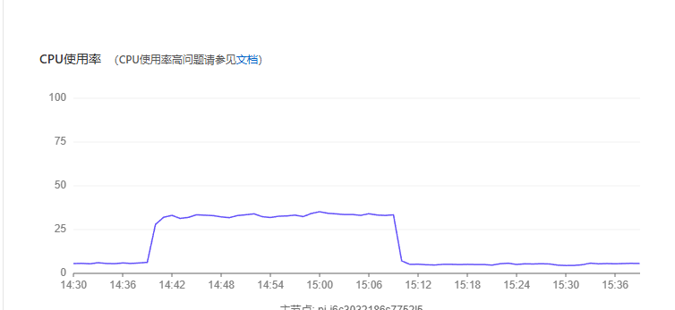 |
| 活跃连接数 | 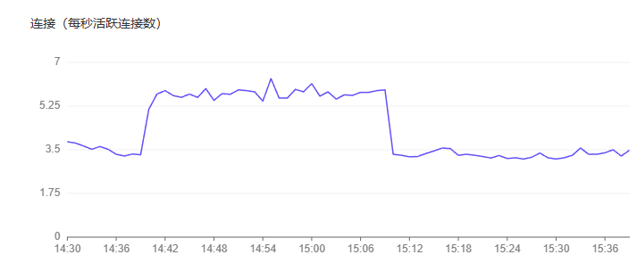 |
| QPS | 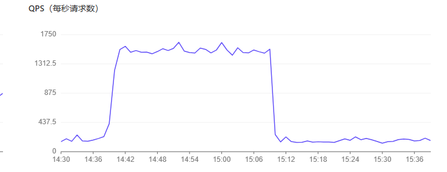 |
| TPS | 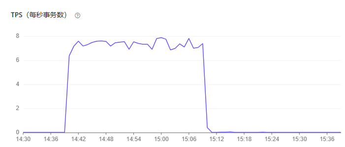 |
| MPS | 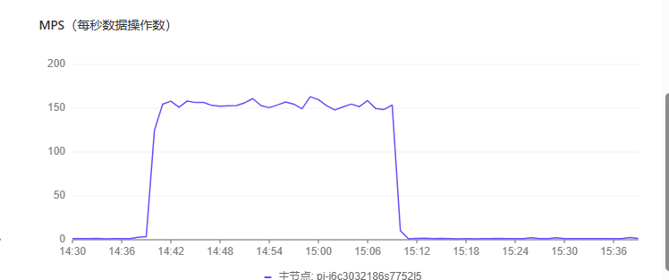 |

### 6.7 ECS 监控截图

| 指标 | 截图 |
|:--|:--|
| CPU（宿主机视角） | 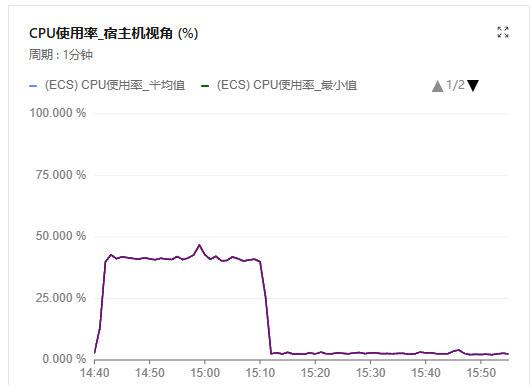 |
| CPU（操作系统视角） | 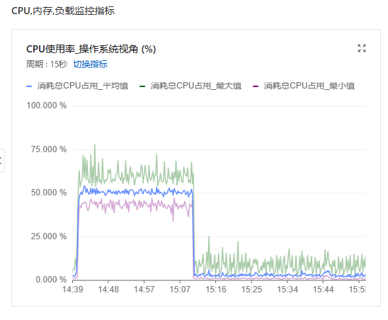 |
| 内存使用率 | 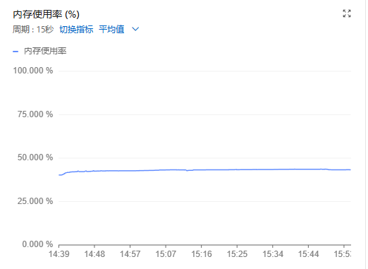 |
| 系统平均负载 | 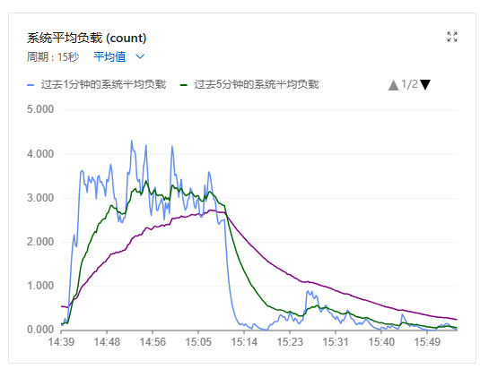 |
| 内网带宽 | 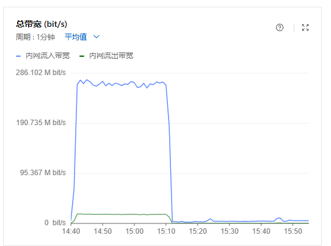 |
| 公网带宽 | 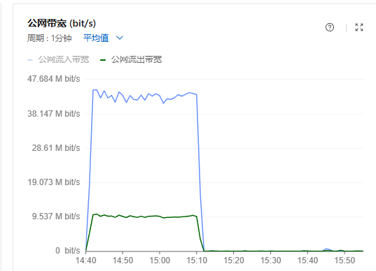 |
| 公网流出带宽使用率 | 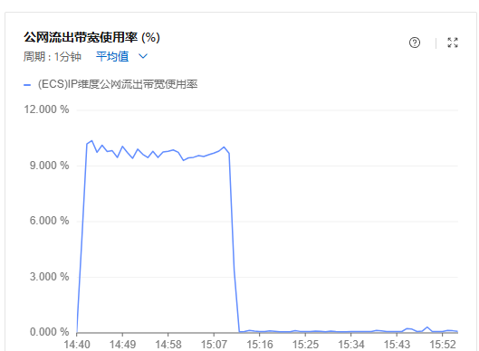 |
| 磁盘 BPS | 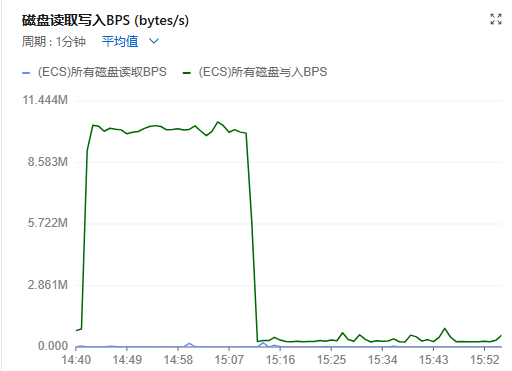 |
| 磁盘 IOPS | 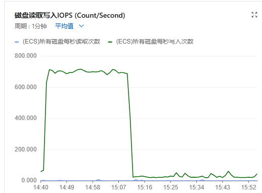 |
| 同时连接数 | 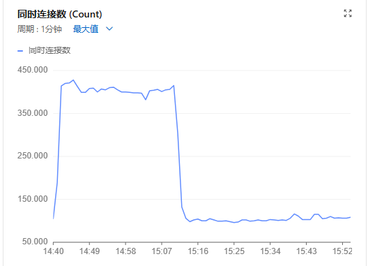 |

---

## 七、失败趋势与加购链路分析

### 7.1 加购_1688 500 根因与趋势

**根因定位（2026-06-15 复现确认）**

```
POST /api_b2b/cart/add1688
  ← CartController::add1688()
  ← DetailService::getBuyPriceSkuInfo()  (DetailService.php:234)
  ← ErrorException: Undefined array key "price"
  → 响应 { "code": 500, "msg": "Undefined array key \"price\"" }
```

| 对比项 | 失败商品（如 758501247949） | 成功商品（如 732934777093） |
|:--|:--|:--|
| 详情接口 | 200 ✅ | 200 ✅ |
| SKU 是否含 `price` | **全部无**（16/16） | **有**（如 `price: 17.0`） |
| 其它价格字段 | 有 `consignPrice`、`fenxiaoPriceInfo` | 有 `consignPrice` 等 |

- 前置 **关键词搜索、商品详情均为 0 失败**；500 仅发生在加购算价环节。
- 动态复现：48 次加购 → 47 成功 / 1 失败（~2.1%），与压测报告 ~1.8% 一致。
- 静态 payload 加购全部成功，排除接口整体不可用。

**失败率趋势**

| 轮次 | 加购请求 | 500 失败 | 失败率 |
|:--|--:|--:|--:|
| 10min | 3,012 | 51 | 1.69% |
| 30min | 8,820 | 163 | 1.89% |

长时间运行未自愈；**需后端修复 `price` 空值处理**；脚本侧已过滤无 `price` SKU 作为压测规避。

### 7.2 淘宝关键词 40000 趋势

| 轮次 | 真实用户 taobao 关键词 | 虚拟用户 taobao 关键词 | 合计失败率 |
|:--|--:|--:|--:|
| 10min | 10 / 7,089 (0.14%) | 13 / 8,876 (0.15%) | ~0.15% |
| 30min | 23 / 21,010 (0.11%) | 36 / 27,938 (0.13%) | ~0.12% |

1688 关键词/图搜两轮均为 **0 失败**；淘宝侧偶发 40000 量级稳定可控，属上游采集/风控限制。

---

## 八、覆盖盲区：淘宝详情 / 加购未压测到

两轮请求明细中均**无** `商品详情_taobao`、`商品加购_taobao`，仅有 1688 侧详情与加购（且请求数一一对应）。

**根因（脚本逻辑）**：

1. **加购 break 逻辑**：动态加购 shuffle 两个来源后，第一个成功即 `break`，1688 基本都成功，淘宝分支常被跳过。
2. **淘宝搜索结果 item 提取为空**：`_extract_search_items` 使用字段 `item_id`，若淘宝搜索响应中商品 id 字段名不一致，则解析为空 → 无法调用详情 → 无法生成加购 payload。

**待实施方案（方案 1 增强版）**：
- 去掉 break，1688 / 淘宝两个来源均尝试加购；
- 修复淘宝搜索结果的 item-id 字段提取；
- （可选）淘宝静态商品兜底，保证链路始终有覆盖。

---

## 九、专项验证：预热登录失败已闭环

| 项目 | 说明 |
|:--|:--|
| 历史问题 | main 上 `performance_test_003` 登录稳定 HTTP 500，每轮固定 1 个「登录 [预热]」失败 |
| 根因 | 后端 `LoginController` 对 NULL 日期字段执行 `strtotime(null)` |
| 处理 | `MAIN_MOCK_EXCLUDE = {3}` 将该账号移出 main 压测池 |
| 验证 | 10min / 30min 两轮均为 **46 次预热、0 失败** ✅ |

---

## 十、结论与建议

### 10.1 发布结论

**附条件通过。** 100 并发下，10 分钟基准与 30 分钟稳定性测试均达标；Locust、ECS、RDS 三层监控均未见性能衰减；ECS CPU（宿主机）~42%、RDS CPU ~33%，资源有余量但 ECS OS 视角瞬时峰值 ~78% 需关注；预热登录问题已闭环。

### 10.2 失败接口待办（按优先级）

| 优先级 | 失败接口 | API 路径 | 30min 失败率 | 责任方 | 动作 |
|:--|:--|:--|:--|:--|:--|
| 🔴 P1 | 商品加购_1688 | `/api_b2b/cart/add1688` | 1.89% | 后端 | **已定位**：SKU 无 `price` → `DetailService.php:234` 报错；需后端兜底 + 脚本已过滤无 price SKU |
| 🟡 P2 | 关键词浏览_taobao | `/api_tb/product/keyword` | 0.11% | 上游/采集 | 确认 40000 风控策略 |
| 🟡 P2 | 虚拟用户关键词查询_taobao | `/api_tb/product/keyword` | 0.13% | 上游/采集 | 同上 |

### 10.3 非失败项待办

| 优先级 | 事项 | 责任方 | 说明 |
|:--|:--|:--|:--|
| 🟡 P2 | 商品详情_1688 响应偏慢（0 失败） | 后端/架构 | P95 1.9s，评估缓存与回源优化 |
| 🟡 P2 | 补齐淘宝详情/加购压测覆盖 | 测试脚本 | 方案 1 增强版：去 break + 修 item 提取 |
| 🟢 已闭环 | 预热登录 003 账号 | 测试脚本 | 已剔除；后端根治后可恢复该账号 |

### 10.4 后续建议

1. 后端修复加购 500 后，复跑 30min 验证失败率是否归零。
2. 脚本侧完成淘宝链路覆盖改造后，补充一轮压测，确认 `商品详情_taobao` / `商品加购_taobao` 进入请求明细。
3. 可补充 **UI 页面压测**（`locustfile_ui.py`）评估前台页面可用性。
4. **阶梯加压**：当前 100 并发 ECS OS CPU ~50%（峰值 ~78%）、RDS CPU ~33%；距 645 RPS 约 6.5 倍，**ECS 先于 RDS 触顶**；建议 200 → 500 → 1000 逐级压测，同步采集 ECS + RDS 监控。

---

## 十一、附件与变更记录

| 文件 | 说明 |
|:--|:--|
| `stress_main_47r_53v_10m_20260615_140935(10min).html` | 10 分钟 Locust 原始报告 |
| `stress_main_47r_53v_30m_20260615_143954.html` | 30 分钟 Locust 原始报告 |
| `性能压测结果报告（10min）_2026-06-15.md` | 10 分钟单轮详细报告 |
| `assets/aliyun-rds-*.png` | PolarDB/RDS 监控截图 |
| `assets/aliyun-ecs-*.png` | ECS 应用节点监控截图（CPU/内存/负载/带宽/磁盘） |
| `性能压测结果汇总报告_2026-06-15.pdf` | 汇总报告 PDF |

| 日期 | 版本 | 说明 | 编制 |
|:--|:--|:--|:--|
| 2026-06-15 | v1.0 | 10min 单轮报告 | 测试组 |
| 2026-06-15 | v2.0 | 汇总 10min + 30min 两轮结果 | 测试组 |
| 2026-06-15 | v2.1 | 新增「失败接口清单」专章，含 API 路径与两轮失败对比 | 测试组 |
| 2026-06-15 | v2.2 | 写入加购_1688 500 根因（SKU 缺 price / DetailService.php:234） | 测试组 |
| 2026-06-15 | v2.3 | 补充 PolarDB/RDS 监控（30min 窗口 CPU/QPS/连接/TPS/MPS） | 测试组 |
| 2026-06-15 | v2.4 | 补充 ECS 应用节点监控（CPU/内存/负载/带宽/磁盘/连接）及全链路对照 | 测试组 |
