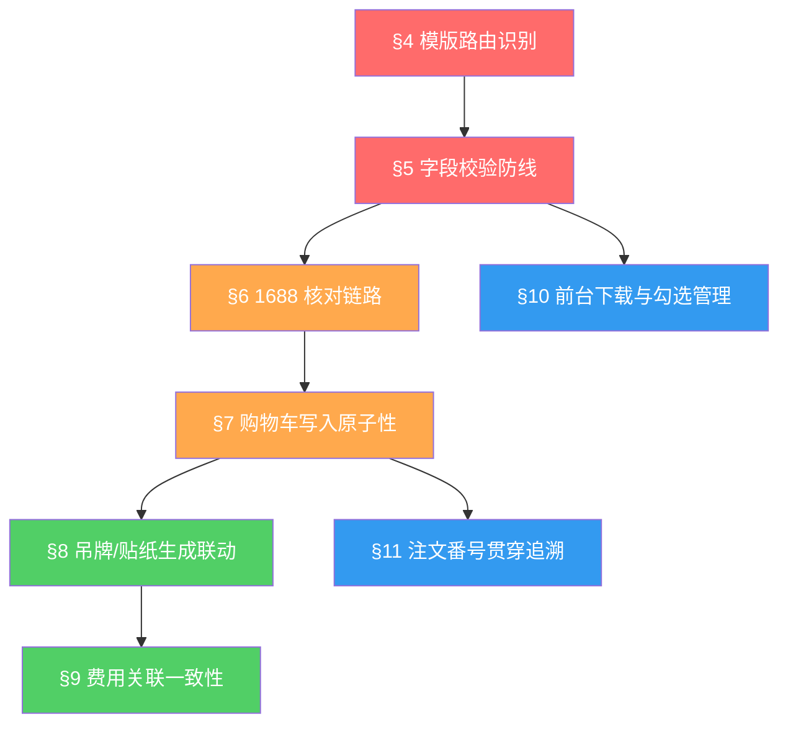

# Superpowers — 全球站批量导入功能

> **继承声明**：本文件继承 `superpowers-base.md` 中的 §1 Design First / §2 TDD Protocol / §3 Brainstorming 三大通用协议。
> 以下领域规则从 §4 起编号，聚焦批量导入功能的业务红线与高危约束。
> 领域审计补充：§3 Brainstorming 在本项目中重点关注多模版字段校验的边界值审计、1688 接口降级场景、以及吊牌/贴纸生成的数据完整性。

---

## 项目上下文

### 现状问题

| # | 痛点 | 影响 |
|:--|:--|:--|
| 1 | 大客户通过 Excel 下单，业务员需手动逐条选品到购物车 | 操作耗时长，人工出错率高 |
| 2 | 吊牌/贴纸参数需手动逐个创建 | 重复劳动，效率低下 |
| 3 | 缺少 SKU/价格与 1688 的自动核对机制 | 数据导错风险，发货后才发现 |
| 4 | 用户注文番号无法在系统中检索 | 订单追溯困难 |

### 解决目标

| 层级 | 验收标准 |
|:--|:--|
| **业务** | 支持 4 种模版批量导入，自动选品到购物车并生成关联吊牌/贴纸 |
| **技术** | 页面加载 ≤ 2s，API 响应 ≤ 500ms，接口规范可复用 |
| **UX** | 导入异常精确定位到 Excel 行号，操作引导明确 |

### 功能全景

| 模块 | 一行描述 |
|:--|:--|
| 批量导入引擎 | 后台入口解析 4 种 Excel 模版，校验字段后写入购物车/订单 |
| 1688 校验链路 | 与 1688 商品接口核对 SKU/颜色/尺寸/价格 |
| 吊牌/贴纸生成 | 根据模版参数自动生成吊牌/贴纸并关联服务费用 |
| 前台下载引擎 | 8160 模版前台下载、勾选状态管理、1000 条上限 |
| 注文番号扩展 | 前后台多页面新增用户注文番号字段及筛选 |

---

## 规则依赖图

> **执行约束**：严禁在未通过前置规则校验的情况下执行后置规则的审计逻辑。

---

## 领域规则

### §4 模版路由识别（Template Router）🔫 触发

**触发条件**：上传 Excel 文件时触发

**规则内容**：
1. 系统必须通过**模版名称**自动识别模版类型（7182 / 8160 / 7561-自社 / 7561-ZOZO）
2. 7561 模版通过表单名称判定仓库类型：名称含 `zozo`（**不区分大小写**）→ ZOZO 仓库，否则 → 自用仓库
3. 仅支持 `.xlsx` 格式，其他格式必须报错拒绝
4. 表头结构必须与对应模版定义严格匹配，不匹配时提示具体行数

**高危场景**：
- 模版名称拼写变体（如 `ZOZO`/`Zozo`/`zozo`）
- 上传非对应客户的模版
- 上传 `.xls` 或 `.csv` 格式文件

---

### §5 字段校验防线（Field Validation Firewall）🔫 触发

**触发条件**：模版解析完成后逐行校验时触发

**规则内容**：
1. **7182 模版**：ABCDEF 六项为必填，缺失必须报错
2. **数值字段**：price 不允许带货币符号，num 仅接受正整数
3. **SKU/颜色/尺寸**：必须与 1688 链接字段核对（§6 前置）
4. 校验为**行级粒度**：部分成功部分失败，报错定位到具体 Excel 行
5. 所有币种统一 **CNY**，差价保留 **2 位小数**

**高危场景**：
- price 字段含 `¥`/`￥`/`$` 等符号
- num 为 0、负数、小数、非数字
- 必填字段为空或仅含空格

---

### §6 1688 核对链路（1688 Verification Chain）🔫 触发

**触发条件**：§5 字段格式校验通过后，对需要核对的模版触发

**规则内容**：
1. 对 7182、7561 模版中的商品链接调用 1688 接口获取 SKU 信息
2. **size（尺寸）+ color（颜色）**：与 1688 链接上的字段进行核对，不匹配则报错
3. **price（单价）**：与 1688 报价进行比价，展示表单价、链接价、差价（保留 2 位小数）
4. 表单价、链接价、差价支持**一键复制**
5. 1688 接口不可用时：**报错提醒**业务员
6. 1688 商品下架/链接失效时：**报错提醒**，定位到具体 Excel 行

**高危场景**：
- 1688 接口超时（网络抖动）
- 商品下架后链接返回空数据
- SKU 属性名称在 1688 侧变更（如"颜色分类"vs"颜色"）

---

### §7 购物车写入原子性（Cart Write Atomicity）🔫 触发

**触发条件**：点击"确认导入"后触发

**规则内容**：
1. 数据写入购物车前必须**全部行校验通过**，有异常数据则无法确认导入
2. 在用户面板导入的数据**归属对应用户**，同步到该用户的购物车
3. 写入过程包括：生成订单 + 同步参数
4. 7182 模版默认附加项选择：**全量详检**
5. 7561-ZOZO 模版：选品完成 + 附加项选择**吊牌** + 报价包含吊牌费用

**高危场景**：
- 导入时上一行的 SKU 导入到下一行中（PRD 明确提到的并发风险）
- 数据部分异常时误触确认导入

---

### §8 吊牌/贴纸生成联动（Tag/Sticker Generation）🔫 触发

**触发条件**：8160 模版导入时 / 7561-ZOZO 转代购订单时触发

**规则内容**：
1. **贴纸**：固定模版，仅需 SKU + 商品编码
2. **吊牌**：参数含品牌名、SKU、销售价格、颜色、尺寸、管理编码（均非必填）
3. 未填参数在吊牌/贴纸中**删除对应字段内容**，系统优化调整排版
4. 数量同步：根据订单**正品数量**同步吊牌/贴纸数量
5. 费用关联：自动产生关联**服务费用**并添加到附加项
6. 8160 模版：导入即生成
7. 7561-ZOZO：导入时不生成，**转代购订单时**自动触发生成，数据读取订单信息
8. 8160 已有吊牌/贴纸时：下载弹窗提醒 → 继续则带出已有参数
9. 8160 覆盖冲突：导入内容与已有内容有冲突时弹窗提醒是否覆盖

**高危场景**：
- 全部参数为空时的排版降级
- 覆盖已有吊牌后费用未更新
- 正品数量为 0 时贴纸/吊牌生成行为

---

### §9 费用关联一致性（Cost Association Consistency）🔫 触发

**触发条件**：§8 吊牌/贴纸生成完成后触发

**规则内容**：
1. 用户选择"是否需要贴纸=是" → 生成贴纸 + 关联服务费用
2. 用户选择"是否需要吊牌=是" → 生成吊牌 + 关联服务费用
3. 选择"否" → 不创建 + 不产生费用
4. 8160 覆盖已有模版后，必须**重新判断**是否有其他费用产品，如有则添加附加项并关联费用

**高危场景**：
- 从"是"改为"否"后费用未扣减
- 覆盖模版后新增费用未关联
- 贴纸和吊牌同时选择"否"后的费用清零

---

### §10 前台下载与勾选管理（Frontend Download & Selection）🔫 触发

**触发条件**：8160 模版前台下载流程触发

**规则内容**：
1. 注1：展开订单商品列表，逐一勾选商品
2. 注2：订单列表复选功能，勾选后该订单**所有单品**被选中
3. 注3：批量导入模版下载按钮，未勾选时**置灰**，勾选后**变蓝**
4. **上限 1000 条**（按 SKU 计数，多 SKU 算多条），超过时弹窗提醒
5. 系统自动识别前 1000 个商品勾选，超过的不勾选
6. 勾选状态存储在**前端**，页面刷新/关闭/跳转时**保持不变**
7. **导出后**勾选项清零

**高危场景**：
- 恰好 1000 条的边界
- 第 1001 条时的弹窗和自动截断
- 页面刷新后状态恢复验证
- 导出后再次勾选的初始状态

---

### §11 注文番号贯穿追溯（Order Note Traceability）🔫 触发

**触发条件**：涉及 user_order_no 字段的读写操作时触发

**规则内容**：
1. 后台：订单详情 → 商品信息中显示 user_order_no
2. 后台：代购订单列表 → 筛选条件新增"用户注文"，支持**精确匹配**
3. 前台 5 个页面新增用户注文番号筛选（見積書一览、注文历史、全商品、My仓库、国际配送）
4. JANCODE + SKU 合并到 mysku 字段，逗号分隔，支持**一键复制**
5. ItemURL + SkuURL 写入订单备注 + 报价单

**高危场景**：
- 筛选结果不包含目标订单
- 用户注文番号含特殊字符（日文、空格等）时的匹配
- mysku 字段合并后显示截断

---

## 模块缩写配置表

| 缩写 | 全称 | 说明 |
|:--|:--|:--|
| **BI-ENTRY** | Batch Import Entry | 批量导入入口与权限 |
| **BI-TPL** | Template Router | 模版路由识别与解析 |
| **BI-VAL** | Field Validation | 字段校验与格式验证 |
| **BI-1688** | 1688 Verification | 1688 SKU/价格核对链路 |
| **BI-CART** | Cart Write | 购物车写入与数据同步 |
| **BI-TAG** | Tag/Sticker Gen | 吊牌/贴纸生成与排版 |
| **BI-COST** | Cost Association | 费用关联与附加项 |
| **BI-DL** | Frontend Download | 前台模版下载与勾选 |
| **BI-ONO** | Order Note | 用户注文番号贯穿追溯 |

---

## 测试数据画像与隔离策略

### 最小必备测试数据集

| # | 数据项 | 要求 | 用途 |
|:--|:--|:--|:--|
| 1 | 业务员账号 A | 普通业务员权限，已分配客户 | 批量导入操作主体 |
| 2 | 业务员账号 B | 普通业务员权限，已分配不同客户 | 权限隔离验证 |
| 3 | 客户账号 7182 | B2B 客户，关联业务员 A | 7182 模版导入目标 |
| 4 | 客户账号 8160 | B2B 客户，已有代购订单 | 8160 模版下载/导入目标 |
| 5 | 客户账号 7561 | B2B 客户，含自用仓库 + ZOZO 仓库 | 7561 双模版导入目标 |
| 6 | 1688 在线商品 × 3 | 不同 SKU/颜色/尺寸组合 | 1688 校验核对 |
| 7 | 1688 下架商品 × 1 | 链接失效 | 降级报错测试 |
| 8 | 各模版 Excel × 4 | 正常数据 + 异常数据各一份 | 正向/逆向校验 |

### 账号隔离要求

- 业务员 A 和 B 的客户**不可交叉**
- 每个客户的购物车在测试前必须**清空**
- 8160 客户必须有**至少 2 个已完成订单**（含商品数 > 5）
- 7561-ZOZO 客户需有商品转**代购订单**的完整链路环境
