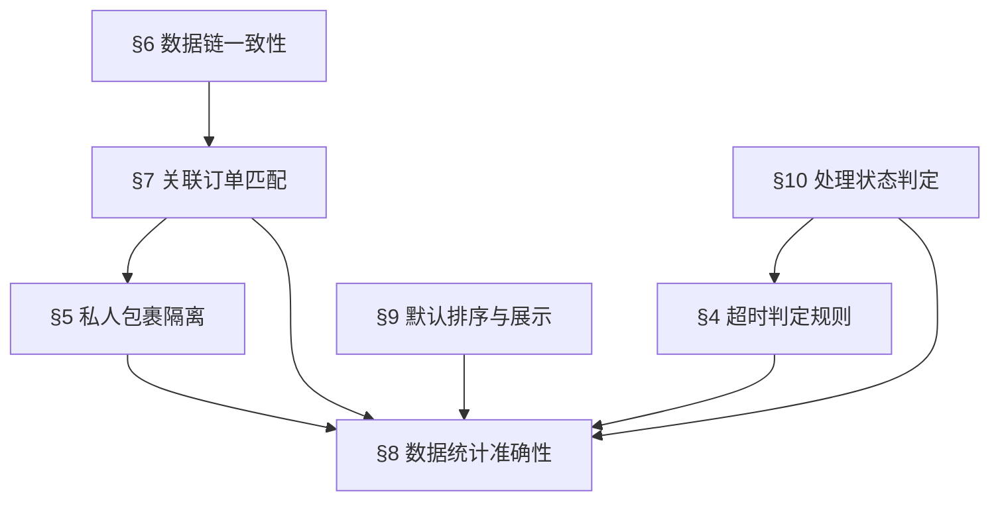

# Superpowers：国内包裹签收处理功能

> **继承声明**：本文件继承 `superpowers-base` (§1 Design First / §2 TDD Protocol / §3 Brainstorming)，
> 以下仅定义本项目的领域专属规则，严禁重复定义基础通用规则。

---

## 项目上下文 (Project Context)

### 现状问题

| 痛点 | 影响 |
|:---|:---|
| 包裹签收、处理全靠人工纸质登记 | 无法追踪处理时效，管理盲区 |
| 无法量化各环节处理效率 | 超时包裹无预警，客户时效承诺受损 |
| 包裹与订单关联靠人工核对 | 匹配错误率高，私人包裹混入业务统计 |
| 质检环节人力调配无数据支撑 | 无法评估岗位人员储备需求 |

### 解决目标

| 层面 | 验收标准 |
|:---|:---|
| **业务** | 实现包裹签收→处理的全链路线上化管理，超时自动识别预警 |
| **技术** | 扫码枪/PDA与系统实时同步，1688接口数据联动，接口支持后续仓储系统复用 |
| **UX** | 页面加载≤2s，API响应≤500ms，支持Chrome/Safari主流浏览器 |

### 功能全景

- **筛选区**：9个筛选条件 + 搜索/重置按钮（时间段×3 + 文本模糊×3 + 下拉×3+2）
- **数据统计区**：6维度实时统计（已发货/已签收/未签收/已处理/未处理/已超时）
- **列表展示区**：12个展示字段 + 默认排序规则
- **手工录入弹窗**：运单号输入 → 自动匹配订单 → 私人包裹降级
- **翻页器**：默认30条/页，支持10/20/30/50切换 + 跳页

---

## 规则依赖图 (Rule Dependency Graph)

> **约束**：MUST NOT execute downstream rule audit without passing upstream。
> 即：§10处理状态 → §4超时判定 → §8统计准确性，必须按依赖链顺序验证。

---

## §4 超时判定规则 (Timeout Determination) 🔫 触发

- **工作日规则**：周一至周五签收的包裹，签收后超过 **24小时** 未处理（无接手时间），视为超时
- **周六规则**：周六签收的包裹，超过 **48小时** 未处理，视为超时
- **周日规则**：周日签收的包裹，**跳过周日**，从周一开始计算 24小时超时阈值
- **计时起点**：以签收时间（扫码枪扫码时间）为起点
- **处理时长精度**：按 **小时取整**

---

## §5 私人包裹隔离规则 (Private Package Isolation) 🔫 触发

- **判定条件**：签收扫码后，系统无法匹配到对应的订单 / 业务员 / 用户ID
- **处理方式**：判定为私人包裹，仅记录签收数据（快递单号、签收时间、物流公司）
- **隔离约束**：私人包裹 **不计入** 处理记录、超时记录、处理时长等数据统计维度

---

## §6 数据链一致性 (Data Chain Consistency) 🔫 触发

- **收件扫码链**：扫码枪扫码 → 系统同步快递单号 + 快递公司名称
- **初检扫码链**：初检扫码枪扫码 → 同步对应订单信息 → 跳转打开订单详情（多订单跳转第一个）
- **1688 接口链**：采购下单 → 店铺发货 → 1688 接口同步运单号 → 绑定我司订单号
- **接口复用性**：接口设计需考虑后续仓储系统合并复用

---

## §7 关联订单匹配规则 (Order Association Matching) 🔫 触发

- **多对多映射**：一个快递号可以关联多个订单号；一个订单号也可以对应多个快递号
- **匹配逻辑**：采购下单 → 对应店铺发货 → 1688接口将商品和运单号同步 → 绑定我司订单号 → 扫码后同步关联订单号
- **展示规则**：关联订单号一行一个展示
- **搜索联动**：按快递号或订单号搜索时，可能出现多条结果

---

## §8 数据统计准确性 (Statistics Accuracy) 🔫 触发

- **6维度统计**：已发货、已签收、未签收、已处理、未处理、已超时
- **全量统计**：统计对应筛选结果的全部数据，包括翻页数据
- **私人包裹排除**：私人包裹数据不统计到超时、处理时长等维度
- **默认统计**：页面默认展示的数据也需要进行数据统计

---

## §9 默认排序与展示规则 (Default Display Rules) 🔫 触发

- **默认数据范围**：页面打开时默认展示当天包裹的签收和处理数据
- **排序规则**：按包裹签收时间升序排列（签收越早排越上面）
- **超时置顶**：之前有超时未处理的包裹默认展示，且排序最高（置顶）
- **默认统计**：默认展示的数据也需要进行数据统计

---

## §10 处理状态判定 (Processing Status Determination) 🔫 触发

- **未处理**：包裹已签收但没有接手时间
- **已处理**：包裹有接手时间（初检扫码时间）
- **处理时长**：从包裹签收时间到包裹接手时间，按小时取整

---

## 【模块缩写配置表】

| 缩写 | 模块名称 | 说明 |
|:---|:---|:---|
| FT | 筛选与搜索 | 9个筛选项 + 搜索/重置按钮 |
| DT | 数据列表展示 | 12个展示字段 + 默认排序 |
| ST | 数据统计 | 6维度统计区 |
| MI | 手工录入 | 运单手工录入弹窗 |
| TO | 超时判定 | 超时规则计算与状态标记 |
| PP | 私人包裹 | 私人包裹判定与隔离 |
| PG | 翻页分页 | 翻页器 + 条数切换 |

---

## 【测试数据画像与隔离策略】

### 最小测试数据集

| 数据类型 | 数量 | 用途 |
|:---|:---|:---|
| 已签收+已处理的普通包裹 | ≥5 | 正向展示、筛选验证 |
| 已签收+未处理的普通包裹 | ≥3 | 处理状态验证 |
| 超时未处理包裹（工作日24h） | ≥2 | 超时判定验证 |
| 超时未处理包裹（周六48h） | ≥1 | 周六超时验证 |
| 周日签收的包裹 | ≥1 | 周日跳过规则验证 |
| 私人包裹（无匹配订单） | ≥2 | 私人包裹判定+隔离验证 |
| 一快递多订单的包裹 | ≥1 | 多对多关联验证 |
| 一订单多快递的数据 | ≥1 | 反向多对多验证 |
| 手工录入运单号 | ≥2 | 手工录入匹配+不匹配验证 |

### 账号隔离要求

| 账号类型 | 数量 | 用途 |
|:---|:---|:---|
| 后台管理员账号 | ×1 | 具备仓库管理模块全部权限 |
| 业务员账号 | ×2 | 验证业务员筛选下拉 |
| 采购员账号 | ×2 | 验证采购员筛选下拉 |
| 质检/初检岗位账号 | ×1 | 验证组别字段和接手操作 |

### 设备要求

| 设备 | 用途 |
|:---|:---|
| 扫码枪/PDA | 收件签收扫码、初检扫码 |
| Chrome 浏览器 | 后台页面访问 |
