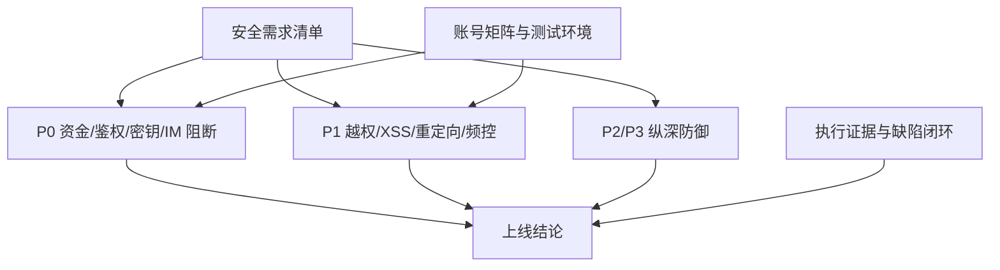

# Superpowers - 安全优化

> 本项目继承 `00_全局测试规约库/superpowers-base.md` 的通用规则；本文仅定义安全优化领域的补充验收规则。

## 项目上下文

| 上下文 | 内容 |
|:--|:--|
| 现状问题 | 安全审计发现资金完整性、鉴权缺失、IDOR、XSS、密钥暴露、扩展越权抓取等应用层漏洞。 |
| 业务目标 | 上线前消除 P0 阻断风险，降低 P1 高危攻击面，建立可回归的安全验收资产。 |
| 技术目标 | 将前端可信参数改为服务端可信计算，补齐鉴权、归属、验签、净化、白名单、审计与敏感数据保护。 |
| 测试目标 | 用可执行用例覆盖每条安全需求的拒绝路径、合法路径、无副作用、日志审计和回归链路。 |

## 功能全景

| 模块 | 能力 | 测试关注 |
|:--|:--|:--|
| 资金与支付安全 | 退款、支付回调、提现、余额调整、售后退款、充值 | 权限、金额服务端计算、验签、幂等、审批、经办人、负值/零值 |
| 鉴权与访问控制 | admin_index、api_tb refreshToken、SSO、凭证签发 | 匿名拒绝、角色拒绝、白名单、token 不泄漏、失败频控 |
| 资源归属与 IDOR | 地址、聊天房间、报价回退 | user_main_uuid、room member、quote_no 归属、跨账号拒绝 |
| IM 与消息安全 | WebSocket、聊天读写、存储型 XSS | 握手 token、服务端 sender/group、成员校验、双端净化 |
| XSS 与注入防护 | v-html、innerHTML、Excel 导出 | DOMPurify、textContent、TYPE_STRING、危险协议拦截 |
| 密钥与敏感数据 | WorldTrade 私钥、验证码、邮件正文 | public 禁密钥、轮换、日志脱敏、TTL/清理 |
| 扩展与本地组件 | Chrome 扩展、Lodop 打印 | host_permissions、sender 校验、URL 白名单、禁 eval |
| 审计与纵深 | 代客登录、余额/退款经办 | 持久审计、admin_id、IP、目标用户、保留期 |

## 规则依赖图

执行约束：安全验证不得对生产环境执行破坏性、资金变更、凭据撞库、内网探测、恶意脚本执行等操作；生产仅允许非破坏性配置检查或已授权冒烟。

## §4 P0 安全阻断项必须全部修复并回归

触发：P0-1 至 P0-8 任一项。

| 规则 | 验收标准 |
|:--|:--|
| 资金安全 | 普通用户不得退款；支付回调必须强制验签；提现必须有支付密码；余额/退款必须服务端限额和审计。 |
| 鉴权安全 | admin_index 写接口匿名返回 401；无权限角色返回 403；合法管理员路径不回归失败。 |
| 密钥安全 | public 静态目录不可访问私钥、`.pem`、`.key`、`.env`；疑似暴露密钥完成轮换。 |
| IM 身份安全 | WebSocket 握手必须校验 token；sender/group 由服务端上下文决定。 |
| 上线结论 | 任一 P0 未通过，报告结论必须为暂缓上线。 |

## §5 所有用户可控资源写操作必须做归属校验

触发：地址、进口商地址、聊天房间、报价回退、订单、退款、余额等按 ID/编号访问资源的读写。

| 规则 | 验收标准 |
|:--|:--|
| 地址归属 | 跨用户 update、delete、updateDefault、updateIncludeDeliveryNote 全部拒绝。 |
| 聊天房间 | 非成员不得读、发、置顶、删除、标记房间消息。 |
| 报价回退 | 他人 quote_no 不可读取、回退、导出或触发远程详情写库。 |
| 无副作用 | 拒绝请求不得修改目标资源、默认状态、流水、消息或日志敏感字段。 |

## §6 资金金额和支付状态只能由服务端可信来源决定

触发：退款 amount、充值 amount、提现 amount、售后 refund_fee、万里汇回调状态。

| 规则 | 验收标准 |
|:--|:--|
| 退款金额 | 拒收前端任意 amount，按原订单实付和可退余额计算。 |
| 回调状态 | 缺签、错签、金额/币种不匹配、重复回调均不改本地状态。 |
| 提现金额 | 未设支付密码拒绝，错误密码拒绝，amount 必须大于 0。 |
| 调整/售后 | 负值、超额、高额未审批必须拒绝；经办 admin_id 必须落库。 |

## §7 XSS、HTML 注入和公式注入必须双端防护

触发：IM 聊天、远程商品描述、CMS 内容、Chrome 扩展搜索结果、Excel 导出。

| 规则 | 验收标准 |
|:--|:--|
| HTML 净化 | `<script>`、`onerror`、SVG、`javascript:`、危险 `data:` 等 payload 不执行。 |
| 历史路径 | 历史消息、历史 CMS、历史商品描述加载时同样净化。 |
| DOM 构建 | Chrome 扩展使用 DOM API/textContent/addEventListener，不拼接危险 innerHTML/onclick。 |
| Excel 导出 | `= + - @`、Tab、回车开头文本在 XLSX 中为纯文本，不执行公式。 |

## §8 密钥、Token、验证码和邮件正文不得泄露或长期明文留存

触发：WorldTrade 私钥、SSO token、api token、client_secret、验证码、email_log。

| 规则 | 验收标准 |
|:--|:--|
| 静态目录 | 私钥移出 public；公开访问敏感扩展名被拒绝。 |
| Token 传输 | SSO 不把登录 token 拼进 URL；回跳接收端拒绝任意 query token。 |
| 凭证响应 | refreshToken 或认证失败响应不返回 token/secret 明文。 |
| 日志留存 | 邮件日志不存活验证码正文；验证码使用 TTL、hash 或定期清理。 |

## §9 外部入口必须有白名单、频控和审计

触发：SSO 回跳、客户凭证签发、Chrome 扩展 background、Lodop、本地 WebSocket。

| 规则 | 验收标准 |
|:--|:--|
| 白名单 | 回跳域、扩展 sender.url、fetch 目标、协议和私网地址均按白名单拒绝。 |
| 频控 | client_secret 连续错误触发锁定或递增延迟；失败文案不泄漏账号存在性。 |
| 审计 | 代客登录、余额调整、售后退款、token 刷新等关键动作可追溯到经办人/IP/目标对象。 |
| 本地组件 | 不再 eval 不可信 WS 消息，或限制来源并升级 SDK。 |

## 【模块缩写配置表】

| 模块缩写 | 模块名称 | 说明 |
|:--|:--|:--|
| SEC-FIN | 资金与支付安全 | 退款、支付回调、提现、余额调整、售后退款、充值 |
| SEC-AUTH | 鉴权与访问控制 | admin_index、api_tb、SSO、凭证签发、邮箱枚举 |
| SEC-IDOR | 资源归属与 IDOR | 地址、聊天房间、报价回退、跨账号访问 |
| SEC-IM | IM 与消息安全 | WebSocket、聊天消息读写、聊天存储型 XSS |
| SEC-XSS | XSS 与注入防护 | v-html、innerHTML、Excel 公式注入、CMS/商品描述 |
| SEC-SECRET | 密钥与敏感数据 | 私钥、Token、验证码、邮件正文、日志脱敏 |
| SEC-EXT | Chrome 扩展与本地组件 | host_permissions、sender、URL 白名单、Lodop |
| SEC-AUD | 审计与纵深防御 | 经办人、持久审计、审批链路、日志可追溯 |

## 【测试数据画像与隔离策略】

| 数据类型 | 最低配置 | 用途 |
|:--|:--|:--|
| 用户账号 | 用户 A、用户 B、未设支付密码用户、已设支付密码用户 | 越权退款、提现、地址 IDOR、报价归属。 |
| 管理员账号 | 超级管理员、普通管理员、无权限管理员、客服账号 | admin_index、余额调整、售后退款、代客登录、IM。 |
| 资金样本 | 待支付报价单、已支付订单、可退订单、余额账户、提现账户 | 退款、支付回调、充值、提现、售后退款。 |
| 万里汇样本 | 合法签名回调、缺签、错签、金额币种不匹配、重复回调 | 支付回调验签和幂等。 |
| 地址和报价样本 | 用户 A/B 地址、进口商地址、quote_no、他人 quote_no | IDOR 归属验证。 |
| IM 样本 | 房间 A/B、成员/非成员、WebSocket token、历史消息 | 房间成员校验、sender/group 服务端绑定、XSS。 |
| XSS/注入 payload | ``、SVG、`javascript:`、Excel `=HYPERLINK()`、`+cmd`、`@SUM` | 净化和公式注入验证。 |
| 扩展样本 | 测试扩展包、业务域页面、非业务域页面、内网/loopback URL | Chrome 扩展 sender 和 URL 白名单。 |
| 敏感数据样本 | `.pem/.key/.env` 请求路径、验证码邮件、email_log、verify_code_log | 私钥访问、日志脱敏、TTL/清理。 |

