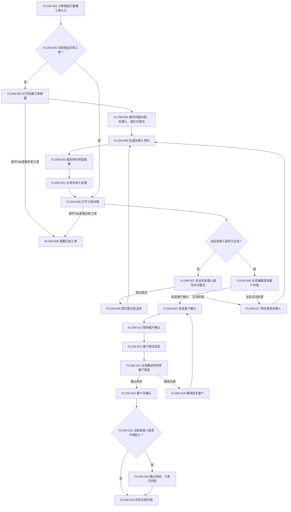
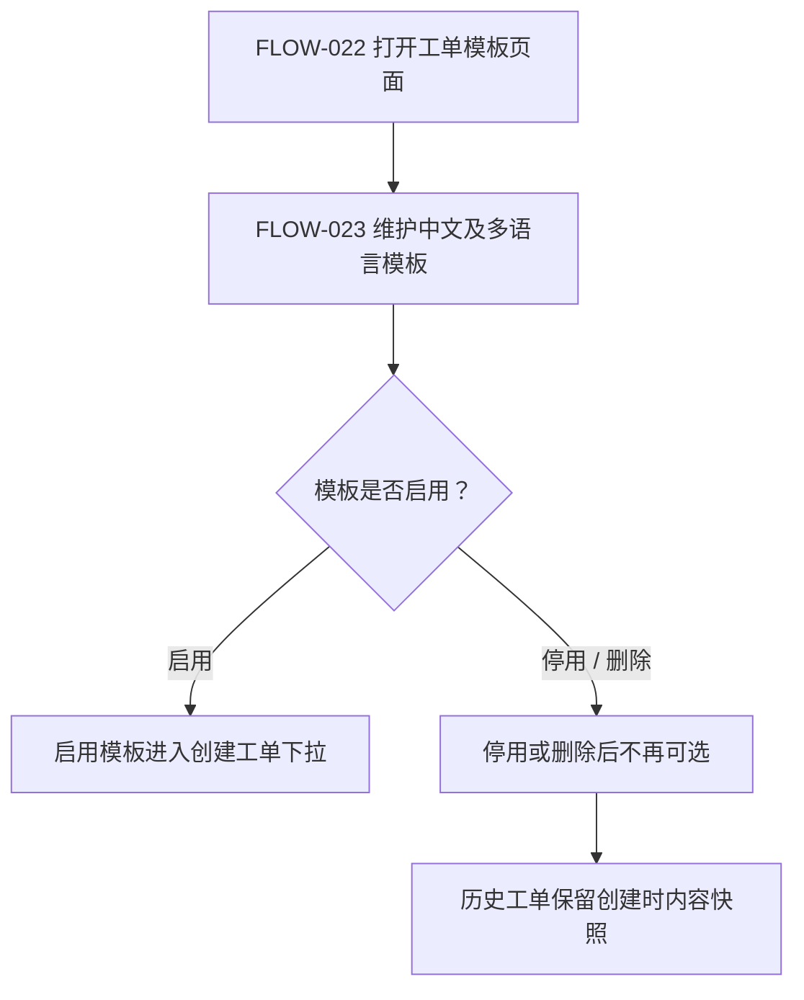

# 工单处理流程图

## 1. 摘要

- 关联 PRD：[工单处理PRD.md](./工单处理PRD.md)
- 关联功能清单：[工单处理功能清单.md](./工单处理功能清单.md)
- 同步状态：已同步
- 最后更新：2026-05-26

## 2. 流程节点映射

| 流程节点ID | 节点名称 | 关联功能 | 关联PRD章节 | 说明 |
| --- | --- | --- | --- | --- |
| FLOW-001 | 订单商品行查看工单入口 | FUN-001 | 2.0 | 在代购订单详情商品行展示创建工单或工单处理入口。 |
| FLOW-002 | 判断当前商品是否已有工单 | FUN-001 | 2.0 | 决定显示创建工单还是工单处理。 |
| FLOW-003 | 打开创建工单弹窗 | FUN-002 | 2.0.1 | 带入订单、商品、规格、国家、业务、采购等商品快照。 |
| FLOW-004 | 填写工单并提交 | FUN-002、FUN-003 | 2.0.1 | 选择单个处理人，填写问题内容，上传实物图或链接图。 |
| FLOW-005 | 生成处理人待办 | FUN-011 | 2.1 | 工单进入处理人我的待办。 |
| FLOW-006 | 打开工单详情 | FUN-004 | 2.0.2 | 从订单详情或我的待办进入同一工单详情弹窗。 |
| FLOW-007 | 非业务处理人填写意见 | FUN-005 | 2.0.2 | 采购、质检、仓库等处理人填写本次处理意见和附件。 |
| FLOW-008 | 提交意见给业务 | FUN-005 | 2.0.2 | 非业务处理意见同步给订单业务，等待业务下一步处理。 |
| FLOW-009 | 业务编辑对客内容 | FUN-006 | 2.0.2 | 业务整理客户可见内容，确认图片是否随内容发送。 |
| FLOW-010 | 发送客户确认 | FUN-006 | 2.0.2、3.1 | 工单进入待客户确认。 |
| FLOW-011 | 等待客户确认 | FUN-015 | 3.1 | 内部只可查看，不可转交。 |
| FLOW-012 | 客户提交回复 | FUN-015 | 3.1 | 客户选择结果和原文回传。 |
| FLOW-013 | 业务翻译并同步客户信息 | FUN-008 | 2.0.2 | 业务填写客户内容翻译并同步给提出人和相关处理人。 |
| FLOW-014 | 工单进入客户已确认 | FUN-008 | 2.0.2 | 客户信息已同步，等待发起人确认结果。 |
| FLOW-015 | 发起人确认完结 | FUN-009 | 2.0.2 | 只有发起人可执行。 |
| FLOW-016 | 工单已完结 | FUN-009 | 2.0.2 | 工单只可查看，所有处理按钮隐藏。 |
| FLOW-017 | 转交其他处理人 | FUN-007 | 2.0.2 | 当前处理人无法处理时转交，进入新处理人待办。 |
| FLOW-018 | 继续回复客户 | FUN-008 | 2.0.2、3.1 | 客户已回复后，业务可继续沟通，形成多轮客户沟通记录。 |
| FLOW-019 | 历史记录归档 | FUN-010 | 2.0.2 | 工单内容、内部处理、客户沟通、流转记录分类展示。 |
| FLOW-020 | 我的待办筛选查看 | FUN-011、FUN-012 | 2.1 | 按客户ID、订单/工单、一体式创建时间段、状态、处理人筛选；支持我的待办与全部工单模式切换，全部工单模式使用独立状态Tab。 |
| FLOW-021 | 从待办进入处理 | FUN-012 | 2.1 | 下一步按钮打开工单详情。 |
| FLOW-022 | 维护工单模板 | FUN-013 | 2.2 | 新增、复制、停用、删除模板。 |
| FLOW-023 | 维护多语言模板 | FUN-014 | 2.2 | 支持多语言内容维护，供业务对客发送时使用。 |
| FLOW-024 | 判断模板是否启用 | FUN-013 | 2.2 | 启用模板可被创建工单弹窗选择，停用或删除后不再可选。 |
| FLOW-025 | 模板进入创建工单下拉 | FUN-002、FUN-013 | 2.0.1、2.2 | 启用模板在创建工单中显示，选择后回填中文内容。 |
| FLOW-026 | 模板停用或删除 | FUN-013 | 2.2 | 停用或删除后不影响历史工单。 |
| FLOW-027 | 历史工单保留模板快照 | FUN-014 | 2.2 | 历史工单继续展示创建时内容快照。 |
| FLOW-028 | 查看历史工单 | FUN-016 | 2.0.1、2.0.2 | 按商品规格跨订单查看历史工单，点击后新开浏览器Tab页，不覆盖当前创建弹窗或工单详情。 |

## 3. Mermaid 流程图

## 4. 模板维护流程

## 5. 异常流程

| 异常ID | 触发场景 | 所在流程节点 | 处理方式 | 关联功能 |
| --- | --- | --- | --- | --- |
| EX-001 | 创建工单时未选择处理人或未填写问题内容 | FLOW-004 | 阻止提交，底部红色提示必填项 | FUN-002 |
| EX-002 | 图片上传失败 | FLOW-004、FLOW-007、FLOW-009 | 保留已填写内容，提示重新上传 | FUN-003 |
| EX-003 | 非业务角色尝试发送客户确认 | FLOW-009、FLOW-010 | 后端拒绝操作，前端隐藏按钮或提示无权限 | FUN-006 |
| EX-004 | 待客户确认阶段尝试转交 | FLOW-011 | 不展示转交入口，接口拒绝转交 | FUN-007 |
| EX-005 | 客户回复缺少选择结果 | FLOW-012 | 不进入客户已回复，提示客户回复数据不完整 | FUN-015 |
| EX-006 | 客户已回复但未填写中文翻译 | FLOW-013 | 阻止确认同步，提示填写客户内容翻译 | FUN-008 |
| EX-007 | 非发起人尝试确认完结 | FLOW-015 | 隐藏确认完结按钮，接口拒绝完结 | FUN-009 |
| EX-008 | 两个入口同时提交同一工单 | FLOW-006 | 校验状态版本，提示刷新后再处理 | FUN-004 |
| EX-009 | 历史记录出现重复客户沟通 | FLOW-019 | 按唯一沟通记录ID去重后展示 | FUN-010 |
| EX-010 | 模板被停用或删除后历史工单查看 | FLOW-027 | 历史工单继续展示创建时快照，不受模板变更影响 | FUN-014 |
| EX-011 | 历史工单召回无权限订单 | FLOW-028 | 后端按订单和组织权限过滤，不返回无权限工单 | FUN-016 |
