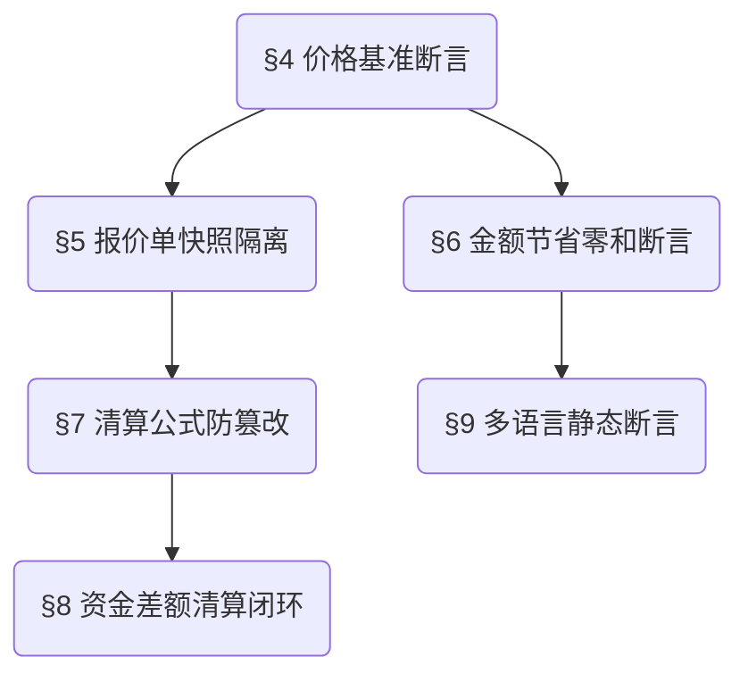

> **继承声明**: 本项目严格继承 `superpowers-base` 中的通用测试规约（§1 Design First, §2 TDD Protocol, §3 Brainstorming）。以下为本领域的补充审计规则与专属测试约束。

## Project Context (项目语境)

| 现状问题 | 解决目标 (验收标准) | 功能全景 |
| :--- | :--- | :--- |
| 1. 前后台金额口径不一致，单价来源混乱。 | 1. **业务验收**：前后台一致，减少清算争议。 | 统一 1688 `promotionPrice` 价格基准 |
| 2. 会员节省感知不直观。 | 2. **技术验收**：全局统一读取 1688 营销价快照，禁止回退。 | 重塑前台费用构成与节省展示 |
| 3. 第三方平台手续费与代采手续费概念混淆。 | 3. **UX 验收**：前台报价支付和后台清算弹窗计算金额严格吻合。 | 后台清算公式与差额闭环 |

## Rule Dependency Graph (约束执行拓扑)

> **执行约束：严禁在未通过前置规则校验的情况下执行后置规则的审计逻辑。**

## Domain Rules (领域红线规约)

### §4 [Critical] 全局价格基准断言 (Global Price Source Protocol)
> `🔫 触发`: 任何展示/计算/导出商品“单价”的节点
- **约束定义**: 无论前台商品卡/详情、购物车，还是后台代购详情/清算弹窗/导出报表，涉及到“商品单价”及以此衍生的计算，**有且仅允许**使用 1688 `promotionPrice` 作为数据源。
- **边界防御**: 若 1688 接口返回异常、无营销价或值为 0 时，必须触发降级空态（表现为普通商品），**严禁**系统静默读取旧版本商品单价。

### §5 [Critical] 报价单快照隔离 (Snapshot Isolation Protocol)
> `🔫 触发`: 生成报价单及支付时
- **约束定义**: 确认订单并生成报价单的瞬间，必须对 `promotionPrice` 单价、预估国内运费（由 1688 `product.freight.estimate` 供给）、代采手续费进行硬快照（Snapshot）固化。
- **边界防御**: 即使生成报价单后 1688 原厂价格发生波动或预估运费生变，待支付或已支付的报价单均不允许受到波及，只认当时的快照金额。

### §6 [High] 节省金额零和断言 (Saved Amount Non-Deductible Rule)
> `🔫 触发`: 展示“Hubbuyer 为您节省”、“本店节省”时
- **约束定义**: “商品金额节省”（1688原价对应金额 - Hubbuyer会员价对应金额）与“人工交涉节省”（采购差价）纯粹用于前端 UI 权益感知。
- **边界防御**: 节省金额绝对**禁止**作为二次抵扣项混入报价单支付金额或实际结算金额。

### §7 [Critical] 清算公式防篡改 (Settlement Formula Integrity)
> `🔫 触发`: 后台订单清算试算阶段
- **约束定义**: 必须按弹窗原生公式试算：`实际结算金额 = 客户价 + 附加项费用 + 质检费用 + 订单其他费用 + 代采手续费`。`订单差额 = 实际结算金额 - 报价单支付金额 - 采购差额`。
- **边界防御**: “手续费”专指代采手续费，第三方“平台服务费”只能游离在公式外，严禁计入报价单；同一来源金额（如返现）若已被某分类收录，系统必须给出警示防重录。

### §8 [Critical] 资金差额清算闭环 (Capital Balance Loop)
> `🔫 触发`: 确定清算（二次确认后）
- **约束定义**: 订单差额若 > 0，必须执行强依赖扣除动作（自动扣客户余额，余额不足扣不足金）；若 < 0 则执行退款；= 0 仅沉淀审计记录。
- **边界防御**: 无清算权限账户不得绕过弹窗直接篡改底层账目，核心操作日志必记：清算版本、字段快照、操作人与时间。

### §9 [Medium] 静态文案多语言配置断言 (i18n Layout Independence)
> `🔫 触发`: 前台任意页面切换语言环境
- **约束定义**: 页面新增字段名、按钮、弹窗/抽屉提示、Hover Tooltips 必须从多语言配置源读取。
- **边界防御**: 系统生成的商品名、用户/店铺级输入（如店铺名称）等动态业务实体数据，严禁被错误作为本地化文案翻译并改写。

---

## 【模块缩写配置表】(Module Dictionary)

| 业务域 (Domain) | 模块缩写 (Prefix) | 范围说明 |
| :--- | :--- | :--- |
| 前台商品 | `C-GOODS` | 宫格列表、商品卡样式、商品详情页 Hubbuyer 价格模块与运费 |
| 购物车与订单确认 | `C-CART` | 购物车汇总与会员已省、确认订单页 |
| 报价单与支付 | `C-QUOTE` | 报价单列表、详情、支付弹窗、订单详情差额处理卡 |
| 后台订单管理 | `A-ORDER` | 代购订单详情、各项实际费用维护、批量操作、单价校验 |
| 订单清算与资金 | `A-SETTLE` | 订单清算弹窗、差额引擎计算、确定清算、余额/不足金扣减 |
| 全局导出规则 | `G-EXPORT` | 表单下载、全商品导出、报表打印 |

## 【测试数据画像与隔离策略】(Test Data Matrix)

为验证复杂的差额和节省策略，至少需预置并隔离以下测试画像：
1. **白板客户账号 (Account-Normal)**: 无任何会员权益，观察普通商品卡形态及代采手续费正常收取。
2. **企业会员账号 (Account-VIP)**: 具备会员权益与免代采手续费标记。
3. **高权限财务账号 (Account-Admin)**: 具备确定清算与审批资金差额处理的最高权限。
4. **最小业务数据集**:
   - `Item-A`: 稳定具备 `promotionPrice`（会员价）、有合法原价的 1688 商品。
   - `Item-B`: 无 `promotionPrice` 接口返回异常的 1688 商品。
   - `Order-1`: 由 `Item-A` 下单，处于“待入金”状态，且存在平台服务费的场景。
   - `Order-2`: 已付款进入后台的订单，准备执行清算弹窗与退/补差额。
