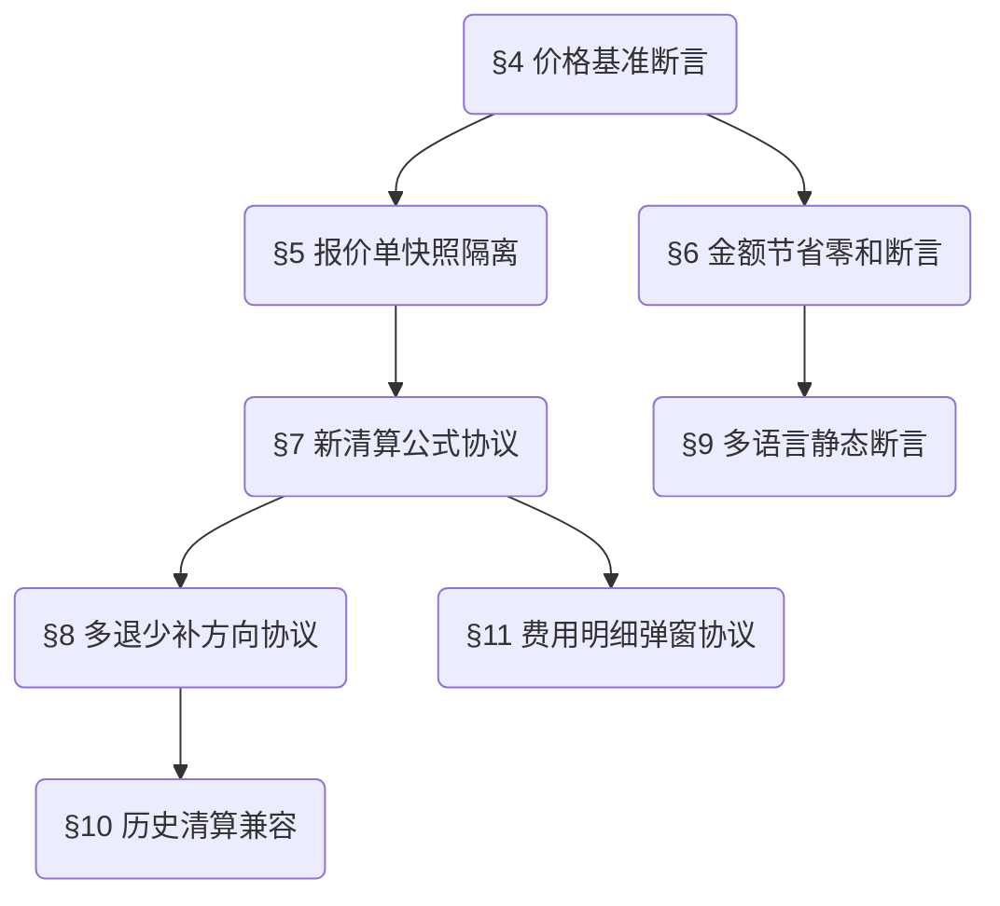

> **继承声明**: 本项目严格继承 `superpowers-base` 中的通用测试规约（§1 Design First, §2 TDD Protocol, §3 Brainstorming）。以下为本领域的补充审计规则与专属测试约束。

## Project Context (项目语境)

| 现状问题 | 解决目标 (验收标准) | 功能全景 |
| :--- | :--- | :--- |
| 1. 前后台金额口径不一致，单价来源混乱。 | 1. **业务验收**：前后台一致，减少清算争议。 | 统一 1688 `promotionPrice` 价格基准 |
| 2. 会员节省感知不直观。 | 2. **技术验收**：全局统一读取 1688 营销价快照，禁止回退。 | 重塑前台费用构成与节省展示 |
| 3. 第三方平台手续费与代采手续费概念混淆。 | 3. **UX 验收**：前台报价支付和后台清算弹窗计算金额严格吻合。 | 后台清算公式与差额闭环 |
| 4. 旧清算逻辑将采购差额二次扣减，且历史退款字段分散。 | 4. **清算验收**：从实际支出开始计算实际清算金额，再由报价单支付金额减实际清算金额判定多退少补。 | 清算逻辑优化、店铺退款合并、人工交涉节省独立展示、历史清算兼容 |

## Rule Dependency Graph (约束执行拓扑)

> **执行约束：严禁在未通过前置规则校验的情况下执行后置规则的审计逻辑。**

## Domain Rules (领域红线规约)

### §4 [Critical] 全局价格基准断言 (Global Price Source Protocol)
> `🔫 触发`: 任何展示/计算/导出商品“单价”的节点
- **约束定义**: 无论前台商品卡/详情、购物车，还是后台代购详情/清算弹窗/导出报表，涉及到“商品单价”及以此衍生的计算，**有且仅允许**使用 1688 `promotionPrice` 作为数据源。
- **边界防御**: 若 1688 接口返回异常、无营销价或值为 0 时，必须触发降级空态（表现为普通商品），**严禁**系统静默读取旧版本商品单价。

### §5 [Critical] 报价单快照隔离 (Snapshot Isolation Protocol)
> `🔫 触发`: 生成报价单及支付时
- **约束定义**: 确认订单并生成报价单的瞬间，必须对 `promotionPrice` 单价、预估国内运费（由 1688 `product.freight.estimate` 供给）、代采手续费进行硬快照（Snapshot）固化。
- **边界防御**: 即使生成报价单后 1688 原厂价格发生波动或预估运费生变，待支付或已支付的报价单均不允许受到波及，只认当时的快照金额。

### §6 [High] 节省金额零和断言 (Saved Amount Non-Deductible Rule)
> `🔫 触发`: 展示“Hubbuyer 为您节省”、“本店节省”时
- **约束定义**: “商品金额节省”（1688原价对应金额 - Hubbuyer会员价对应金额）、“代采手续费节省”和“人工交涉节省”纯粹用于前端 UI 权益感知。
- **边界防御**: 节省金额绝对**禁止**作为二次抵扣项混入报价单支付金额、实际清算金额或订单差额。

### §7 [Critical] 新清算公式协议 (Settlement Formula Integrity)
> `🔫 触发`: 后台订单清算试算阶段
- **约束定义**: 报价单支付金额 = `商品金额 + 预估国内运费 + 预估检品费用 + 预估附加项费用 + 预估代采手续费`。
- **约束定义**: 实际清算金额 = `实际支出 + 到付运费 + 退换货运费 + 店铺其他费用 + 实际检品费用 + 实际附加项费用 + 订单其他费用 + 实际代采手续费 - 店铺退款 - 店铺返现`。
- **约束定义**: 订单差额 = `报价单支付金额 - 实际清算金额`；正数应退还客户，负数客户需补，等于 0 无需处理。
- **边界防御**: 采购差额/人工交涉节省不得再次进入订单差额公式；同一来源金额不得在店铺退款、店铺返现、订单其他费用或人工交涉节省中重复计算。

### §8 [Critical] 多退少补方向协议 (Refund / Top-up Direction)
> `🔫 触发`: 前台订单详情、订单清算抽屉、订单清算记录展示订单差额时
- **约束定义**: 订单差额为正数时展示“应退还客户”；为负数时展示“客户需补”；等于 0 展示“无需处理”。前台、管理端和记录页必须保持同一方向。
- **边界防御**: 金额符号与退款/补款文案不一致时禁止确认清算，不允许只改文案掩盖公式错误。
- **范围边界**: 退款通道、资金执行和导出文件格式不在本次页面级 PRD 范围内；测试只验证页面结果、记录生成、权限与历史结果保留，不伪造真实资金动作。

### §9 [Medium] 静态文案多语言配置断言 (i18n Layout Independence)
> `🔫 触发`: 前台任意页面切换语言环境
- **约束定义**: 页面新增字段名、按钮、弹窗/抽屉提示、Hover Tooltips 必须从多语言配置源读取。
- **边界防御**: 系统生成的商品名、用户/店铺级输入（如店铺名称）等动态业务实体数据，严禁被错误作为本地化文案翻译并改写。

### §10 [Critical] 历史清算兼容协议 (Historical Settlement Compatibility)
> `🔫 触发`: 已清算历史订单、未清算历史订单、历史退款字段进入新清算页面或清算记录查询时
- **约束定义**: 已清算历史订单继续展示清算时保存的报价单支付金额、实际清算金额、订单差额和明细，不因打开订单详情、查询记录或查看公式自动重算。
- **约束定义**: 未清算历史订单只有在必要金额完整后才按新逻辑重新计算；必要金额缺失时必须指出缺失项并禁止确认。
- **边界防御**: 历史没货退款、不良商品退款等拆分字段在新页面统一合并为“店铺退款”，只改变展示和汇总口径，不得重复计入。

### §11 [Critical] 费用明细弹窗协议 (Settlement Detail Dialog Protocol)
> `🔫 触发`: 从订单清算抽屉打开检品方式、附加项、店铺其他费用或订单其他费用时
- **约束定义**: 四类费用弹窗均从订单清算抽屉触发并展示在左侧，可同时打开，按点击顺序从上到下排列，标题栏可拖动并保持在浏览器可视范围。
- **约束定义**: 订单其他费用弹窗支持托盘费用、叉车费用、仓储费用、其他；仅选择“其他”时显示自定义费用名称。
- **边界防御**: 未保存、非数字、0、负数或无效费用行不得进入实际清算金额；保存失败需保留输入并提示修正。

### §12 [Critical] 人工交涉节省独立展示协议 (Negotiation Savings Isolation)
> `🔫 触发`: 展示或计算人工交涉节省时
- **约束定义**: 人工交涉节省 = `正品金额 + 店铺退款 + 国内运费 - 实际支出 + 店铺返现`，独立展示，不进入实际清算金额，也不再次参与订单差额。
- **边界防御**: 正常结果应大于或等于 0；若异常为负数，前台订单详情、管理端订单详情、订单清算抽屉和订单清算记录均保留真实负数并红色加粗。

---

## 【模块缩写配置表】(Module Dictionary)

| 业务域 (Domain) | 模块缩写 (Prefix) | 范围说明 |
| :--- | :--- | :--- |
| 前台商品 | `C-GOODS` | 宫格列表、商品卡样式、商品详情页 Hubbuyer 价格模块与运费 |
| 购物车与订单确认 | `C-CART` | 购物车汇总与会员已省、确认订单页 |
| 报价单与支付 | `C-QUOTE` | 报价单列表、详情、支付弹窗、订单详情差额处理卡 |
| 后台订单管理 | `A-ORDER` | 代购订单详情、各项实际费用维护、批量操作、单价校验 |
| 订单清算 | `A-SETTLE` | 订单清算抽屉、差额引擎计算、确定清算、费用明细弹窗、清算记录和历史兼容 |
| 全局导出规则 | `G-EXPORT` | 表单下载、全商品导出、报表打印 |

## 【测试数据画像与隔离策略】(Test Data Matrix)

为验证复杂的差额和节省策略，至少需预置并隔离以下测试画像：
1. **白板客户账号 (Account-Normal)**: 无任何会员权益，观察普通商品卡形态及代采手续费正常收取。
2. **企业会员账号 (Account-VIP)**: 具备会员权益与免代采手续费标记。
3. **高权限财务账号 (Account-Admin)**: 具备订单详情、确定清算、订单清算记录和导出审计权限。
4. **最小业务数据集**:
   - `Item-A`: 稳定具备 `promotionPrice`（会员价）、有合法原价的 1688 商品。
   - `Item-B`: 无 `promotionPrice` 接口返回异常的 1688 商品。
   - `Order-1`: 由 `Item-A` 下单，处于“待入金”状态，且存在平台服务费的场景。
   - `Order-2`: 已付款进入后台的订单，准备执行清算弹窗与退/补差额。
   - `Order-Clear-Refund`: 报价单支付金额大于实际清算金额，订单差额为正数，应展示应退还客户。
   - `Order-Clear-Topup`: 报价单支付金额小于实际清算金额，订单差额为负数，应展示客户需补。
   - `Order-Clear-Zero`: 报价单支付金额等于实际清算金额，订单差额为 0。
   - `Order-History-Settled`: 已清算历史订单，用于验证打开和查询不自动重算。
   - `Order-History-Unsettled-Missing`: 未清算历史订单且缺少必要金额，用于验证禁止确认。
   - `Order-Fee-Dialogs`: 含实际检品、实际附加项、店铺其他费用、订单其他费用明细，用于验证四类左侧弹窗。
