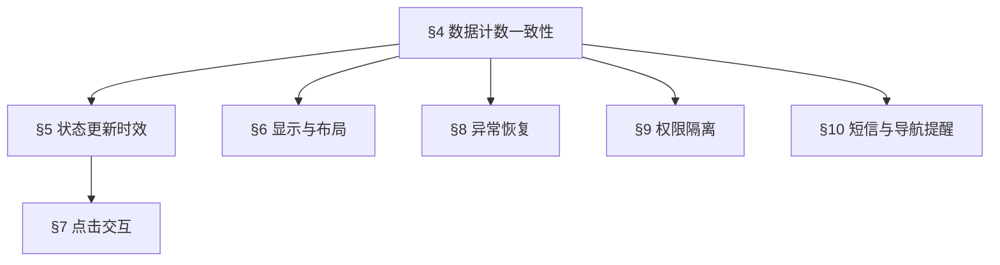

> 本规约继承全局基础规则，仅补充“消息提醒功能以及重要待办”项目专属红线。未在 PRD 中明确的站内信、短信失败重试、频控、模板内容等，不作为本轮确定验收规则。

## 一、项目上下文

| 维度 | 内容 |
|:--|:--|
| 现状问题 | 新订单、新发货单、新客户待匹配、重要待办、未读消息等事项缺少稳定、明显、可点击的提醒入口 |
| 业务目标 | 通过气泡角标、短信配置、右侧导航数量提醒相关人员及时处理待办 |
| 技术目标 | 分类气泡、重要待办、右侧导航数量必须和后端待办数据一致，并支持加载失败、轮询、刷新恢复 |
| UX 目标 | 折叠、展开、多语言、点击跳转场景下提醒不丢失、不遮挡、不误触 |

## 二、规则依赖图

## 三、模块缩写配置表

| 缩写 | 模块 | 用例范围 |
|:--|:--|:--|
| BUB | 通用气泡规则 | 一级/二级展示、汇总、`99+`、折叠展示、页面切换 |
| CM | 管理系统客户管理 | 客户管理、客户信息、客户经理匹配、轮询恢复 |
| ORD | B2B 订单管理 | 报价单、代购订单待审核计数与审核增减 |
| SHIP | B2B 发货配送 | 发货单列表待审核计数与审核增减 |
| INT | 气泡点击交互 | 一级展开、二级跳转、重要待办展开、点击区域 |
| TODO | 重要待办 | 三子模块汇总、`99+`、刷新登录、异常提示、多语言 |
| SMS | 短信提醒 | 注册成功触发、人员配置、多人通知 |
| NAV | 右侧导航 | 消息、待办、订单数量与权限范围 |
| STB | 稳定性与权限 | 弱网、刷新、多标签、并发、权限隔离 |

## 四、数据计数一致性红线

| 编号 | 规则 | 触发 | 缺陷判定 |
|:--|:--|:--|:--|
| R-COUNT-001 | 一级分类气泡必须等于已加载二级分类待办数量之和 | 客户管理、订单管理、发货配送 | 数量错误为 High，重复累计或漏减为 Critical |
| R-COUNT-002 | 二级分类气泡必须等于目标待办数量 | 客户信息、报价单、代购订单、发货单列表 | 数量和列表不一致为 High |
| R-COUNT-003 | 重要待办气泡必须等于三个已计入子模块待办数之和 | 问题确认、测量 / 报告、系统通知 | 错计失败子模块或漏计已加载子模块为 High |
| R-COUNT-004 | `>99` 必须显示 `99+` | 所有气泡 | 展示实际大数导致布局异常为 Medium 到 High |

## 五、状态更新时效红线

| 编号 | 规则 | SLA |
|:--|:--|:--|
| R-TIME-001 | 客户匹配客户经理后客户信息气泡消失 | 1 秒内 |
| R-TIME-002 | 页面切换后目标模块气泡渲染 | 2 秒内 |
| R-TIME-003 | 重要待办刷新或重新登录后渲染 | 页面加载完成后 1 秒内 |
| R-TIME-004 | 客户匹配后未消失进入异常校验 | 每 5 秒 1 次，连续 3 次仍异常则刷新 |
| R-TIME-005 | 重要待办未实时更新进入轮询 | 每 30 秒拉取 1 次 |

## 六、显示与布局红线

| 编号 | 规则 |
|:--|:--|
| R-UI-001 | 折叠和展开状态均不能丢失提醒气泡 |
| R-UI-002 | 多语言标题过长时，气泡不得被遮挡、隐藏或错位 |
| R-UI-003 | 气泡与标题右边缘保持约 5px 间距，重要待办折叠态显示在 `Important...` 右侧 |
| R-UI-004 | 子模块加载失败时，重要待办气泡旁展示 `?` 并提供 hover 提示 |

## 七、点击交互红线

| 编号 | 规则 |
|:--|:--|
| R-ACT-001 | 点击一级分类气泡必须展开其下所有二级分类 |
| R-ACT-002 | 点击二级分类气泡必须跳转至对应待办列表 |
| R-ACT-003 | 点击重要待办气泡必须展开重要待办模块 |
| R-ACT-004 | 气泡点击不得误触标题折叠、展开或其他导航行为 |

## 八、异常恢复红线

| 编号 | 规则 |
|:--|:--|
| R-ERR-001 | 二级分类或子模块加载失败时，不得把失败数据计入汇总 |
| R-ERR-002 | 数据恢复后必须自动补全汇总 |
| R-ERR-003 | 待办数量负数必须自动修正为 0；展示 0 或隐藏待产品确认 |
| R-ERR-004 | 弱网或接口超时时不得展示错误总数 |

## 九、权限隔离红线

| 编号 | 规则 |
|:--|:--|
| R-AUTH-001 | 无权限模块不展示或不计入提醒数量 |
| R-AUTH-002 | 右侧导航数量只能统计当前用户可见范围 |
| R-AUTH-003 | 不同角色不能通过角标数字推断无权限模块业务量 |

## 十、短信与右侧导航红线

| 编号 | 规则 |
|:--|:--|
| R-NOTI-001 | 用户注册成功后按配置人员发送短信提醒 |
| R-NOTI-002 | 多人配置时不得只通知单人 |
| R-NOTI-003 | 右侧导航“消息”展示未读消息条数 |
| R-NOTI-004 | 右侧导航“待办”展示未处理全部条数 |
| R-NOTI-005 | 右侧导航“订单”展示全部订单条数，统计范围待产品确认 |

## 十一、测试数据画像与隔离策略

| 数据类型 | 最低要求 | 建议准备方式 |
|:--|:--|:--|
| 客户数据 | 至少 1 个未匹配客户经理客户，1 个可完成匹配客户 | 优先业务 API，其次 UI 创建 |
| B2B 报价单 | 待审核 0、1、2、100 四类数据 | 优先业务 API，其次 UI 创建，必要时受控 mock seed |
| 代购订单 | 待审核 0、1、3、100 四类数据 | 同上 |
| 发货单 | 待审核 0、1、2、6 四类数据 | 同上 |
| 重要待办 | 三子模块分别有 0、2、3、4、100 等数据组合 | 优先 API 或测试后台预置 |
| 消息/待办/订单导航 | 未读消息、未处理待办、订单总数数据 | 需产品确认统计范围 |
| 短信 | 至少 2 个测试接收人，短信发送记录可查 | 测试短信通道或 Mock 发送记录 |
| 多语言 | 一组长标题语言配置 | B2B 多语言配置 |

## 十二、执行边界

| 边界 | 规则 |
|:--|:--|
| Agent2 真实执行 | 本次用户明确要求暂不执行测试用例 |
| DB 造数 | 仅允许 Agent2 在后续执行阶段通过受控 `mock_write`，且必须满足非生产、白名单、审计日志规则 |
| 暂缓项 | 站内信模板、短信失败重试、退订、频控不进入本轮确定验收 |
