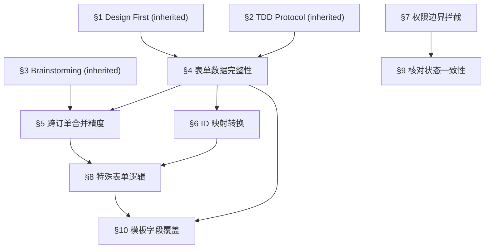

# 表单下载 Superpowers 测试规约

> 本文件继承 `superpowers-base.md` 的 §1（Design First）、§2（TDD Protocol）、§3（Brainstorming）通用规约。
> 以下从 §4 起定义**表单下载项目**的领域专属测试规则。

---

## 项目背景与解决目标

### 现状问题

| 问题 | 描述 | 业务影响 |
|------|------|---------|
| **缺少商品核对** | 用户无法在收货时核对商品与订单是否一致 | 用户投诉增加，售后成本上升 |
| **表单下载不完善** | 管理端发货单详情缺少完善的表单下载专区，无法满足纳品书、发票、面单等多类型表单需求 | 仓库打包效率低，发货准确性下降 |
| **模板字段缺失** | 表单模板与项目字段匹配度不明确，存在字段缺失 | 导出表单数据不完整，影响通关和交付 |

### 解决目标

| 层级 | 目标 | 验收标准 |
|------|------|---------|
| **业务目标** | ① 增加移动端+PC端商品核对功能 ② 优化管理端表单下载专区（支持 30+ 种表单） ③ 确保模板字段完整匹配 | 核对准确率 100%、表单下载覆盖全业务场景、字段零缺失 |
| **技术目标** | ① 移动端扫码核对 + 状态保存 ② 多表单类型生成/下载/打印 ③ 跨订单商品合并逻辑 ④ 7182 客户 ID 映射（JPN 前缀） | API 接口覆盖、数据精度保证 |
| **UX 目标** | ① 直观的核对界面（全选/取消/统计） ② 简化表单下载流程（下拉选择 → 一键下载） ③ 数据可读性和格式规范 | 操作步骤最小化、信息展示清晰 |

### 功能全景（4 大模块）

```
模块一 [用户端] 移动端货物核对 → 扫码 → 登录 → 归属判断 → 核对 → 保存
模块二 [用户端] PC端商品选择 + 表单下载 → 订单详情/资金明细/包裹明细等
模块三 [管理端] 发货单详情优化 → 表单下载专区(纳品书/发票/面单) + 品名材质修改
模块四 [技术支撑] 表单模板管理 + 数据填充引擎 + 权限验证
```

---

## 规则依赖图 (Mermaid Rule Dependency Graph)



> **约束**: MUST NOT execute downstream rule audit without passing upstream.

---

## §4 表单数据完整性 🔫 触发

**触发条件**：任何表单下载/打印操作

- 所有表单生成后，必须验证 PRD 定义的每个"已匹配"字段是否被正确填充
- 数值类字段（单价、数量、合计）必须验证**计算精度**：`合计 = 单价 × 数量`，`总计 = Σ 合计`
- 金额字段必须保留 2 位小数，不得出现浮点精度丢失
- 空值字段必须显示为空白或约定的默认值，MUST NEVER 显示 `null`、`undefined` 或未替换的模板占位符

## §5 跨订单合并精度 🔫 触发

**触发条件**：选择"商业发票合并"时

- 合并条件：同一发货单内，**跨订单**的相同规格 + 相同价格商品合并
- 合并后数量 = 各订单中该商品数量之和
- 合并后金额 = 单价 × 合并后数量（MUST 与原始各条目金额之和一致）
- 合并不得改变商品的其他属性（图片、链接、产品 ID）
- 仅规格或仅价格相同而另一项不同时，MUST NOT 合并

## §6 ID 映射转换 🔫 触发

**触发条件**：涉及 7182 纳品书 / 7182 商业发票时

- 樱花站客户 ID `7182` 在全球站必须显示为 `JPN7182`（前缀 `JPN` + 原始 ID）
- 所有 7182 类表单中出现的客户 ID 字段均需验证此映射
- 映射规则对纳品书和商业发票必须一致

## §7 权限边界拦截 🔫 触发

**触发条件**：任何涉及登录、归属判断、订单访问的操作

- 未登录用户扫码 → 必须跳转登录页，登录后自动继续流程
- 商品归属不匹配 → 必须显示提示页，MUST NEVER 展示其他用户的商品数据
- 订单不存在时 → 前端禁用下载按钮 + 后端 API 拦截返回错误码（双重防线）
- 管理端操作无需做归属判断（admin 权限可操作所有发货单）

## §8 特殊表单逻辑 🔫 触发

**触发条件**：涉及 EMS 面单、流通王发票/面单

- **EMS 面单**：选择后必须弹出备注弹窗，备注默认填充数据，用户可修改后确认打印
- **流通王面单/发票**：当收件方与进口商地址完全字符串匹配，或进口商地址为 `null` / `""`（空字符串）时，进口商栏必须自动填写 `SAME AS CONSIGNEE`
- 偏远地区选择必须影响面单生成结果

## §9 核对状态一致性 🔫 触发

**触发条件**：移动端/PC 端操作货物核对时

- 移动端确认核对后的状态必须与 PC 端同步展示
- 取消选择（取消勾选）= 取消核对，保存后该商品恢复为"未核对"状态
- 核对统计（已核对/总数量）必须实时更新
- 全选后取消单个商品再确认 → 仅取消选中的商品核对状态

## §10 模板字段覆盖 🔫 触发

**触发条件**：引入新表单模板或修改现有模板时

- 所有 30+ 种表单模板的字段映射必须与 PRD 中的"项目对应字段"列完全一致
- 面单类（7 种）→ 打印操作
- 纳品书类（5 种）→ 下载操作
- 商业发票类（7 种）→ 下载操作
- 发货相关（6 种）→ 下载操作
- 订单相关（5 种）→ 下载操作
- "可空"字段（如 `product.usage`）必须验证空值不导致模板渲染异常

## §11 多语言标签 🔫 触发（会议纪要 #2）

**触发条件**：任何表单/面单/纳品书/发票的生成和下载

- 日本用户：表单中的标签（如"公司名称""邮编""电话"等固定文本）必须显示**日文**
- 其他国家用户：表单标签必须显示**英文**
- 标签 vs 内容：表单标签根据用户国籍切换语言，但**实际业务内容（如商品名称）仍显示中文**
- 目前仅覆盖日语和英文两种语言
- 语言切换 MUST NOT 影响数值精度

## §12 修改作用域隔离 🔫 触发（会议纪要 #3）

**触发条件**：修改品名/材质操作

- 品名/材质修改**仅生效于下载页面和修改页面**
- MUST NOT 影响其他模块（订单详情、发货单列表等）
- 验证路径：修改品名 → 下载纳品书确认新品名 → 检查其他页面仍为原品名

---

## 【模块缩写配置表】

| 模块缩写 | 全称 | 覆盖范围 |
|----------|------|---------|
| **FD** | Form Download（表单下载） | 通用表单下载功能 |
| **MV** | Mobile Verification（移动端核对） | 移动端货物核对页面 |
| **PV** | PC Verification（PC 端核对） | PC 端发货单详情商品选择 |
| **NP** |納品書（纳品书） | 纳品书 / ZOZO / 7182 / 带地址附加项 / 用户端纳品书导出 |
| **IV** | Invoice（商业发票） | OCS / TW / 流通王 / 海源 / LDX / 合并 / 7182 |
| **WB** | Waybill（面单） | EMS / LDX / OCS / TW / 流通王 / 邮政船运 / 翼速 |
| **SH** | Shipping（发货相关） | 整柜数据 / 配货单 / 包裹明细 / 物流清算 / 发货记录 |
| **OD** | Order（订单相关） | 订单清算 / 订单详情 / 资金记录 / 資金全履歴 |
| **PM** | Product Modify（品名材质修改） | 修改品名/材质弹窗 |

---

## 【测试数据画像与隔离策略】

### 最低测试数据集

| 数据项 | 要求 | 用途 |
|--------|------|------|
| 管理员账号 (admin) | 1 个，具备管理端全部权限 | 管理端发货单详情、表单下载专区、品名修改 |
| 普通用户账号 | 2 个（用户 A + 用户 B），有实际订单 | 用户端核对、归属判断、表单下载 |
| 发货单 | 至少 1 单含 2+ 不同订单的商品（用于测试合并逻辑） | 跨订单合并验证 |
| 7182 客户订单 | 至少 1 单关联樱花站客户 | 7182 ID 映射转换 (JPN7182) |
| 进口商地址场景 | ① 地址与收件方相同 ② 地址为 null ③ 地址为空字符串 ④ 正常地址 | 流通王 SAME AS CONSIGNEE |
| 商品数据 | 3+ 种商品，含中/英文品名、材质、SKU、图片 | 品名材质修改 + 表单字段填充 |
| 箱子二维码 | 至少 2 个箱子的有效二维码 | 移动端扫码核对 |

### 账号隔离策略

- **管理端测试**：使用 admin 账号，可操作全部发货单
- **用户端测试**：用户 A 和用户 B 严格隔离，验证归属判断时用用户 B 访问用户 A 的商品
- **数据清理**：每轮测试结束后，核对状态需重置为未核对
