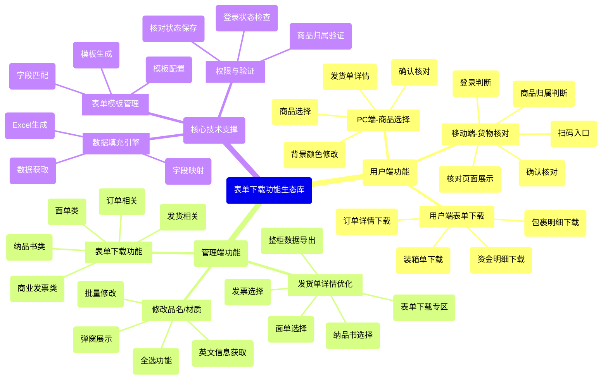
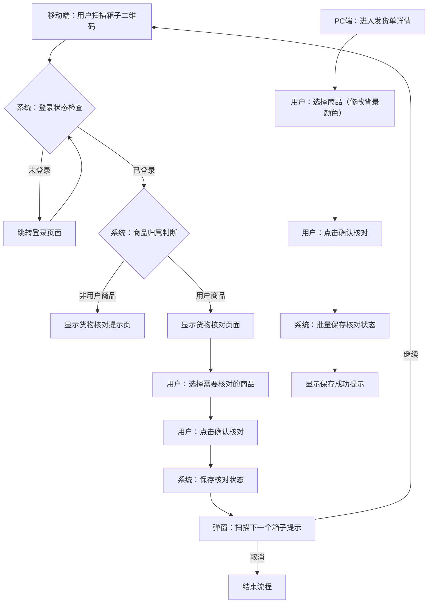
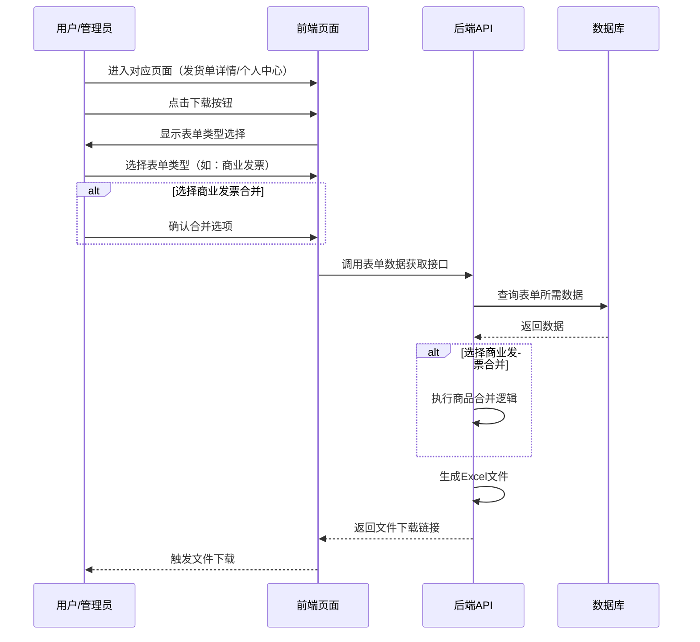
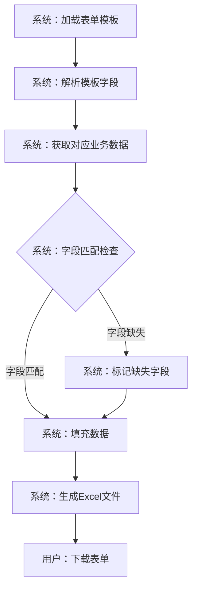
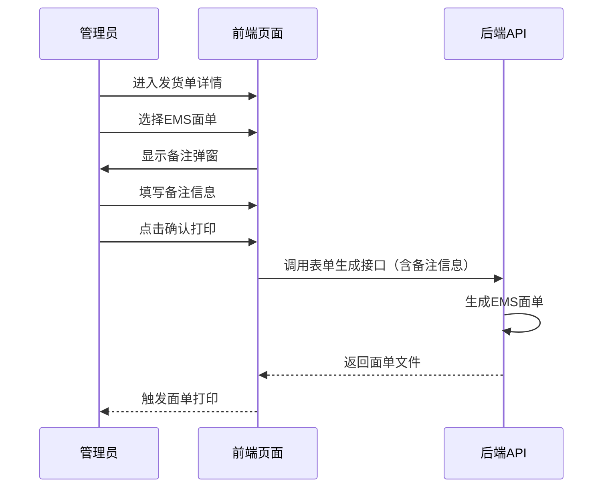

# 表单下载功能：核心流程图与交互链路导图

本文档基于《表单下载PRD》及当前 B2B/OEM 后端业务模块之交互逻辑整理生成，涵盖表单下载功能的宏观架构思维导图、货物核对流程链路图以及表单生成与下载时序图。

---

## 一、 表单下载功能全景拆解 (Mindmap)

以下思维导图全景展现了本次优化项目于管理端与用户端所切分的核心疆域及兜底法则：

---

## 二、 【货物核对】移动端与PC端核心流程验证图

针对移动端货物核对与PC端商品选择功能的核心业务流程，其在前端视觉表现与后台中间件拦截的双相协作时序：

---

## 三、 【表单下载】管理端与用户端核心流程时序图

针对管理端和用户端的表单下载功能，为确保数据准确性和完整性的核心安全逻辑：

---

## 四、 【修改品名/材质】核心交互流程

针对修改品名/材质功能的核心业务流程，展示从触发到保存的完整链路：

---

## 五、 【表单模板】字段匹配与数据填充流程

针对表单模板的字段匹配与数据填充流程，确保表单数据的准确性和完整性：

---

## 六、 【EMS面单】特殊处理流程

针对EMS面单打印需要显示备注弹窗的特殊处理流程：

