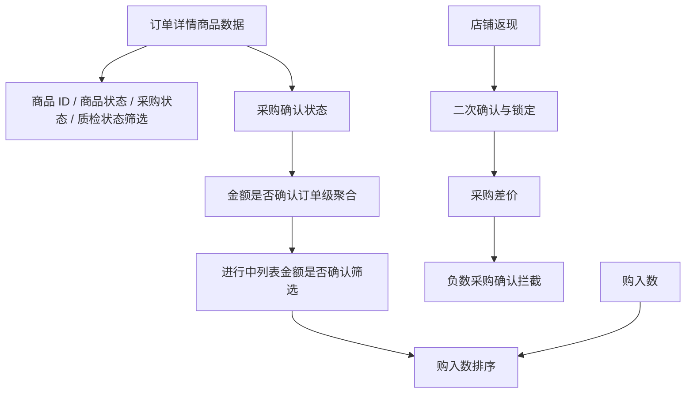

# Superpowers - 订单详情页优化

> 本项目继承 `superpowers-base` 的 §1 Design First、§2 TDD Protocol、§3 Brainstorming 通用规则；本文仅定义订单详情页优化领域的补充规则。

## 项目上下文

| 上下文 | 内容 |
|:--|:--|
| 现状问题 | 全球站后台代购订单详情页缺少商品级筛选，进行中列表缺少金额确认筛选和未购买订单定位能力 |
| 业务目标 | 采购人员能在多商品、多店铺订单中快速定位问题商品、未确认金额订单、未购买订单 |
| 技术目标 | 查询口径由后端稳定支持，分页、排序、筛选结果一致，不依赖前端假筛 |
| UX 目标 | 筛选栏、下拉框、排序按钮、弹窗提示清晰，不遮挡原有订单操作 |

## 功能全景

| 模块 | 能力 | 测试关注 |
|:--|:--|:--|
| 订单详情页筛选栏 | 商品 ID、商品状态、采购状态、质检状态筛选 | 精确匹配、状态口径、多条件交集、大订单性能 |
| 采购差价负数拦截 | 采购差价为负数时阻止采购确认 | 金额边界、弹窗文案、状态不误更新、接口防绕过 |
| 店铺返现二次确认 | 店铺返现未确认不进入采购差价，确认后锁定 | 确认前后金额口径、按钮状态、权限锁定 |
| 金额是否确认筛选 | 进行中列表按全部/已确认/未确认筛选 | 多商铺任一未确认、数量公式、分页联动 |
| 购入数排序 | 购入数量为空订单置顶 | 空值与 0 区分、全量分页排序、筛选联动 |

## 规则依赖图

执行约束：严禁在未通过前置规则校验的情况下执行后置规则的审计逻辑。

## §4 筛选结果必须按后端全量交集计算

🔫 触发：订单详情页商品 ID、商品状态、采购状态、质检状态任一筛选或组合筛选。

| 规则 | 验收标准 |
|:--|:--|
| 商品 ID 精确匹配 | 输入完整 SKU 仅命中该 SKU，不按部分字符模糊匹配 |
| 多条件交集 | 多个筛选项同时存在时，结果必须满足全部条件 |
| 全量查询 | 不允许只筛当前可见区域或当前分页局部数据 |
| 店铺归属 | 多店铺订单筛选后商品店铺归属不串、不重复、不丢失 |

## §5 商品状态和质检状态必须按数量口径可解释

🔫 触发：商品状态筛选、质检状态筛选、商品状态展示。

| 状态 | 规则 |
|:--|:--|
| 待入库 | 正品数量更新后和已入库数量不同，且已入库数量为 0 |
| 部分入库 | 正品数量和已入库数量不相同，且已入库数量不为 0 |
| 已入库 | 正品数量和已入库数量相同，且发货数量为 0 |
| 待采购 | 允许采购审核完成后，还未更新采购数据 |
| 部分到货 | 到货数小于采购数 |
| 暂不购买 | 通过“暂不购买”按钮形成状态 |
| 质检状态 | 对应不良、待定、退货、换货、待检品数量大于 0 |

待确认项：发货数量不为 0 的商品状态归属、多质检状态同时存在时的命中策略。

## §6 金额是否确认必须按订单级聚合判断

🔫 触发：进行中列表“金额是否确认”筛选。

| 场景 | 规则 |
|:--|:--|
| 已确认 | 订单内全部需要采购确认的商铺/商品均完成确认 |
| 未确认 | 订单中任一商铺/商品存在采购确认按钮未点击 |
| 未确认额外条件 | 筛选未确认时，还需满足采购数 = 不良数 + 正品数 |
| 多商铺订单 | 不得因部分商铺已确认而误归入已确认 |

待确认项：数量公式在多商品订单中按任一商品、命中商品还是全商品判断。

## §7 采购差价和店铺返现属于金额安全链路

🔫 触发：采购确认、采购差价、店铺返现二次确认。

| 规则 | 验收标准 |
|:--|:--|
| 负数采购差价 | 若进入版本，采购差价为负数时阻止采购确认 |
| 负数边界 | `-0.01` 必须被识别为负数，0 和正数不得误拦截 |
| 接口防绕过 | 前端限制之外，后端也必须拒绝非法确认 |
| 店铺返现未确认 | 未确认前只记录在店铺返现栏，不进入采购差价 |
| 店铺返现已确认 | 确认后状态、颜色、金额锁定、权限锁定一致 |

待确认项：采购差价负数拦截和店铺返现二次确认是否进入本次版本。

## §8 暂缓/开发评估项必须有版本开关意识

🔫 触发：PRD 中标记“暂缓”“看开发评估”“开发评估”的需求。

| 需求项 | 默认执行策略 |
|:--|:--|
| 采购差价负数拦截 | 默认产出用例，执行前确认是否 Execute |
| 店铺返现二次确认 | 默认产出用例，执行前确认是否 Execute |
| 购入数排序 | 默认产出用例，执行前确认是否 Execute |

Agent2 执行时若未取得确认结论，相关用例必须标记为 `Skip-待版本确认`，不得按失败处理。

## §9 购入数排序必须验证全量分页

🔫 触发：进行中列表购入数字段排序。

| 规则 | 验收标准 |
|:--|:--|
| 空值置顶 | 点击排序后购入数量为空的订单置顶 |
| 0 与空值 | 数值 0 不得默认等同于 null/空字符串，除非产品确认 |
| 全量排序 | 多页数据排序必须基于全量结果集，不得只排当前页 |
| 组合联动 | 金额是否确认筛选后再排序时，排序作用于筛选后的结果集 |

## 【模块缩写配置表】

| 模块缩写 | 模块名称 | 说明 |
|:--|:--|:--|
| OD-FLT | 订单详情筛选 | 商品 ID、商品状态、采购状态、质检状态筛选 |
| OD-AMT | 金额确认与采购差价 | 金额是否确认、采购确认、采购差价负数拦截 |
| OD-CB | 店铺返现确认 | 店铺返现二次确认、金额锁定、权限 |
| OD-LST | 进行中列表筛选排序 | 金额是否确认筛选、购入数排序、分页联动 |
| OD-SEC | 权限安全与回归 | 权限、接口防绕过、XSS、异常态、性能与日志 |

## 【测试数据画像与隔离策略】

| 数据类型 | 最低配置 | 用途 |
|:--|:--|:--|
| 多商品订单 | 至少 1 笔包含 5 个以上商品 | 验证详情页筛选和多条件交集 |
| 多店铺订单 | 至少 1 笔包含 2 个以上店铺 | 验证店铺归属、金额确认聚合 |
| 商品状态数据 | 待入库、部分入库、已入库各至少 1 条 | 验证商品状态筛选 |
| 采购状态数据 | 待采购、部分到货、暂不购买各至少 1 条 | 验证采购状态筛选 |
| 质检状态数据 | 有不良、有待定、有退货、有换货、待检品各至少 1 条 | 验证质检状态筛选 |
| 金额确认数据 | 全部已确认、部分未确认、全部未确认各至少 1 笔 | 验证金额是否确认筛选 |
| 数量公式数据 | 采购数=不良数+正品数、不满足公式各至少 1 笔 | 验证未确认额外条件 |
| 购入数数据 | 空值、0、正整数各至少 1 笔 | 验证购入数排序 |
| 角色账号 | 采购员、主管/管理员、无权限账号各 1 个 | 验证权限与锁定 |

