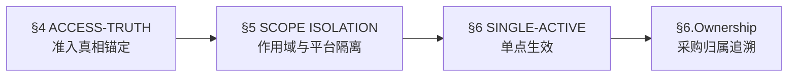

# Superpowers — 黑白名单及采购账号项目

> **继承**: 本文件继承 [superpowers-base.md](file:///D:/test_workspace/00_全局测试规约库/superpowers-base.md) 中的通用规则（§1 Design First / §2 TDD Protocol / §3 Brainstorming）。
>
> **环境隔离协议**：本项目不涉及金额、汇率、会员等级或多国币种转换。
> 已卸载：PRICE-IDENTITY / SITE-SUPREMACY / EXCHANGE-RATE。
> 禁止在后续审计中引用任何关于"计费"或"汇率快照"的逻辑。
>
> **领域审计重点（对 §3 Brainstorming 的补充）**: 针对黑白名单规则、采购账号授权等业务逻辑，必须自发进行边界值审计。

---

## 规则依赖图

> Agent 在执行审计或生成用例时必须遵循以下执行顺序：

**执行约束**：严禁在未通过准入真相校验的情况下执行平台隔离或互斥规则的审计。

---

## 4. ACCESS-TRUTH ANCHORING (准入真相锚定)
> **🔫 触发**: IP 黑白名单配置变更 | 授信账号豁免判定 | 采购账号到期预警

- **Trust Override (授信优先)**:
  - 判定优先级必须严格遵循：`[授信账号豁免 (admin/东哥)]` > `[IP黑名单拦截]` > `[IP白名单放行]` > `[普通IP拦截提醒]`。
  - 严禁低优先级规则覆盖高优先级判定结果。

- **Three-Way Consistency (三方一致性校验)**:
  - 必须验证：`[后台配置]` ↔ `[数据库/缓存状态]` ↔ `[前端拦截反馈]` 的数据链路闭环一致性。
  - 任何一环数据不一致即判定为缺陷。

- **Alerting Logic (到期预警)**:
  - 采购账号授权到期前 **3 天**，系统必须在 UI 逻辑中强制注入"数字气泡"预警。
  - 气泡必须在相关管理页面持续可见，直至续期或过期处理完成。

## 5. SCOPE & PLATFORM ISOLATION (作用域与平台隔离)
> **🔫 触发**: 平台切换（1688↔淘宝） | Token 授权回调 | 应用-账号绑定操作

- **Middleware Lockdown (中间件物理拦截)**:
  - 未授权 IP 必须在中间件层级被物理重定向至拦截页，严禁通过 API 直连后台业务。
  - 拦截必须发生在路由分发之前，不可依赖业务层代码判断。

- **Account Sandbox (平台账号沙箱)**:
  - 1688 与淘宝的授权 Token、子账号绑定逻辑必须物理隔离。
  - 严禁跨平台共用 Token 或混用授权回调链路。

- **App-Limit Constraint (应用绑定硬约束)**:
  - 严格执行"**1 个应用最多绑定 5 个主账号**"的硬性约束。
  - 达到上限后，绑定入口必须置灰/禁用，后端同步拦截，不可仅靠前端校验。

## 6. SINGLE-ACTIVE ENFORCEMENT (单点生效规约)
> **🔫 触发**: 账号启用/禁用切换 | 一键采购执行 | 脏数据检测

- **Mutex Toggle (跨平台互斥开关原子性)** `[V2变更]`:
  - 核心限定域已由单平台变更为**以 B2B 后台账号为界**。同一 B2B 后台账号下，横跨 1688 和淘宝双平台，同一时刻只能有 **1 个账号** 处于"启用"状态。
  - 启用账号 B（不论哪个平台）时，系统必须在**同一事务**内自动将该 B2B 后台账号绑定的其他所有采购账号置为"禁用"。

- **Dirty-State Self-Rescue (脏数据自救断言)** `[V2变更]`:
  - 若业务层在一键采购时检测到数据库中同一 B2B 后台账号存在 **≥ 2 个启用账号**，系统执行自救协议：
    1. **拒绝执行**：中断一键采购。
    2. **抛出告警**：向管理端推送脏数据提示。
    3. **日志审计**：记录脏数据快照。
  - 严禁在脏数据状态下"随机取一个"执行。

- **Ownership Traceability (采购归属可追溯)**:
  - 每笔一键采购订单必须记录执行时使用的**具体账号 ID**，确保采购行为可审计、可回溯。

---

## 7. 增量更新影响评估 (V2 Delta Impact)

> **本次 V2 (2026-04-11) 规则变更影响面评估：**

| 影响域 | 变更内容 | 受影响模块 | 测试策略调整 | 新增用例估算 |
|--------|---------|-----------|-------------|-------------|
| 隔离域边界 | 账号与平台强行绑定 B2B 后台账号 | 账号管理→平台绑定全链路 | 旧"单平台全局互斥"代码作废，改为"跨平台内部互斥"测试 | +10~12 条 |
| 代购订单入口 | 详情页新增一键采购入口 | 订单详情→一键采购 | 追加前置条件 `订单状态 == '进行中'` 渲染校验 | +5~6 条 |
| 跨平台并发 | 合并跨平台处理机制（淘宝+1688） | 启用/禁用操作全链路 | 交叉执行双平台启用操作，防备并发死锁 | +6~8 条 |
