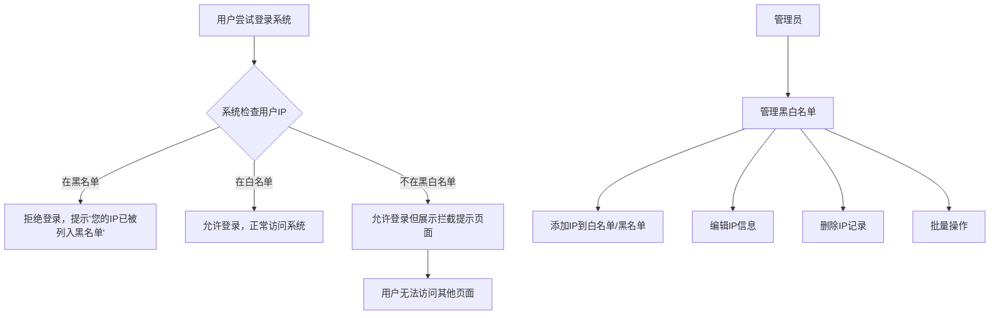
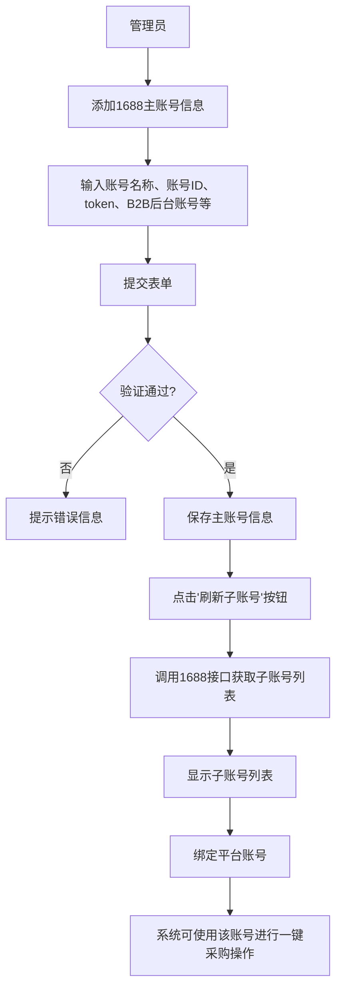
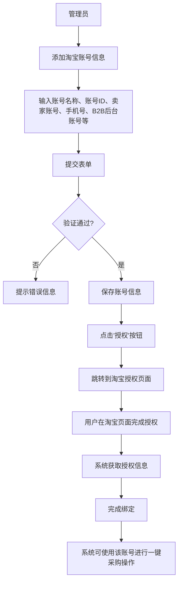
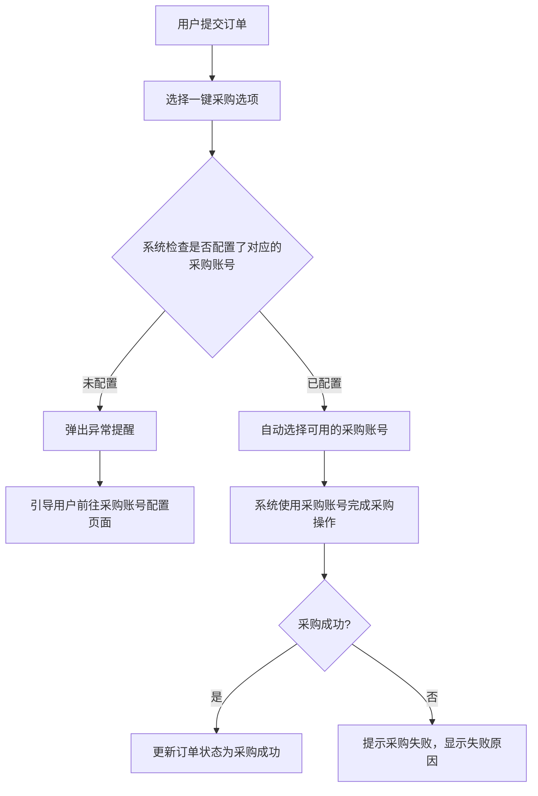
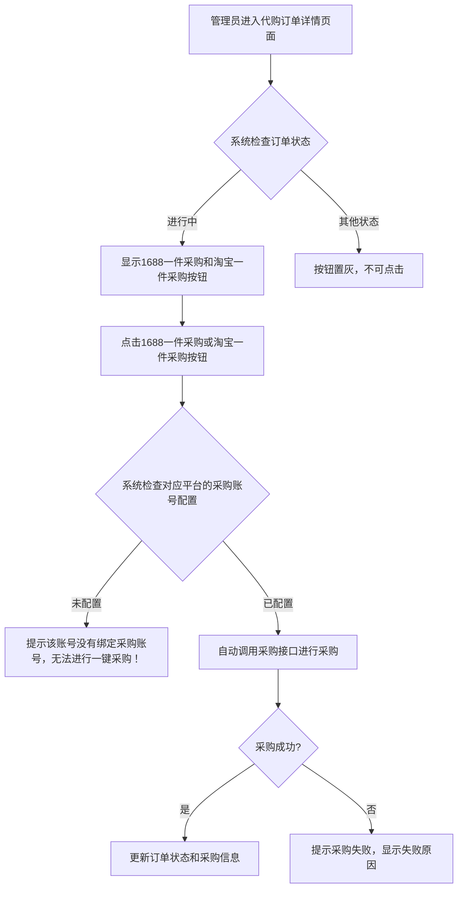
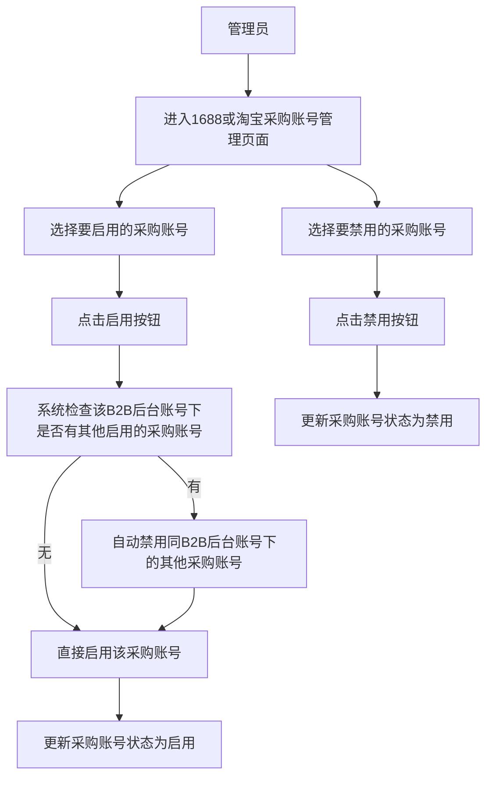
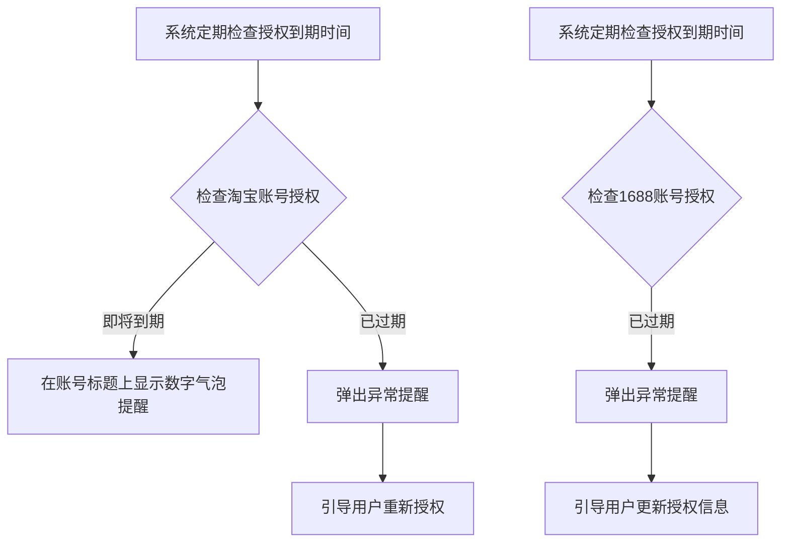
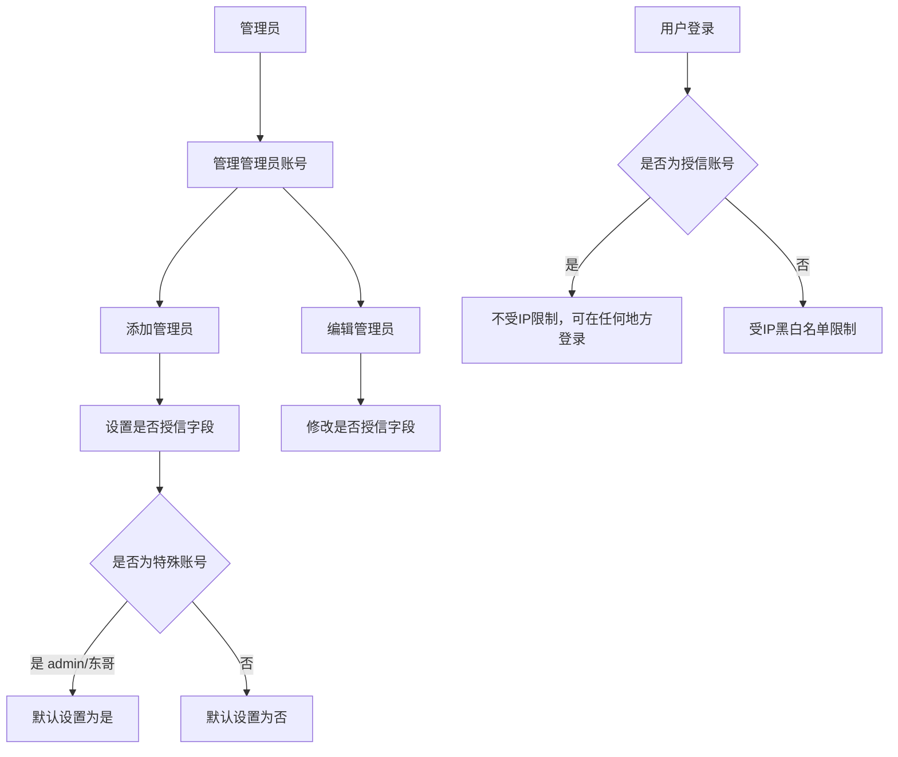
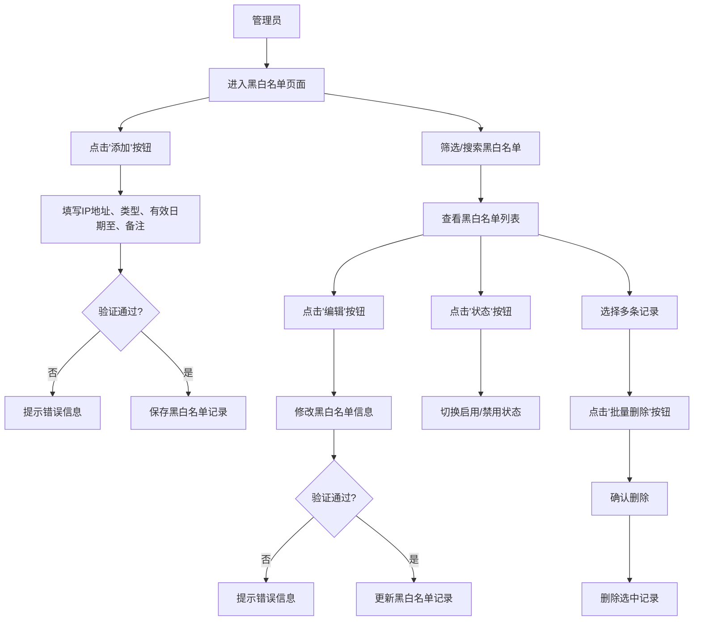

# 黑白名单及采购账号业务流程图

## 1. IP黑白名单流程

```mermaid
flowchart TD
    A[用户尝试登录系统] --> B{系统检查用户IP}
    B -->|在黑名单| C[拒绝登录，提示'您的IP已被列入黑名单']
    B -->|在白名单| D[允许登录，正常访问系统]
    B -->|不在黑白名单| E[允许登录但展示拦截提示页面]
    E --> F[用户无法访问其他页面]
    G[管理员] --> H[管理黑白名单]
    H --> I[添加IP到白名单/黑名单]
    H --> J[编辑IP信息]
    H --> K[删除IP记录]
    H --> L[批量操作]
```

## 2. 1688采购账号管理流程

```mermaid
flowchart TD
    A[管理员] --> B[添加1688主账号信息]
    B --> C[输入账号名称、账号ID、token、B2B后台账号等]
    C --> D[提交表单]
    D --> E{验证通过?}
    E -->|否| F[提示错误信息]
    E -->|是| G[保存主账号信息]
    G --> H[点击'刷新子账号'按钮]
    H --> I[调用1688接口获取子账号列表]
    I --> J[显示子账号列表]
    J --> K[绑定平台账号]
    K --> L[系统可使用该账号进行一键采购操作]
```

## 3. 淘宝采购账号授权流程

```mermaid
flowchart TD
    A[管理员] --> B[添加淘宝账号信息]
    B --> C[输入账号名称、账号ID、卖家账号、手机号、B2B后台账号等]
    C --> D[提交表单]
    D --> E{验证通过?}
    E -->|否| F[提示错误信息]
    E -->|是| G[保存账号信息]
    G --> H[点击'授权'按钮]
    H --> I[跳转到淘宝授权页面]
    I --> J[用户在淘宝页面完成授权]
    J --> K[系统获取授权信息]
    K --> L[完成绑定]
    L --> M[系统可使用该账号进行一键采购操作]
```

## 4. 一键采购流程

```mermaid
flowchart TD
    A[用户提交订单] --> B[选择一键采购选项]
    B --> C{系统检查是否配置了对应的采购账号}
    C -->|未配置| D[弹出异常提醒]
    D --> E[引导用户前往采购账号配置页面]
    C -->|已配置| F[自动选择可用的采购账号]
    F --> G[系统使用采购账号完成采购操作]
    G --> H{采购成功?}
    H -->|是| I[更新订单状态为采购成功]
    H -->|否| J[提示采购失败，显示失败原因]
```

## 5. 订单维度一键采购流程

```mermaid
flowchart TD
    A[管理员进入代购订单详情页面] --> B{系统检查订单状态}
    B -->|进行中| C[显示1688一件采购和淘宝一件采购按钮]
    B -->|其他状态| D[按钮置灰，不可点击]
    C --> E[点击1688一件采购或淘宝一件采购按钮]
    E --> F{系统检查对应平台的采购账号配置}
    F -->|未配置| G[提示该账号没有绑定采购账号，无法进行一键采购！]
    F -->|已配置| H[自动调用采购接口进行采购]
    H --> I{采购成功?}
    I -->|是| J[更新订单状态和采购信息]
    I -->|否| K[提示采购失败，显示失败原因]
```

## 6. 采购账号启禁用流程

```mermaid
flowchart TD
    A[管理员] --> B[进入1688或淘宝采购账号管理页面]
    B --> C[选择要启用的采购账号]
    C --> D[点击启用按钮]
    D --> E[系统检查该B2B后台账号下是否有其他启用的采购账号]
    E -->|有| F[自动禁用同B2B后台账号下的其他采购账号]
    E -->|无| G[直接启用该采购账号]
    F --> G
    G --> H[更新采购账号状态为启用]
    B --> I[选择要禁用的采购账号]
    I --> J[点击禁用按钮]
    J --> K[更新采购账号状态为禁用]
```

## 7. 授权到期提醒流程

```mermaid
flowchart TD
    A[系统定期检查授权到期时间] --> B{检查淘宝账号授权}
    B -->|即将到期| C[在账号标题上显示数字气泡提醒]
    B -->|已过期| D[弹出异常提醒]
    D --> E[引导用户重新授权]
    F[系统定期检查授权到期时间] --> G{检查1688账号授权}
    G -->|已过期| H[弹出异常提醒]
    H --> I[引导用户更新授权信息]
```

## 8. 管理员授信流程

```mermaid
flowchart TD
    A[管理员] --> B[管理管理员账号]
    B --> C[添加管理员]
    C --> D[设置是否授信字段]
    D --> E{是否为特殊账号}
    E -->|是 admin/东哥| F[默认设置为是]
    E -->|否| G[默认设置为否]
    B --> H[编辑管理员]
    H --> I[修改是否授信字段]
    J[用户登录] --> K{是否为授信账号}
    K -->|是| L[不受IP限制，可在任何地方登录]
    K -->|否| M[受IP黑白名单限制]
```

## 9. 黑白名单管理流程

```mermaid
flowchart TD
    A[管理员] --> B[进入黑白名单页面]
    B --> C[筛选/搜索黑白名单]
    C --> D[查看黑白名单列表]
    B --> E[点击'添加'按钮]
    E --> F[填写IP地址、类型、有效日期至、备注]
    F --> G{验证通过?}
    G -->|否| H[提示错误信息]
    G -->|是| I[保存黑白名单记录]
    D --> J[点击'编辑'按钮]
    J --> K[修改黑白名单信息]
    K --> L{验证通过?}
    L -->|否| M[提示错误信息]
    L -->|是| N[更新黑白名单记录]
    D --> O[点击'状态'按钮]
    O --> P[切换启用/禁用状态]
    D --> Q[选择多条记录]
    Q --> R[点击'批量删除'按钮]
    R --> S[确认删除]
    S --> T[删除选中记录]
```
